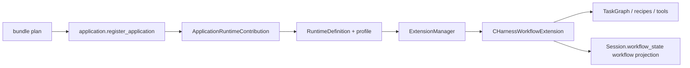

# C/C++ Workflow

## Metadata

> 状态：`active`
> 类型：`application authority`
> 负责人：`C/C++ workflow maintainers`
> 最后同步日期：`2026-08-17`
> 对应代码范围：`packages/embedagent-workflow-cpp/src/embedagent_workflow_cpp/`, `packages/embedagent-core/src/embedagent_core/application.py`, `packages/embedagent-host/src/embedagent_host/runtime/agent_applications.py`

## 1. Purpose And Boundary

C/C++ Workflow 是基于 Agent Platform 的上层应用，也是 EmbedAgent 产品当前默认启用的一等工作流。它提供 Clang 为中心的工程识别、执行纪律、任务图、recipe、质量证据和工具包。

通用 `Agent`、`AgentSession`、会话恢复、权限、工具执行、上下文、Host/UI 协议与 GUI/TUI 注册不属于本应用。一个独立 `Agent` 不导入、构造或假设 C/C++ 扩展。

## 2. Composition

`packages/embedagent-workflow-cpp/src/embedagent_workflow_cpp/application.py` 是 C/C++ application plugin 的唯一注册入口。它通过 Core 的 `ApplicationRuntimeContribution` 提供 `cpp_runtime_definition()`、应用 profile、workspace profile detectors、workflow package id 和 empty-state metadata，并通过 `ApplicationRegistrar` 注册扩展、prompt/context providers 与 shell contribution。产品只在 bundle plan 选择 `embedagent_workflow_cpp.application:register_application` 时加载该入口；`product_catalog` 不导入 C/C++ package，也不构造 C/C++ application record。
`packages/embedagent-workflow-cpp/src/embedagent_workflow_cpp/component.py` 提供 `cpp_runtime_definition()`；`packages/embedagent-workflow-cpp/src/embedagent_workflow_cpp/profile.py` 和 `packages/embedagent-workflow-cpp/src/embedagent_workflow_cpp/workspace_profile.py` 提供应用 profile 与工作区检测 collaborators。

`CHarnessWorkflowExtension.extension_capabilities()` 是应用参与平台的唯一能力边界。当前声明：

- workflow prompt 是否注入及其内容；
- workflow state 初始化与 package manifest；
- active tool names、工具注册和上下文 reducer；
- workspace recipes 和 session task loading；
- extension-owned tool call 处理。

能力必须是显式 `ExtensionCapability` 记录，不按方法名自动发现。运行时的 `ExtensionManager` 和 `AgentExtensionHost` 负责统一分发，应用不建立第二条执行循环。

## 3. Workflow Model

应用将用户可见模式与 C/C++ 内部纪律分开：

- `mode`：`explore`, `spec`, `build`, `debug`, `verify`；
- `discipline_profile`：当前为 `lite_spec_tdd` 或 `full_spec_tdd`；
- `execution_phase`：由 profile、mode 和 evidence 共同约束的应用内部阶段；
- `TaskGraph`：任务结构与进度的应用内部真相。

常用 phase track：

| mode | execution phases |
|---|---|
| `build` | `understand` -> `contract` -> `implement` -> `check` -> `handoff`; full profile 可插入 `test_design` / `repair` |
| `debug` | `reproduce` -> `isolate` -> `patch` -> `regression_check` -> `handoff` |
| `verify` | `select_recipe` -> `execute` -> `summarize` |

`phase_engine.py` 根据工具证据推进 phase，`prompt_stack.py` 生成应用 prompt units。平台只持久通用 mode 和 workflow carrier，不解释 profile、phase 或任务图。

## 4. Task Truth And Projection

`TaskGraph` 及其 session graph store 属于 `embedagent_workflow_cpp`。任务变化以 `workflow_patch` 事件通过 Core `SessionJournal` 先 append、再由 `SessionReducer` 应用；该事件流和 `transcript.jsonl` 是任务真相。`HarnessSessionGraphState` 只是按 session id 缓存的可丢弃 projection，可从已恢复的 `Session.workflow_state["workflow"]` 重建，不能在事件提交前发布任务变化。`CHarnessWorkflowExtension` 通过 `workflow_projection.py` 将需要给 Host/UI 的部分写入 `Session.workflow_state["workflow"]`：

- `summary`；
- `items`；
- `activity`；
- `metadata.current_phase`；
- `metadata.discipline_profile`。

`Session.workflow_state["workflow"]` 是通用读模型，不是另一个 `TaskGraph`。前端把它当作 summary/items/activity/metadata 结构交给注册 renderer，不读取扁平 `task_summary`、`task_items`、`current_phase`、`discipline_profile` 或 `current_activity` 字段，不导入 C/C++ 内部类，也不根据 UI local state 推进 phase。

`.embedagent/memory/sessions/<session_id>/task-graph.json` 若存在，只是带 `snapshot_schema_version`、`source_transcript_event_count` 和 `source_workflow_fingerprint` 的派生快照。恢复和 `list_tasks` 先读取 canonical session projection；缺失、损坏或过期 sidecar 不得改变任务结果。关闭 extension/runtime 时必须清空 session graph cache。

## 5. Tools And Packs

通用平台提供文件、搜索、编辑、`bash` 和 `ask_user` 等基础工具。C/C++ 应用通过 `embedagent_workflow_cpp.packs` 声明应用工具包，并注册：

- `list_recipes`；
- `run_recipe`；
- `report_quality_v2`；
- `record_failing_evidence`；
- `task_status`。

`report_quality_v2` 是当前实际工具标识，其后缀是稳定运行时 API 的一部分，不表示本文档或整体架构存在两套版本。

`tool_registry.py` 拥有 handler 组装，`tool_metadata.py` 拥有 permission category、preview、renderer 和 invalidation metadata，`packs.py` 是工具包真相。`AgentExtensionHost` 将 mode contract 与应用 active names 合并后，以显式 tool names 调用 `ToolRuntime.schemas_for(...)`。构造空白 `ToolRuntime` 不会自动注册 C/C++ 工具。

## 6. Recipes And Offline Runtime

`workspace_profile.py` 识别 C/C++ 文件和 build-system 信号；`workspace_recipes.py` 发现 CMake、Make 和 Ninja recipes；`recipe_ops.py` 将发现、执行和质量报告映射为工具 observation。

recipe、`bash` 和质量流程只能调用 `scripts/offline-runtime-contract.json` 声明的 bundled binaries。增加运行时二进制时，必须同步该 contract、产品包装检查和离线验收。

## 7. Permission And Context

C/C++ 应用决定当前工作流焦点、active packs 和 phase evidence；平台 `PermissionPolicy` 决定 allow/ask/deny；独立写路径策略决定路径是否可写；上下文系统决定模型能看到什么。应用扩展参与这些边界，但不替代它们。

## 8. Verification

主要回归入口：

- `tests/test_c_cpp_workflow_runner_taskgraph.py`
- `tests/test_c_cpp_workflow_runner_debug.py`
- `tests/test_c_cpp_workflow_runner_verify.py`
- `tests/test_c_cpp_workflow_task_projection.py`
- `tests/test_c_cpp_workflow_contracts.py`
- `tests/test_workflow_extensions.py`
- `tests/test_cpp_workflow_distribution.py`
- `tests/test_agent_profiles.py`
- `tests/test_host_package_composition.py`

修改 modes、profile、phase、`TaskGraph`、tools/packs、recipes、workflow projection 或 product catalog 注入时，必须同步本文档。

## 9. Related Documents

- `docs/platform/agent-core.md`
- `docs/platform/tools-and-extensions.md`
- `docs/platform/mode-contract.md`
- `docs/platform/permissions-and-context.md`
- `docs/platform/frontend-protocol.md`
- `docs/product/composition.md`
- `docs/product/packaging-and-deployment.md`
