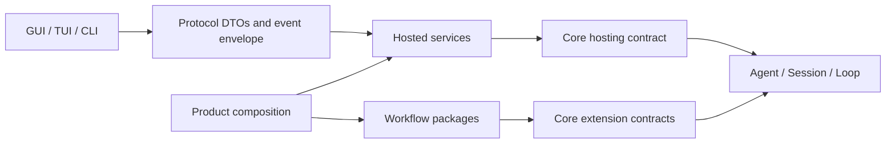

# Phase 7C Architecture Convergence Design

**Status:** Approved

**Date:** 2026-07-26

## 1. Goal

Phase 7C converges the current Agent Core, Host, workflow, Protocol, and GUI
boundaries without adding product features. It retires transitional paths,
removes duplicated policy and dead modules, and makes the dependency and event
flows unambiguous.

This phase is complete only when each migrated behavior has one owner, one
supported path, and an architecture guard that prevents the retired path from
returning.

## 2. Context

The six-distribution dependency DAG, standalone `Agent` / `AgentSession` facade,
workflow package boundary, hosted application registry, and capability-driven
GUI shell are established. The remaining debt is concentrated in cross-layer
behavior rather than package layout:

- generic Host tool projection recognizes only legacy workflow-state names
- Host calls private `AgentSession._host_*` methods
- `AgentRuntimeServices` tunnels hosted concerns into Core
- `QueryEngine` and `InProcessAdapter` retain coordination already assigned to
  extracted services
- Core-to-GUI events are reshaped more than once
- duplicate policy constants and modules without production consumers remain
- active architecture documents reference source files that no longer exist

Phase 8 remains reserved for real C/C++ project validation. Clean Windows 7
SP1 x64 and fixed-WebView2 target evidence remains the external Phase 7B release
acceptance gate. Phase 7C does not rename or close either program.

## 3. Scope

Phase 7C must deliver all of the following:

- arbitrary workflow-state names do not suppress workflow-neutral tools
- missing workflow state remains empty outside an explicitly selected workflow
- Host uses a supported Core hosting contract and no Core private members
- Core contains no product branding, hosted defaults, or legacy workflow-state
  vocabulary
- runtime services have one owner behind focused ports or definitions
- Core events reach GUI consumers through one Protocol envelope path
- tool, edit, command, and extension failures remain Agent-visible tool results
- dead modules, old namespaces, duplicate policy, and obsolete tests are deleted
- active documentation matches the promoted source paths and contracts
- all architecture, package, Core SDK, Host, workflow, and GUI gates pass

## 4. Non-Goals

Phase 7C does not include:

- a runnable `embedagent-composition` export pipeline
- new workflows, tools, providers, GUI surfaces, or product features
- clean Windows 7 target-machine acceptance
- Phase 8 real-project C/C++ validation
- enterprise, intranet, telemetry, marketplace, or multi-agent capabilities
- compatibility layers for retired pre-release private APIs or event shapes
- a wholesale rewrite or direct port of Pi or T3 Code

## 5. Target Dependency Direction



The dependency rules are:

1. Core does not import Host, Protocol, product, GUI, or a workflow package.
2. Workflow packages depend on Core and participate only through explicit
   profile, extension, manifest, and runtime contracts.
3. Host depends on Core and Protocol, but never accesses a Core private member.
4. Product composition selects and injects applications, workflows, providers,
   registries, and GUI shell metadata.
5. GUI shells consume Protocol DTOs and declared capabilities. They do not infer
   workflow policy from tool names or workflow-state strings.

## 6. Milestones

### 6.1 Phase 7C.1: Workflow Neutrality

- remove `chat`, `plan`, `review`, and `command` visibility assumptions from
  generic Host tool metadata
- preserve an empty missing workflow state in Core, Host, and Protocol
- let each workflow package declare its own states and specialized tool
  visibility
- verify that workflow-neutral tools remain visible under an arbitrary
  `custom` workflow state
- delete old fallback/default branches instead of retaining aliases

### 6.2 Phase 7C.2: Hosted Session Contract

- classify every existing `_host_*` operation by its actual owner
- route ordinary user-turn and interaction-reply behavior through supported
  `AgentSession` operations
- introduce one explicit, typed Core hosting contract for hosted command and
  lifecycle operations that cannot use the standalone facade
- keep the hosting contract out of the `embedagent_core` package-root exports
- delete all `_host_*` methods and direct Host access to Core internals

### 6.3 Phase 7C.3: Runtime Ownership Slimming

- move history behavior to `SessionLogPort`
- move remembered permission behavior to `PermissionPolicy`
- move tool commit behavior to `ToolRuntimePort`
- move workflow configuration to `RuntimeDefinition` and extensions
- move context, memory, workspace, and maintenance behavior behind the focused
  hosted or context ports that own it
- delete `AgentRuntimeServices` fields once their consumers use the owning port
- keep `QueryEngine` as coordinator over lifecycle, loop, action, snapshot, and
  extension services only
- keep `InProcessAdapter` responsible for application selection, managed
  sessions, hosted service invocation, and Protocol bridging only
- delete forwarding wrappers and duplicate implementations in the same change
  that promotes their replacement

### 6.4 Phase 7C.4: Canonical Event Path

Promote this as the only supported event flow:

```text
Core internal event
-> Host event encoder
-> Protocol SessionEventEnvelope
-> GUI transport
-> JavaScript read-model reducer
```

- define the canonical wire envelope in `embedagent-protocol`
- perform Core-to-Protocol mapping exactly once in Host
- make GUI backend transports forward the envelope without renaming fields or
  injecting workflow defaults
- perform Protocol-to-UI projection exactly once in the renderer read model
- remove duplicate mapping from callback, backend, and session-event helpers
- cover interaction, failed tool action, changed-file diff, and command-result
  ordering with cross-language contract tests

### 6.5 Phase 7C.5: Redundancy Retirement

- confirm production and wheel consumers before deleting a candidate
- remove unused `ToolSpecV2`, `apply_aggregate_budget`, and the obsolete
  `embedagent.workflow_packages` namespace when the evidence remains clean
- consolidate duplicated profile, writable-glob, and base-tool policy under
  the correct owner
- remove tests and samples whose only purpose is preserving retired behavior
- add import/source guards that reject deleted namespaces and compatibility
  aliases

### 6.6 Phase 7C.6: Governance Closure

- replace stale references to removed workflow application/profile files with
  the current component, profile, registry, and product-catalog paths
- update README, architecture, roadmap, module docs, and debt-audit status in
  the same change
- add guards for workflow neutrality, supported Host access, canonical event
  flow, and retired module paths
- rebuild, inspect, and isolated-smoke all six Python distributions
- extend core-only distribution smoke to execute one fake-model turn rather
  than only importing `Agent`

## 7. Canonical Event And Failure Semantics

The Protocol session event envelope has stable identity, ordering, and payload
boundaries. It contains at least:

- `schema_version`
- `event_id`
- `session_id`
- `sequence`
- `event_kind`
- `timestamp`
- `payload`

Tool, edit, command, and extension failures first become structured Core tool
results. The same result is returned to the Agent loop and projected to the GUI.
The GUI may render an error treatment, but it cannot create a second failure
path outside transcript-backed Agent behavior.

Failure payloads use structured `code`, `message`, `retryable`, and `source`
fields. Renderers must not infer failure categories from colors, visible copy,
slash command names, or built-in tool names. An unmapped internal event records
a safe Host diagnostic; it does not synthesize a workflow state or terminate an
otherwise valid Agent session.

## 8. Migration Rules

Every behavioral migration follows the same order:

1. add a focused test or architecture guard that fails against the old path
2. implement the promoted contract
3. move all production callers
4. delete the old path and its compatibility tests
5. run the focused subsystem gate
6. add a guard that prevents the retired path from returning

A milestone cannot carry both the old and new path into the next milestone.
Splitting a large file is not evidence of convergence by itself. A move counts
only when ownership is clearer and the old implementation or forwarding layer
is deleted.

## 9. Verification Strategy

Phase 7C.1 must prove that `custom` workflow state retains workflow-neutral
tools, missing workflow state remains empty, and C/C++ state policy comes from
the workflow package.

Phase 7C.2 must prove that production source contains no `AgentSession._host_*`
access and that hosted command, resume, and interaction behavior retains its
transcript ordering.

Phase 7C.3 must prove that each retired `AgentRuntimeServices` field has one
replacement owner and that forbidden `QueryEngine` forwarding wrappers are not
reintroduced.

Phase 7C.4 must prove Python and JavaScript agreement for interaction, tool
failure, diff, and command-result event sequences and payloads.

Phase 7C.5 must prove that deletion candidates have no production source or
wheel consumers and that architecture guards reject their old imports.

Phase 7C.6 runs the final repository gates from a clean worktree:

```powershell
uv run pytest tests/test_pre_release_architecture_guards.py tests/test_current_architecture_boundaries.py -v
uv run pytest tests/ -m "not slow and not gui" -v
uv run --locked python scripts/lint.py
uv run python scripts/build-python-distributions.py --dist-dir <fresh-dir>
uv run python scripts/check-python-distributions.py --dist-dir <fresh-dir>
uv run python scripts/smoke-python-distributions.py --dist-dir <fresh-dir> --python .venv/Scripts/python.exe
```

When webapp source changes, run from `src/embedagent/frontend/gui/webapp`:

```powershell
npm test
npm run build
```

Generated GUI static assets remain committed when webapp source changes.

## 10. Risks And Controls

- **Session restore and transcript order:** freeze current ordering with focused
  tests before replacing the private Host bridge.
- **GUI event drift:** retain event identity and sequence and verify paired
  request/result flows instead of relying only on visual snapshots.
- **C/C++ workflow regression:** run harness tests in every milestone rather
  than deferring them to Phase 7C.6.
- **Deletion mistakes:** require production reference and wheel-content evidence
  before removal.
- **Compatibility creep:** do not add aliases or dual-read paths for pre-release
  internal contracts.
- **Stale artifacts:** use a fresh distribution directory; the checked-in or
  existing local `dist/` directory is not acceptance evidence.

## 11. Exit Criteria

Phase 7C is complete when:

- workflow-neutral runtime behavior accepts arbitrary workflow-state names
- generic Core, Host, and Protocol no longer invent `chat`
- Host has no private Core access
- hosted services no longer enter Core through an untyped service bag
- runtime coordinators contain no duplicate owner logic or private forwarding
  compatibility layers
- one Protocol event envelope connects Host and GUI
- Agent-visible and GUI-visible failures originate from the same tool result
- identified dead modules, namespaces, duplicate policies, and stale tests are
  deleted
- active architecture documentation matches the source tree
- architecture, non-GUI, lint, GUI, six-wheel inspection, and isolated smoke
  gates pass

Completion of Phase 7C permits work to proceed to the existing Phase 8 real
C/C++ validation program. It does not claim Windows 7 release acceptance or a
productized independent Agent export pipeline.
