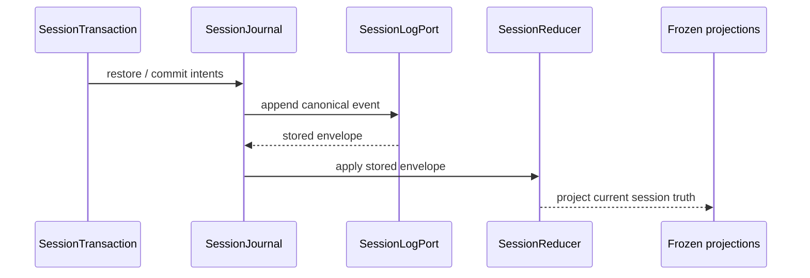

# Current Architecture Documentation Implementation Plan

> **For agentic workers:** REQUIRED SUB-SKILL: Use superpowers:subagent-driven-development (recommended) or superpowers:executing-plans to implement this plan task-by-task. Steps use checkbox (`- [ ]`) syntax for tracking.

**Goal:** Replace the mixed, lifecycle-versioned active documentation layout with one current authority system organized around the reusable Agent platform, independently owned applications, and EmbedAgent product composition/delivery.

**Architecture:** Physically migrate active authorities into `docs/platform/`, `docs/applications/`, and `docs/product/`, then rewrite each owner in place so retired runtime paths cannot remain as current truth. Keep cross-domain navigation at the docs root, move all C/C++ semantics behind the application boundary, and enforce the result with Python documentation and architecture guards.

**Tech Stack:** Markdown authorities, Python 3.8/pytest documentation guards, ripgrep, Git.

---

### Task 1: Lock The Domain Topology And Move Authority Files

**Files:**
- Modify: `tests/test_documentation_navigation.py`
- Create: `docs/platform/README.md`
- Create: `docs/applications/README.md`
- Create: `docs/product/README.md`
- Move: `docs/modules/agent-core.md` -> `docs/platform/agent-core.md`
- Move: `docs/modules/session-runtime.md` -> `docs/platform/session-runtime.md`
- Move: `docs/modules/tools-and-tooling.md` -> `docs/platform/tools-and-extensions.md`
- Move: `docs/tool-contracts.md` -> `docs/platform/tool-contracts.md`
- Move: `docs/modules/permissions-and-context.md` -> `docs/platform/permissions-and-context.md`
- Move: `docs/permission-model.md` -> `docs/platform/permission-model.md`
- Move: `docs/modules/protocol-and-core.md` -> `docs/platform/protocol.md`
- Move: `docs/frontend-protocol.md` -> `docs/platform/frontend-protocol.md`
- Move: `docs/modules/frontend-gui.md` -> `docs/platform/frontend-gui.md`
- Move: `docs/modules/frontend-tui.md` -> `docs/platform/frontend-tui.md`
- Move: `docs/mode-schema.md` -> `docs/platform/mode-contract.md`
- Move: `docs/pi-inspired-agent-core-blueprint.md` -> `docs/platform/agent-platform-blueprint.md`
- Move: `docs/agent-harness-v2.md` -> `docs/applications/cpp-workflow.md`
- Move: `docs/modules/packaging-and-deployment.md` -> `docs/product/packaging-and-deployment.md`
- Delete: `docs/modules/README.md`
- Modify: `docs/README.md`

- [ ] **Step 1: Replace the expected authority topology in the navigation test**

Set `REQUIRED_MAP_TARGETS` to the new stable paths and add the removed paths to
`RETIRED_ACTIVE_AUTHORITIES`. Add these assertions:

```python
DOMAIN_INDEXES = (
    "docs/platform/README.md",
    "docs/applications/README.md",
    "docs/product/README.md",
)

RETIRED_DOMAIN_PATHS = (
    "docs/modules",
    "docs/agent-harness-v2.md",
    "docs/frontend-protocol.md",
    "docs/tool-contracts.md",
    "docs/permission-model.md",
    "docs/mode-schema.md",
    "docs/pi-inspired-agent-core-blueprint.md",
    "docs/guides/session-truth-boundary.md",
)


def test_current_authorities_use_domain_oriented_paths():
    for relative_path in DOMAIN_INDEXES:
        assert (ROOT / relative_path).is_file()
    for relative_path in RETIRED_DOMAIN_PATHS:
        assert not (ROOT / relative_path).exists()


def test_active_authority_filenames_do_not_use_lifecycle_generations():
    offenders = []
    for path in _active_global_docs():
        relative_path = path.relative_to(ROOT).as_posix()
        if re.search(r"(?:^|[-_])v[0-9]+(?:[-_.]|$)", path.name, re.IGNORECASE):
            offenders.append(relative_path)
    assert offenders == []
```

Update `test_pi_blueprint_describes_direction_without_completed_phase_ledger()` to read
`docs/platform/agent-platform-blueprint.md` and rename it to
`test_agent_platform_blueprint_describes_direction_without_completed_phase_ledger`.

- [ ] **Step 2: Run the topology test and confirm it fails before migration**

Run:

```powershell
uv run python scripts/test-suite.py tdd tests/test_documentation_navigation.py
```

Expected: FAIL because the three domain indexes and target authority paths do not exist and old
paths still exist.

- [ ] **Step 3: Move the authorities without compatibility stubs**

Create the three directories, use `git mv` for every one-to-one move listed above, move
`docs/agent-harness-v2.md` to `docs/applications/cpp-workflow.md`, and remove
`docs/modules/harness.md`, `docs/modules/README.md`, and `docs/guides/session-truth-boundary.md`
after their content is preserved for Tasks 2 and 4 through Git history. Do not leave redirect
documents at old paths.

- [ ] **Step 4: Create the three local indexes and update the global map**

Each local index must contain metadata plus a concise ownership table:

```markdown
> 状态：`active`
> 类型：`navigation`
> 负责人：`project maintainers`
> 最后同步日期：`2026-08-01`
```

`docs/platform/README.md` routes generic runtime, contracts, GUI/TUI, and the target blueprint.
`docs/applications/README.md` routes only the C/C++ workflow and states that peer applications get
peer authorities. `docs/product/README.md` routes composition and delivery.

Rewrite `docs/README.md` so the first routing distinction is platform/application/product and all
`REQUIRED_MAP_TARGETS` appear exactly as repository-relative paths. Keep it below 1000 words.

- [ ] **Step 5: Re-run the topology test**

Run the Task 1 command again. Expected: the topology, map-target, active-index, and context-budget
tests pass. Failures caused by stale references inside other tests are handled by later tasks.

- [ ] **Step 6: Commit the physical authority split**

```powershell
git add docs tests/test_documentation_navigation.py
git commit -m "docs: split authorities by architecture domain"
```

### Task 2: Converge Agent Runtime And Session Truth

**Files:**
- Modify: `docs/platform/agent-core.md`
- Modify: `docs/platform/session-runtime.md`
- Modify: `docs/platform/agent-platform-blueprint.md`
- Modify: `tests/test_pre_release_architecture_guards.py`

- [ ] **Step 1: Extend the retired-runtime documentation guard**

Add the following tokens to `legacy_terms` in
`test_active_docs_keep_legacy_architecture_terms_in_removed_contexts`:

```python
"Query" + "Engine",
"Session" + "Restorer",
"query" + "_engine.py",
"session" + "_restore.py",
"Execution" + "Tracer",
"Circuit" + "Breaker",
```

Keep the existing removed/forbidden context markers. This allows the constitution and Agent Core
authority to say an object is deleted while rejecting diagrams, code mappings, and current-flow
sentences that still use it.

- [ ] **Step 2: Run the focused guard and confirm the active documents fail**

```powershell
uv run pytest tests/test_pre_release_architecture_guards.py::test_active_docs_keep_legacy_architecture_terms_in_removed_contexts -v
```

Expected: FAIL with current-actor references in session, workflow, mode, tool, permission, and
protocol authorities.

- [ ] **Step 3: Rewrite the Agent Core authority as current platform truth**

Keep these sections: purpose, responsibilities, ownership boundaries, execution flow,
verification, and change triggers. State the current spine exactly as:

```text
Agent / AgentSession -> SessionTransaction -> SessionJournal -> SessionReducer
                     -> AgentKernel -> AgentLoop
                     -> ProviderStepService / AgentToolActionService
                     -> AgentExtensionHost / focused ports
```

Describe deleted runtime names only once in an explicit “removed without aliases” boundary. Do not
list every source file; name modules and public objects only where necessary for ownership.

- [ ] **Step 4: Rewrite session runtime and absorb the deleted guide**

Replace the old writer diagram with one append-before-apply sequence:



The document must state that `Session`/`session.turns` are live truth, `transcript.jsonl` is the
hosted durable ledger, restore folds the same reducer, and `SessionHistoryAssembler` is the sole
frontend history serializer. Incorporate the durable facts formerly in
`docs/guides/session-truth-boundary.md`; omit its completion narrative.

- [ ] **Step 5: Rename and narrow the platform blueprint**

Use the title `# Agent Platform Blueprint`. Preserve the Pi-inspired placement test and Windows 7,
offline, Python 3.8 constraints, but explicitly distinguish target extraction from current
repository topology. The blueprint must not contain migration ledgers, completed phases, or current
implementation ownership that belongs in platform authorities.

- [ ] **Step 6: Re-run the focused guard and commit**

Run the Step 2 command. Expected: remaining failures point only to authorities owned by Tasks 3-5;
the three Task 2 files produce no offenders.

```powershell
git add docs/platform tests/test_pre_release_architecture_guards.py
git commit -m "docs: converge agent runtime truth"
```

### Task 3: Converge Generic Tools, Permissions, Modes, And Protocol

**Files:**
- Modify: `docs/platform/tools-and-extensions.md`
- Modify: `docs/platform/tool-contracts.md`
- Modify: `docs/platform/permissions-and-context.md`
- Modify: `docs/platform/permission-model.md`
- Modify: `docs/platform/protocol.md`
- Modify: `docs/platform/mode-contract.md`
- Modify: `tests/test_pre_release_architecture_guards.py`

- [ ] **Step 1: Add an application-leakage guard for generic platform contracts**

Add this test near the existing C/C++ boundary guards:

```python
def test_generic_platform_contracts_do_not_own_cpp_application_catalogs():
    platform_docs = (
        ROOT / "docs/platform/tool-contracts.md",
        ROOT / "docs/platform/mode-contract.md",
        ROOT / "docs/platform/tools-and-extensions.md",
    )
    cpp_only_terms = (
        "list_recipes",
        "run_recipe",
        "report_quality_v2",
        "record_failing_evidence",
        "task_status",
        "discipline_profile",
        "execution_phase",
        "TaskGraph",
    )
    offenders = []
    for path in platform_docs:
        text = path.read_text(encoding="utf-8")
        for term in cpp_only_terms:
            if term in text:
                offenders.append("%s contains %s" % (path.relative_to(ROOT).as_posix(), term))
    assert offenders == []
```

- [ ] **Step 2: Run the new guard and confirm it fails**

```powershell
uv run pytest tests/test_pre_release_architecture_guards.py::test_generic_platform_contracts_do_not_own_cpp_application_catalogs -v
```

Expected: FAIL because the moved tool and mode contracts still enumerate C/C++ application
capabilities.

- [ ] **Step 3: Rewrite tools and extension ownership**

`tools-and-extensions.md` owns current assembly and flow: `ExtensionManager` declares
capabilities, `AgentExtensionHost` centralizes extension participation,
`ToolRuntime.schemas_for(...)` projects explicit active names, and `AgentToolActionService` owns
checks/permission/path guard/dispatch. Remove deleted source paths and retired test names.

`tool-contracts.md` owns only workflow-neutral tool records, schemas, observation shape,
permission-category metadata, local resources, and project extension constraints. Replace the
C/C++ tool inventory with one link to `docs/applications/cpp-workflow.md`.

- [ ] **Step 4: Rewrite permission, context, and mode ownership**

`permissions-and-context.md` must show permission and writable-path decisions as independent and
show context assembly through `ContextAssemblerPort`, read-only session views, extension context
reducers, and frozen turn snapshots. `permission-model.md` retains decision categories and default
ask behavior without lifecycle-version commentary.

`mode-contract.md` owns only `explore`, `spec`, `build`, `debug`, and `verify`, mode switching,
generic writable scopes, and workflow-neutral activation contracts. Move all C/C++ phase,
discipline, pack, and tool details to the application authority.

- [ ] **Step 5: Rewrite protocol ownership**

`protocol.md` describes the Core/Host/UI distribution boundary, `HostedSessionController`, frozen
projections, `SessionEventEnvelope`, session bootstrap, and product adapter injection. Remove
deleted engine paths and avoid duplicating the detailed wire contract.

- [ ] **Step 6: Run the leakage and retired-runtime guards and commit**

```powershell
uv run pytest tests/test_pre_release_architecture_guards.py::test_generic_platform_contracts_do_not_own_cpp_application_catalogs tests/test_pre_release_architecture_guards.py::test_active_docs_keep_legacy_architecture_terms_in_removed_contexts -v
```

Expected: generic platform contract leakage passes; any retired-term failures are confined to the
frontend or C/C++ application authority until Tasks 4-5.

```powershell
git add docs/platform tests/test_pre_release_architecture_guards.py
git commit -m "docs: separate generic platform contracts"
```

### Task 4: Consolidate The C/C++ Application Authority

**Files:**
- Modify: `docs/applications/cpp-workflow.md`
- Modify: `docs/applications/README.md`
- Modify: `tests/test_pre_release_architecture_guards.py`

- [ ] **Step 1: Update hard-coded harness authority checks**

In `test_active_docs_use_phase7c_paths_and_vocabulary`, read
`active_docs["docs/applications/cpp-workflow.md"]` instead of
`docs/modules/harness.md`. Rename local variables from `harness` to `cpp_workflow` where the value
is a document. Keep runtime class names such as `CHarnessWorkflowExtension` unchanged because they
remain current code identifiers.

- [ ] **Step 2: Build one current C/C++ workflow outline**

Use this exact top-level structure:

```markdown
# C/C++ Workflow Application
## Purpose And Platform Boundary
## Application Composition
## Modes, Discipline Profiles, And Execution Phases
## TaskGraph And Session Projection
## Packs, Tools, And Recipes
## Prompt And Context Contributions
## Permissions And Write Paths
## Frontend Projection
## Verification And Change Triggers
```

- [ ] **Step 3: Merge current facts and delete generation language**

Preserve the current `CHarnessWorkflowExtension`, `RuntimeDefinition`, application record,
`TaskGraph`, pack, recipe, workflow tool, prompt, phase-advancement, and projection semantics from
the two old authorities. Remove V2, cutover, transition, old engine, and completion narrative.
Explicitly state that Core can run without this application and that product composition selects
it as the bundled default.

- [ ] **Step 4: Verify the application owns its catalog**

Run:

```powershell
rg -n "list_recipes|run_recipe|report_quality_v2|record_failing_evidence|task_status|TaskGraph" docs/applications/cpp-workflow.md
```

Expected: every C/C++-specific term appears in the application authority. Then run the two guards
from Task 3; both must pass for platform and application documents.

- [ ] **Step 5: Commit the consolidated application authority**

```powershell
git add docs/applications tests/test_pre_release_architecture_guards.py
git commit -m "docs: consolidate cpp workflow authority"
```

### Task 5: Move Generic GUI/TUI And Frontend Protocol Into The Platform

**Files:**
- Modify: `docs/platform/frontend-protocol.md`
- Modify: `docs/platform/frontend-gui.md`
- Modify: `docs/platform/frontend-tui.md`
- Modify: `tests/test_pre_release_architecture_guards.py`

- [ ] **Step 1: Update test paths without weakening assertions**

Replace hard-coded reads of `docs/frontend-protocol.md`, `docs/modules/frontend-gui.md`, and
`docs/modules/frontend-tui.md` with their `docs/platform/` paths. Do not change assertions about
canonical envelopes, backend-declared capabilities, one renderer event path, or shell ownership.

- [ ] **Step 2: Rewrite the frontend protocol introduction and ownership boundaries**

The protocol authority must lead with reusable shell registration and backend-declared records.
State that Host creates one `SessionEventEnvelope`, adapters forward it unchanged, app bootstrap is
shell metadata, and session bootstrap/history remain session truth. Keep real schema/app-shell
version identifiers; remove implementation-generation prose and deleted runtime participants.

- [ ] **Step 3: Rewrite GUI and TUI as generic registrable shells**

Both documents must distinguish generic platform behavior from product delivery:

- shell capabilities, commands, surfaces, protocol handling, and reducers are platform-owned;
- C/C++ tasks/recipes are rendered from application projections and are not shell defaults;
- WebView2 bundle assembly and native launchers are product delivery concerns;
- frontends never decide activation, permission, restore, or workflow policy.

Remove phase/parity completion narration. Keep current component responsibilities and focused test
entry points that still exist.

- [ ] **Step 4: Run frontend architecture guards**

```powershell
uv run pytest tests/test_pre_release_architecture_guards.py -k "frontend or gui or tui or renderer or protocol" -v
```

Expected: selected frontend/protocol architecture guards pass using new authority paths.

- [ ] **Step 5: Commit the generic shell documentation**

```powershell
git add docs/platform tests/test_pre_release_architecture_guards.py
git commit -m "docs: describe gui and tui as platform shells"
```

### Task 6: Establish Product Composition And Delivery Ownership

**Files:**
- Create: `docs/product/composition.md`
- Modify: `docs/product/packaging-and-deployment.md`
- Modify: `docs/product/README.md`
- Modify: `docs/workflows/release-doc-checklist.md`
- Modify: `docs/guides/win7-gui-validation.md`
- Modify: `docs/guides/win7-preflight-checklist.md`

- [ ] **Step 1: Write the product composition authority**

Use this structure:

```markdown
# Product Composition
## Purpose
## Six-Distribution Assembly
## Application Catalog And Selection
## Platform Shell Registration
## Runtime Discovery And Configuration
## Verification And Change Triggers
```

State that the product owns the application catalog, selects the bundled C/C++ application,
injects registries/policies/discovery into Host, and composes CLI/TUI/GUI entry points. Lower
distributions never import product namespaces.

- [ ] **Step 2: Replace phase-named packaging sections with outcome names**

Keep current bundle contracts and evidence states, but rename stable headings to:

```markdown
## Release Identity And Acceptance States
## Provenance And Reproducibility
## Target-Machine Handoff And Offline Cache
```

Retain `TARGET_READY`, `PENDING_WIN7`, `ACCEPTED`, hash-bound evidence, and real Win7 constraints.
Mention Phase labels only when linking to the current active handoff plan.

- [ ] **Step 3: Update release workflow and guide links**

Replace `docs/modules/packaging-and-deployment.md` with
`docs/product/packaging-and-deployment.md` and replace old frontend module links with
`docs/platform/frontend-gui.md`. Keep procedures and commands unchanged.

- [ ] **Step 4: Run release documentation navigation tests**

```powershell
uv run pytest tests/test_documentation_navigation.py -v
```

Expected: all product authority targets and guide references exist.

- [ ] **Step 5: Commit product ownership**

```powershell
git add docs/product docs/workflows/release-doc-checklist.md docs/guides
git commit -m "docs: define product composition and delivery ownership"
```

### Task 7: Rewire Governance, Global Architecture, References, And Remaining Guides

**Files:**
- Modify: `AGENTS.md`
- Modify: `README.md`
- Modify: `docs/README.md`
- Modify: `docs/overall-solution-architecture.md`
- Modify: `docs/documentation-governance.md`
- Modify: `docs/documentation-style-guide.md`
- Modify: `docs/workflows/code-doc-sync.md`
- Modify: `docs/references/code-doc-matrix.md`
- Modify: `docs/references/glossary.md`
- Modify: `docs/references/diagrams-conventions.md`
- Modify: `docs/guides/configuration-guide.md`
- Modify: `docs/guides/llm-adapter.md`
- Create: `docs/adrs/0006-agent-platform-application-product-separation.md`
- Modify: `docs/adrs/README.md`
- Modify: `.gsd/DECISIONS.md`
- Modify: `docs/superpowers/README.md`
- Modify: `tests/test_current_architecture_boundaries.py`
- Modify: `tests/test_documentation_navigation.py`
- Modify: `tests/test_pre_release_architecture_guards.py`

- [ ] **Step 1: Add the durable separation ADR**

Record Context, Decision, Alternatives, and Consequences. The decision is:

```text
Generic Agent runtime, contracts, and registrable GUI/TUI shells form the reusable platform.
C/C++ workflow behavior is an application selected through product composition.
EmbedAgent-specific catalog assembly, offline packaging, and release evidence are product-owned.
```

The alternatives are patching names in place and creating a duplicate standalone manual. State
that repository extraction is a future change, not completed by documentation movement.

- [ ] **Step 2: Rewire all global routing and governance language**

Update the AGENTS read-routing table, overall architecture detailed-authority table, governance
authority layer, style-guide owner taxonomy, code-doc workflow owner table, code-doc matrix, and
glossary. `docs/README.md` remains the sole global map; local domain indexes are subordinate maps.

`README.md` keeps its short product overview and routes through `docs/README.md`; do not duplicate
the full domain tree.

- [ ] **Step 3: Replace stale diagrams, guide links, and phase narratives**

In `diagrams-conventions.md`, replace the deleted engine participant with current
`SessionTransaction`, `SessionJournal`, and `SessionReducer` examples. Update configuration links
to platform contracts. Rewrite `llm-adapter.md` as a current OpenAI-compatible provider guide:
configuration fields, supported request/stream behavior, failure semantics, and offline/local
endpoint expectations; remove Phase 1 validation history.

- [ ] **Step 4: Update hard-coded test authority paths**

Change all test reads to the new domain paths, including:

- `tests/test_current_architecture_boundaries.py` tool authority;
- `tests/test_pre_release_architecture_guards.py` frontend protocol, C/C++ workflow, and tool
  contract paths;
- `tests/test_documentation_navigation.py` blueprint and required-map paths.

Do not relax existing behavioral or ownership assertions.

- [ ] **Step 5: Record and index the active documentation slice**

Add the approved separation decision to `.gsd/DECISIONS.md`, link ADR 0006 from
`docs/adrs/README.md`, and make `docs/superpowers/README.md` list exactly the active design, this
plan, and the existing Win7 handoff plan.

- [ ] **Step 6: Search for old paths and current-actor legacy terms**

```powershell
rg -n --glob '!docs/archive/**' --glob '!docs/superpowers/**' "docs/modules/|docs/agent-harness-v2.md|docs/frontend-protocol.md|docs/tool-contracts.md|docs/permission-model.md|docs/mode-schema.md|docs/pi-inspired-agent-core-blueprint.md|query_engine.py|session_restore.py" README.md AGENTS.md docs tests
```

Expected: no matches, except an explicitly forbidden old path inside a guard constant when that
constant is constructed to avoid matching the literal search.

- [ ] **Step 7: Run documentation and architecture guards and commit**

```powershell
uv run python scripts/test-suite.py tdd tests/test_documentation_navigation.py
uv run pytest tests/test_pre_release_architecture_guards.py tests/test_current_architecture_boundaries.py -v
```

Expected: both commands pass.

```powershell
git add AGENTS.md README.md docs tests .gsd/DECISIONS.md
git commit -m "docs: route current architecture authorities"
```

### Task 8: Cold-Read, Verify, And Archive The Completed Slice

**Files:**
- Create: `docs/archive/documentation-domain-separation/README.md`
- Move: `docs/superpowers/specs/2026-08-01-current-architecture-documentation-design.md` -> `docs/archive/documentation-domain-separation/2026-08-01-current-architecture-documentation-design.md`
- Move: `docs/superpowers/plans/2026-08-01-current-architecture-documentation.md` -> `docs/archive/documentation-domain-separation/2026-08-01-current-architecture-documentation.md`
- Modify: `docs/superpowers/README.md`

- [ ] **Step 1: Perform the fresh-reader route test**

Starting only from `docs/README.md`, verify these actions each reach one owner without archive
reading:

1. change standalone Agent session behavior -> `docs/platform/agent-core.md` and
   `docs/platform/session-runtime.md`;
2. add a generic tool capability -> `docs/platform/tools-and-extensions.md` and
   `docs/platform/tool-contracts.md`;
3. change C/C++ task/recipe behavior -> `docs/applications/cpp-workflow.md`;
4. change GUI/TUI registered surfaces -> the appropriate platform shell authority and frontend
   protocol;
5. change bundle assembly -> `docs/product/packaging-and-deployment.md`.

Remove duplicated detail or missing links found during this cold read.

- [ ] **Step 2: Run mechanical document checks**

```powershell
uv run python scripts/test-suite.py tdd tests/test_documentation_navigation.py
rg -n --glob '!docs/archive/**' --glob '!docs/superpowers/**' "QueryEngine|SessionRestorer|query_engine.py|session_restore.py|agent-harness-v[0-9]" README.md AGENTS.md docs
git diff --check
```

Expected: documentation tests pass; search results contain only explicit deleted/forbidden
statements accepted by the guard; `git diff --check` is clean.

- [ ] **Step 3: Run the complete prescribed verification**

```powershell
uv run pytest tests/test_pre_release_architecture_guards.py tests/test_current_architecture_boundaries.py -v
uv run python scripts/test-suite.py full
uv run --locked python scripts/lint.py
```

Expected: all architecture guards, the complete regular Python partition, Ruff, and Black pass.
Frontend source was not changed, so npm test/build are not required.

- [ ] **Step 4: Archive the completed design and plan**

Create the archive index with the material list, closure reason, and current truth links to
`docs/README.md`, the three domain indexes, overall architecture, current status, and roadmap. Move
the design and plan with `git mv`, then remove both from `docs/superpowers/README.md`; keep only the
still-open Win7 handoff plan in the active index.

- [ ] **Step 5: Re-run the active-slice index test after archival**

```powershell
uv run pytest tests/test_documentation_navigation.py::test_active_superpowers_index_matches_active_slice_files -v
```

Expected: PASS with no documentation-domain-separation files under active specs/plans.

- [ ] **Step 6: Commit closure**

```powershell
git add docs
git commit -m "docs: archive architecture authority migration"
```

## Plan Self-Review

- Every target in the approved design appears in Tasks 1-7.
- Platform/application leakage is tested before content is rewritten.
- Retired runtime terms are guarded without banning explicit removed/forbidden statements.
- Real versioned identifiers such as `report_quality_v2` and `stateDiagram-v2` are preserved.
- Current release Phase labels remain allowed only in current work, release procedures, ADRs, and
  archive; stable authorities use outcome-oriented names.
- The design and plan are archived only after all authorities and guards pass.
- No runtime behavior, protocol payload, Python distribution, or frontend source change is in
  scope.
