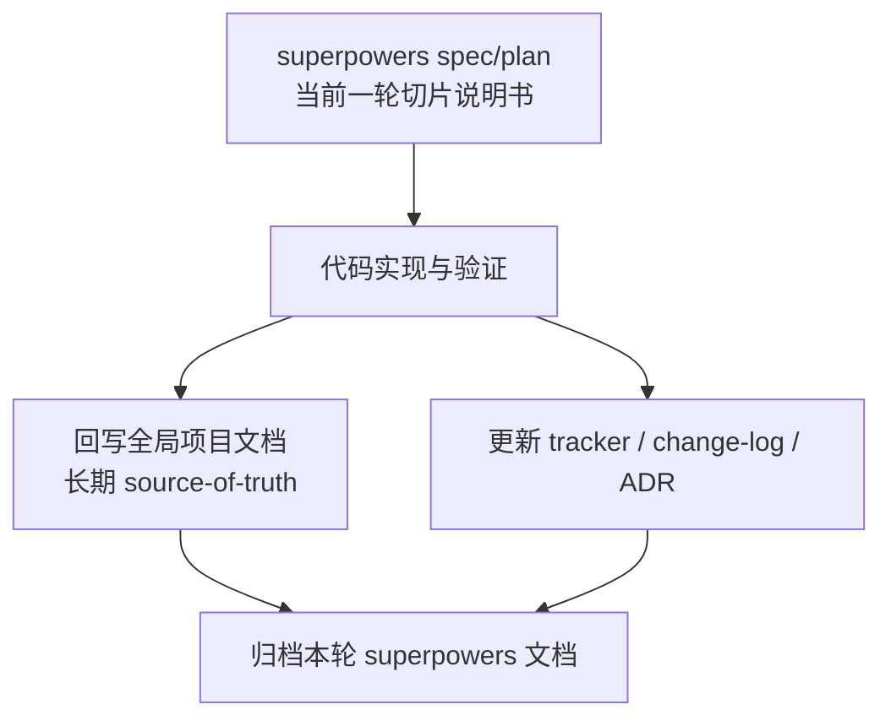
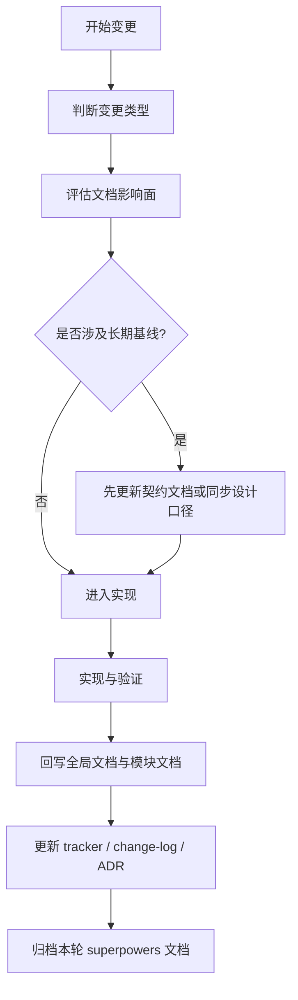

# EmbedAgent 文档治理基线与代码-文档同步工作流设计

## 1. 背景与目标

当前仓库的文档体系存在四类核心问题：

- 文档未按层级和模块维护，项目级架构、当前切片说明、历史材料、操作手册混放在同一层。
- 文档与代码的对应关系不稳定，部分活动文档仍保留旧术语、旧边界或与当前代码不一致的描述。
- 文档格式和表达不统一，缺少固定章节、统一术语表、统一图表规范，阅读和维护成本高。
- 缺少“代码与文档同步开发”的标准流程，导致实现完成后全局文档更新依赖人工记忆，容易遗漏。

本轮设计的目标不是一次性重写全部 `docs/`，而是先建立一套稳定的治理基线，使后续文档优化可以分批推进且不再反复失序。

本轮设计要达成的结果是：

- 明确 `superpowers -> 全局项目文档 -> archive` 的三层文档模型。
- 明确全局 source-of-truth 文档、模块文档、流程文档、参考文档、ADR、归档文档的职责边界。
- 统一文档写作格式、术语规则、图表规则和代码映射规则。
- 建立代码与文档同步开发的标准工作流，并与现有 `superpowers` 技能体系兼容。
- 规划当前仓库的模块化文档补齐清单和分批治理路线图。

## 2. 设计边界与非目标

### 2.1 设计边界

本设计覆盖：

- `README.md`、`AGENTS.md` 与 `docs/` 目录下活动文档的信息架构和维护方式。
- 文档分层、格式、模板、术语、图表和代码映射标准。
- 代码变更到文档更新的同步工作流。
- 与 `superpowers` 工作流文档之间的协作边界。
- 当前仓库后续文档治理的分批实施顺序。

### 2.2 非目标

本设计不覆盖：

- 一次性重写全部历史文档。
- 重新定义产品架构本身。
- 替代 `superpowers` 的设计、计划、TDD、调试或验证流程。
- 引入外部在线文档平台、SaaS 协作系统或复杂文档生成系统。

## 3. 核心设计结论

本轮设计的核心结论如下：

1. 仓库文档分为三层：`superpowers` 过程文档、全局项目文档、归档文档。
2. `superpowers` 文档用于服务“当前一轮切片”的设计和实施，不作为长期架构真相。
3. 全局项目文档是长期 source-of-truth，必须在实现完成后回写同步。
4. `archive` 只保留历史留痕，不承担当前官方口径。
5. 新开发和重要维护默认继续使用 `superpowers`，本仓库只补充文档治理基线和桥接流程。

下面的图描述三层文档模型：



## 4. 文档体系分层模型

### 4.1 三层模型

#### A. `superpowers` 过程文档

位置：

- `docs/superpowers/specs/`
- `docs/superpowers/plans/`

职责：

- 记录当前一轮切片的设计、约束、计划、实施范围和验收条件。
- 服务设计讨论、实现执行、阶段 review。
- 更接近“当前切片说明书”，而不是全局架构基线。

要求：

- 每轮切片完成后，必须把纳入长期基线的内容回写到全局项目文档。
- 切片关闭后归档到 `docs/archive/<topic>/`。

#### B. 全局项目文档

位置：

- `README.md`
- `AGENTS.md`
- `docs/` 下的活动官方文档
- 新增的 `docs/modules/`、`docs/workflows/`、`docs/references/`、`docs/templates/`

职责：

- 记录当前官方口径、正式术语、正式边界、模块职责、长期工作流和维护规则。
- 为开发者、审阅者和未来 agent 提供长期有效的真相源。

要求：

- 不存放已废弃方案的主体内容。
- 对外描述一律采用当前生效口径。

#### C. 归档文档

位置：

- `docs/archive/`

职责：

- 保留已完成切片的设计、计划、分析、实现说明、review 结论与问题复盘。
- 作为历史参考材料存在。

要求：

- 活动文档不得依赖 archive 作为当前真相。
- archive 内文档需要索引 README，但不参与当前官方契约定义。

### 4.2 根目录活动文档的职责

以下文档继续保留为全局 source-of-truth，路径不变：

- `README.md`
- `AGENTS.md`
- `docs/overall-solution-architecture.md`
- `docs/implementation-roadmap.md`
- `docs/development-tracker.md`
- `docs/design-change-log.md`
- `docs/mode-schema.md`
- `docs/tool-contracts.md`
- `docs/permission-model.md`
- `docs/frontend-protocol.md`
- `docs/agent-harness-v2.md`

这些文档负责项目级长期真相，不应被当前切片文档替代。

## 5. 目标信息架构

在不破坏现有官方入口路径的前提下，`docs/` 的目标结构如下：

```text
docs/
  README.md
  documentation-governance.md
  documentation-style-guide.md

  overall-solution-architecture.md
  implementation-roadmap.md
  development-tracker.md
  design-change-log.md
  mode-schema.md
  tool-contracts.md
  permission-model.md
  frontend-protocol.md
  agent-harness-v2.md

  modules/
    README.md
    agent-core.md
    session-runtime.md
    harness.md
    tools-and-tooling.md
    permissions-and-context.md
    protocol-and-core.md
    frontend-tui.md
    frontend-gui.md
    packaging-and-deployment.md

  workflows/
    README.md
    code-doc-sync.md
    architecture-change-process.md
    release-doc-checklist.md

  references/
    glossary.md
    code-doc-matrix.md
    diagrams-conventions.md

  templates/
    architecture-doc-template.md
    module-doc-template.md
    workflow-doc-template.md
    adr-template.md
    change-entry-template.md

  adrs/
  archive/
```

设计原则：

- 根目录保留产品级官方契约与主入口文档。
- `modules/` 承担模块级说明，不再把模块设计散落在根目录多篇主题文档里。
- `workflows/` 承担开发、回写、发布、归档等执行流程说明。
- `references/` 承担术语、图表约定、代码-文档矩阵。
- `templates/` 承担可复用模板，不与正式规范文档混写。
- 根目录治理文档只定义规则；具体执行步骤统一放入 `workflows/`。

## 6. 文档分类与职责

### 6.1 文档类型

本仓库活动文档统一分为以下类型：

- `architecture`
  - 项目级架构边界、系统主链路、官方模型。
- `module`
  - 具体模块职责、入口、边界、数据流、测试入口。
- `workflow`
  - 开发、同步、发布、归档等可执行流程。
- `guide`
  - 操作指南、部署说明、配置说明、验证步骤。
- `reference`
  - 术语表、图表规范、代码-文档对应矩阵。
- `adr`
  - 长期有效的重要决策记录。
- `tracker`
  - 当前阶段进度、风险、近期任务。
- `changelog`
  - 已完成设计变更的留痕。

### 6.2 文档职责边界

- `architecture` 说明“官方模型是什么”。
- `module` 说明“某个代码域当前如何工作”。
- `workflow` 说明“团队怎样做事”。
- `guide` 说明“如何操作或验证”。
- `reference` 提供共享语言和引用材料。
- `superpowers` 文档说明“当前切片准备怎么改”。
- `archive` 文档说明“过去某轮是怎么改的”。

## 7. 统一写作标准

### 7.1 语言与术语

- 采用中文主叙述。
- 代码标识、路径、类名、函数名、协议字段名、模式名、工具名保留英文原文，并使用反引号。
- 活动文档不得把已废弃术语当作正式术语使用，例如 `code`、`todos`、`manage_todos`。
- 历史术语只允许出现在“历史说明”或“兼容说明”章节。

### 7.2 文档元信息

所有活动文档都应在前部显式提供元信息块，最少包含：

- `状态`：`draft` / `active` / `superseded` / `archived`
- `类型`
- `负责人`
- `最后同步日期`
- `对应代码范围`

### 7.3 固定章节

`architecture`、`module`、`workflow` 三类文档统一要求包含以下章节骨架：

1. 目的与范围
2. 适用对象
3. 官方结论 / 当前规则
4. 代码对应关系
5. 关键流程或数据流
6. 验证与回归入口
7. 变更触发条件
8. 相关文档

说明：

- 章节可以扩展，但不应缺少以上骨架。
- `guide`、`reference`、`adr`、`tracker` 可以采用更适合自身的结构，但仍需要职责清晰。

## 8. 代码映射与图表标准

### 8.1 代码映射要求

每篇 `module` 文档必须包含一个稳定的“代码对应关系”块，至少写清：

- 模块职责
- 代码目录
- 入口文件
- 核心对象
- 上游依赖
- 下游影响
- 相关测试
- 相关全局契约文档

标准样式如下：

```md
## 代码对应关系

- 目录：`src/embedagent/harness/`
- 入口文件：`src/embedagent/harness/runner.py`
- 核心对象：`HarnessRunner`、`TaskGraph`、`PhaseEngine`
- 上游依赖：`QueryEngine`、`modes.py`
- 下游影响：`task_status`、session snapshot、frontend runtime 面板
- 测试入口：`tests/...`
- 相关契约：`docs/mode-schema.md`、`docs/tool-contracts.md`
```

### 8.2 图表标准

优先采用 Markdown 内嵌 Mermaid，以适应离线仓库维护场景。

强制补图的场景：

- 架构总览文档：至少 1 张系统分层或主链路图。
- 模块文档：只要存在 3 个以上关键组件交互，就至少 1 张组件图或时序图。
- 工作流文档：至少 1 张流程图。
- 协议或事件流文档：至少 1 张请求/事件流图。
- 会话、任务、权限、上下文等状态型主题：至少 1 张状态图或时序图。

推荐图表类型：

- 分层/模块关系：`flowchart`
- 交互链路：`sequenceDiagram`
- 状态迁移：`stateDiagram-v2`

## 9. 与 `superpowers` 的协作模型

### 9.1 协作原则

本仓库不再另起一套与 `superpowers` 平行的开发流程，而是采用“`superpowers` 承担当前切片，项目文档承接长期真相”的协作模型。

具体规则如下：

- 新开发和重要维护默认继续使用 `superpowers`。
- `superpowers` 产出的 spec/plan 属于本轮切片说明书。
- 实现完成后，纳入长期基线的内容必须同步回写到全局项目文档和模块文档。
- 当前切片关闭后，`superpowers` 文档归档到 `docs/archive/`。

### 9.2 与现有 `superpowers` skills 的边界

`superpowers` 已负责的能力包括：

- `brainstorming`
- `writing-plans`
- `test-driven-development`
- `systematic-debugging`
- `verification-before-completion`
- `requesting-code-review`
- `executing-plans`
- `subagent-driven-development`

本仓库新增的文档治理能力不得替代上述通用流程，而只补充“本仓库特有的文档同步与治理规则”。

### 9.3 推荐桥接型 skill

为避免与 `superpowers` 冲突，仓库侧只建议定义两类桥接 skill：

- `embedagent-doc-impact`
  - 在切片开始或重大改动开始时判断文档影响面。
- `embedagent-doc-sync`
  - 在收尾时根据本轮 `superpowers` 文档、实际代码改动和全局文档做回写同步检查。

这两个 skill 只做桥接，不复制官方术语、设计流程、TDD 或验证规则。

## 10. 代码与文档同步工作流

本仓库采用 `doc-impact-first` 工作流。

### 10.1 触发条件

以下任一情况出现，就必须执行文档同步流程：

- 修改了官方术语、模式、工具、权限、协议、会话模型、任务模型。
- 修改了 `src/embedagent/` 下任一模块的职责边界、核心数据流或对外接口。
- 新增或删除用户可见能力、命令、工作流、打包方式、部署方式。
- 修改了测试/验证入口，导致现有文档中的验证步骤失效。
- 新增一个中长期保留的模块、子系统或目录。

以下情况可以采用轻量路径：

- 纯拼写、格式、注释修正。
- 不改变职责和契约的局部重构。
- 不影响使用方式的测试补充。

### 10.2 标准流程



标准流程分为 7 步：

1. 变更分类
2. 文档影响评估
3. 先改契约，再改实现（适用于架构/协议类变化）
4. 代码与文档同步提交
5. 代码与文档双重验证
6. 更新 `development-tracker` / `design-change-log` / 必要时 `ADR`
7. 归档当前切片 `superpowers` 文档

### 10.3 收尾门禁

在声称一轮工作完成之前，必须额外检查：

- 是否有受影响的 source-of-truth 文档未更新。
- 是否引入了旧术语回流。
- 新模块是否缺少模块文档。
- 架构或长期决策变更是否需要 `ADR`。
- 活动文档是否错误引用 archive 作为当前真相。
- 图表、代码路径、测试入口是否仍与当前代码一致。

## 11. 当前仓库的模块化文档清单

建议新增以下模块文档：

- `docs/modules/agent-core.md`
- `docs/modules/session-runtime.md`
- `docs/modules/harness.md`
- `docs/modules/tools-and-tooling.md`
- `docs/modules/permissions-and-context.md`
- `docs/modules/protocol-and-core.md`
- `docs/modules/frontend-tui.md`
- `docs/modules/frontend-gui.md`
- `docs/modules/packaging-and-deployment.md`

对应关系如下：

| 模块文档 | 主要代码范围 |
|---|---|
| `agent-core.md` | `query_engine.py`、`inprocess_adapter.py`、`session_runtime.py` |
| `session-runtime.md` | `session.py`、`session_history.py`、`session_projector.py`、`transcript_store.py` |
| `harness.md` | `src/embedagent/harness/` |
| `tools-and-tooling.md` | `src/embedagent/tools/`、`src/embedagent/tooling/` |
| `permissions-and-context.md` | `permissions.py`、`context.py`、`workspace_intelligence.py` |
| `protocol-and-core.md` | `src/embedagent/protocol/`、`src/embedagent/core/` |
| `frontend-tui.md` | `src/embedagent/frontend/tui/` |
| `frontend-gui.md` | `src/embedagent/frontend/gui/` |
| `packaging-and-deployment.md` | 打包、离线交付、Win7 验证、内网部署相关脚本与文档 |

## 12. 当前文档的迁移与归位策略

### 12.1 保留并补强的全局文档

以下文档保留在根目录活动入口，并按新规范补强：

- `README.md`
- `AGENTS.md`
- `docs/overall-solution-architecture.md`
- `docs/implementation-roadmap.md`
- `docs/development-tracker.md`
- `docs/design-change-log.md`
- `docs/mode-schema.md`
- `docs/tool-contracts.md`
- `docs/permission-model.md`
- `docs/frontend-protocol.md`
- `docs/agent-harness-v2.md`

### 12.2 下沉或合并为模块/主题文档

以下文档应逐步下沉到 `modules/` 或新的主题入口中：

- `docs/offline-packaging.md`
- `docs/offline-packaging-guide.md`
- `docs/gui-packaging.md`
- `docs/intranet-deployment.md`
- `docs/win7-preflight-checklist.md`
- `docs/win7-gui-validation.md`
- `docs/configuration-guide.md`
- `docs/llm-adapter.md`

### 12.3 评估后归档或仅保留参考价值

以下文档与当前正式架构存在重叠、阶段性或 superseded 特征，应在内容回收后归档：

- `docs/architecture-new.md`
- `docs/context-management-design.md`
- `docs/query-context-redesign.md`
- `docs/tool-design-spec.md`
- `docs/clang-integration-plan.md`
- `docs/harness-state-machine.md`
- `docs/phase6-validation.md`
- `docs/tui-information-architecture.md`
- `docs/context-management-research.md`
- `docs/DOCUMENTATION_ALIGNMENT_REPORT.md`

## 13. 分批治理路线图

为避免一次性重排整个仓库，治理工作分四批进行。

### 第 1 批：建立治理基线

新增并完成首轮落地：

- `docs/README.md`
- `docs/documentation-governance.md`
- `docs/documentation-style-guide.md`
- `docs/workflows/README.md`
- `docs/workflows/code-doc-sync.md`
- `docs/workflows/architecture-change-process.md`
- `docs/workflows/release-doc-checklist.md`
- `docs/references/glossary.md`
- `docs/references/code-doc-matrix.md`
- `docs/references/diagrams-conventions.md`
- `docs/templates/architecture-doc-template.md`
- `docs/templates/module-doc-template.md`
- `docs/templates/workflow-doc-template.md`
- `docs/templates/adr-template.md`
- `docs/templates/change-entry-template.md`

同时轻量修订：

- `README.md`
- `AGENTS.md`

目标：

- 先把治理规则、模板、总入口和同步流程立住。

### 第 2 批：核心架构模块文档

优先完成：

- `agent-core.md`
- `session-runtime.md`
- `harness.md`
- `tools-and-tooling.md`
- `permissions-and-context.md`

目标：

- 把系统核心主链路从“散落的主题文档”收敛为“模块文档 + 全局架构摘要”。

### 第 3 批：协议、前端与交付文档

优先完成：

- `protocol-and-core.md`
- `frontend-tui.md`
- `frontend-gui.md`
- `packaging-and-deployment.md`

目标：

- 收敛 GUI、TUI、打包、验证、部署等多文档并行叙述。

### 第 4 批：历史清理与归档

执行内容：

- 回收 superseded 文档中的仍有效内容。
- 为 archive 主题目录补 README 索引。
- 把不再属于活动入口的文档迁入 `docs/archive/`。

目标：

- 形成“活动文档最小集 + archive 清晰留痕”的稳定状态。

## 14. 验收标准

本轮文档治理基线设计落地后，应满足以下验收条件：

- 仓库存在明确的文档治理总则、格式规范、同步工作流、术语表、代码-文档矩阵和模板目录。
- `superpowers -> 全局文档 -> archive` 三层模型被正式写入仓库文档。
- 活动文档不再混淆“当前切片说明书”和“长期项目真相”。
- 至少建立第一批模块文档入口和治理入口。
- 后续每轮切片都能通过固定流程完成“设计、实现、回写、归档”闭环。

## 15. 设计决策摘要

本设计推荐采用“保留现有官方入口路径 + 建立分层治理骨架 + 渐进迁移”的方案，而不是一次性全量重排 `docs/`。

原因如下：

- 与现有 `AGENTS.md` 中已声明的官方文档入口兼容。
- 不会破坏当前链接、引用和团队已有使用习惯。
- 可以把重构风险拆解到多批次治理中逐步完成。
- 能充分复用 `superpowers`，避免重复建设流程型能力。

## 16. 后续实施建议

本设计获批后，下一步实施顺序建议是：

1. 先落地治理基线文档、模板和参考索引。
2. 再补齐模块文档与代码-文档矩阵。
3. 同步修订根目录全局文档入口。
4. 最后做历史清理和 archive 收口。
