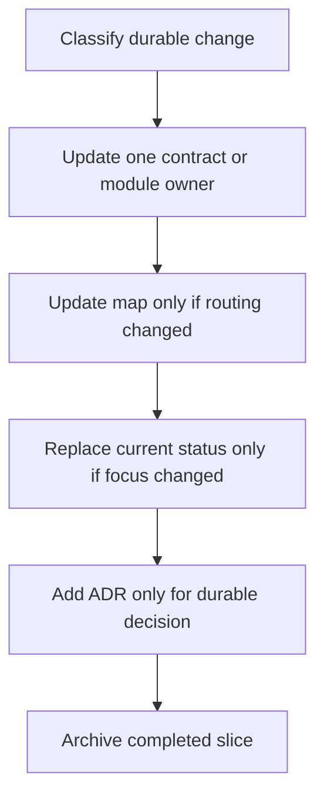

# Documentation Navigation System Implementation Plan

> **For agentic workers:** REQUIRED SUB-SKILL: Use superpowers:subagent-driven-development (recommended) or superpowers:executing-plans to implement this plan task-by-task. Steps use checkbox (`- [ ]`) syntax for tracking.

**Goal:** Replace the active documentation history dump with a compact, tested navigation map that routes agents to one authoritative document per concern.

**Architecture:** Preserve historical material in indexed archive packages, then rebuild the active layer as five progressively disclosed tiers: entry, map, authority, current work, and history. Add focused Python 3.8 documentation contract tests so removed ledgers, stale active slices, broken routing, and default-context growth cannot silently return.

**Tech Stack:** Markdown, Python 3.8 standard library, pytest, ripgrep, Git.

---

## Scope Boundary

This plan implements the approved design in
`docs/superpowers/specs/2026-08-01-documentation-navigation-system-design.md`.

It changes documentation structure and documentation guard tests only. It does
not change runtime code, GUI assets, package ownership, supported APIs, release
scripts, or acceptance criteria. The Windows 7, offline bundle, Python 3.8, and
default C/C++ workflow constraints remain unchanged.

The work is one coherent slice. The archive moves make the compact active map
possible; the tests protect that same boundary. Splitting them would leave
either an unguarded rewrite or a guard with no valid target structure.

## Target File Map

### Create

- `docs/current-status.md`: replace-in-place current focus, blockers, next actions, and evidence scope.
- `docs/superpowers/README.md`: exact index of active slice specs and plans.
- `docs/archive/documentation-history/README.md`: index for frozen tracker, change-log, roadmap, debt-audit, and blueprint history.
- `docs/archive/test-feedback-and-ci/README.md`: index for completed CI alignment and TDD feedback slices.
- `docs/archive/documentation-navigation-system/README.md`: closeout index for this design and plan.
- `tests/test_documentation_navigation.py`: active-map, context-budget, archive-boundary, and active-slice guards.

### Rewrite In Place

- `README.md`: compact product entry point and quick command surface.
- `AGENTS.md`: compact agent constitution and task-based read routing.
- `docs/README.md`: single intent-based documentation map.
- `docs/overall-solution-architecture.md`: cross-distribution topology and cross-layer invariants only.
- `docs/implementation-roadmap.md`: open programs, order, and exit criteria only.
- `docs/pi-inspired-agent-core-blueprint.md`: durable direction without completed Phase A-N chronology.
- `docs/documentation-governance.md`: one-owner update model and active/history boundary.
- `docs/documentation-style-guide.md`: progressive disclosure, budgets, and no-ledger rules.
- `docs/workflows/code-doc-sync.md`: update-the-owner workflow.
- `docs/workflows/architecture-change-process.md`: ADR/current-status/archive closure rules.
- `docs/workflows/release-doc-checklist.md`: map, current-status, and archive checks.
- `docs/references/code-doc-matrix.md`: detailed task-to-authority routing consistent with `docs/README.md`.
- `docs/archive/README.md`: new archive package entries.
- affected archive package READMEs and active guide/module references.

### Move To Archive

- `docs/development-tracker.md` -> `docs/archive/documentation-history/development-tracker-2026-08-01.md`
- `docs/design-change-log.md` -> `docs/archive/documentation-history/design-change-log-2026-08-01.md`
- current `docs/implementation-roadmap.md` -> `docs/archive/documentation-history/implementation-roadmap-2026-08-01.md`
- `docs/pre-release-architecture-debt-audit.md` -> `docs/archive/pre-release-debt-cleanup/2026-06-25-pre-release-architecture-debt-audit.md`
- current `docs/pi-inspired-agent-core-blueprint.md` -> `docs/archive/documentation-history/pi-inspired-agent-core-blueprint-2026-08-01.md`
- `docs/guides/t3-gui-parity-ledger.md` -> `docs/archive/t3-gui-parity-shell/2026-07-18-t3-gui-parity-ledger.md`
- completed Phase 7C and minimal Agent Core specs/plans -> `docs/archive/agent-core-program/`
- completed TDD feedback and CI alignment specs/plans -> `docs/archive/test-feedback-and-ci/`
- this design and plan -> `docs/archive/documentation-navigation-system/` during final closeout.

The Phase 7B Win7 handoff remains active while `acceptance_status=PENDING_WIN7`.
The cross-platform frontend CI spec/plan remains active unless read-only GitHub
evidence confirms all required Linux and Windows matrix results succeeded.

## Task 1: Establish The Current-Work And History Boundary

**Files:**

- Create: `tests/test_documentation_navigation.py`
- Create: `docs/current-status.md`
- Create: `docs/superpowers/README.md`
- Create: `docs/archive/documentation-history/README.md`
- Create: `docs/archive/test-feedback-and-ci/README.md`
- Move: the tracker, change log, old roadmap, and completed slice documents listed in the target file map
- Modify: `docs/archive/README.md`
- Modify: `docs/archive/agent-core-program/README.md`

- [ ] **Step 1: Check external CI evidence without changing repository state**

Run:

```powershell
gh run list --branch main --workflow CI --limit 3 --json databaseId,headSha,status,conclusion,createdAt
$frontendCiRun = gh run list --branch main --workflow CI --limit 1 --json databaseId --jq '.[0].databaseId'
```

If a completed run contains commit `6a2a0a4f` or a descendant, inspect it:

```powershell
gh run view $frontendCiRun --json jobs --jq '.jobs[] | [.name, .conclusion] | @tsv'
```

Expected decision:

- keep the 2026-08-01 cross-platform frontend CI documents active unless both
  Linux and Windows frontend matrix jobs and all pre-existing required jobs are
  confirmed successful;
- if the command is unavailable, unauthenticated, or inconclusive, keep the
  documents active and record no completion claim.

- [ ] **Step 2: Write the failing history-boundary tests**

Create `tests/test_documentation_navigation.py` with this initial content:

```python
from __future__ import unicode_literals

import re
from pathlib import Path


ROOT = Path(__file__).resolve().parents[1]

ACTIVE_LEDGER_PATHS = (
    "docs/development-tracker.md",
    "docs/design-change-log.md",
)

HISTORY_SNAPSHOTS = (
    "docs/archive/documentation-history/development-tracker-2026-08-01.md",
    "docs/archive/documentation-history/design-change-log-2026-08-01.md",
    "docs/archive/documentation-history/implementation-roadmap-2026-08-01.md",
)


def _read(relative_path):
    return (ROOT / relative_path).read_text(encoding="utf-8")


def _active_superpowers_files():
    files = set()
    for relative_root in ("docs/superpowers/specs", "docs/superpowers/plans"):
        root = ROOT / relative_root
        for path in root.glob("*.md"):
            files.add(path.relative_to(ROOT).as_posix())
    return files


def _indexed_superpowers_files():
    text = _read("docs/superpowers/README.md")
    return set(
        re.findall(r"`(docs/superpowers/(?:specs|plans)/[^`]+[.]md)`", text)
    )


def test_historical_progress_ledgers_are_archived():
    for relative_path in ACTIVE_LEDGER_PATHS:
        assert not (ROOT / relative_path).exists()
    for relative_path in HISTORY_SNAPSHOTS:
        assert (ROOT / relative_path).is_file()


def test_active_superpowers_index_matches_active_slice_files():
    assert (ROOT / "docs/superpowers/README.md").is_file()
    assert _indexed_superpowers_files() == _active_superpowers_files()


def test_current_work_docs_do_not_contain_completion_ledgers():
    for relative_path in (
        "docs/current-status.md",
        "docs/implementation-roadmap.md",
    ):
        text = _read(relative_path)
        forbidden_headings = re.findall(
            r"(?mi)^#{2,3}[^\n]*(?:completion|completed|closeout|已完成|已收口)[^\n]*$",
            text,
        )
        assert forbidden_headings == []
```

- [ ] **Step 3: Run the focused test and verify the active history fails it**

Run:

```powershell
uv run python scripts/test-suite.py tdd tests/test_documentation_navigation.py
```

Expected: FAIL because the two active ledgers still exist, the archive snapshots
and current-status file do not exist, and `docs/superpowers/README.md` is absent.

- [ ] **Step 4: Move frozen history and completed slice material**

Run these moves from the repository root:

```powershell
New-Item -ItemType Directory -Force -Path docs/archive/documentation-history
New-Item -ItemType Directory -Force -Path docs/archive/test-feedback-and-ci
git mv docs/development-tracker.md docs/archive/documentation-history/development-tracker-2026-08-01.md
git mv docs/design-change-log.md docs/archive/documentation-history/design-change-log-2026-08-01.md
git mv docs/implementation-roadmap.md docs/archive/documentation-history/implementation-roadmap-2026-08-01.md
git mv docs/superpowers/specs/2026-07-26-phase7c-architecture-convergence-design.md docs/archive/agent-core-program/
git mv docs/superpowers/plans/2026-07-26-phase7c-architecture-convergence.md docs/archive/agent-core-program/
git mv docs/superpowers/specs/2026-07-27-minimal-agent-core-convergence-design.md docs/archive/agent-core-program/
git mv docs/superpowers/plans/2026-07-27-minimal-agent-core-convergence.md docs/archive/agent-core-program/
git mv docs/superpowers/specs/2026-07-30-tdd-test-feedback-design.md docs/archive/test-feedback-and-ci/
git mv docs/superpowers/plans/2026-07-30-tdd-test-feedback-foundation.md docs/archive/test-feedback-and-ci/
git mv docs/superpowers/plans/2026-07-20-ci-platform-alignment.md docs/archive/test-feedback-and-ci/
```

Expected: the source files disappear from the active layer and retain their
contents at the listed archive paths. Do not move the Phase 7B handoff or the
cross-platform frontend CI documents in this step.

- [ ] **Step 5: Create the concise roadmap and current status**

Create `docs/implementation-roadmap.md` with these sections and no completed
phase inventory:

```markdown
# Implementation Roadmap

> 状态：`active`
> 类型：`roadmap`
> 负责人：`project maintainers`
> 最后同步日期：`2026-08-01`
> 详细当前状态：`docs/current-status.md`

## Purpose
Only open programs, ordering constraints, and exit criteria belong here.

## P0: Release Acceptance
- clean Windows 7 SP1 x64 windowed GUI smoke;
- bundled Fixed Version WebView2 109 and bundle-local C smoke;
- hash-bound evidence validation;
- exit only when `validate-release-evidence.py` reports `ACCEPTED`.

## P1: Real C/C++ Project Validation
- representative C and C++ workspaces;
- recipe discovery, Clang diagnostics, build/test, permission, resume, and offline flows;
- define evidence and exit criteria before claiming Phase 8 completion.

## P2: Test And CI Follow-Up
- close only evidence-backed active CI slices;
- decompose large test assets and add owner-based slices after the current fixed partitions remain stable.

## Later: Optional Enterprise/Intranet Adapters
- providers, workflow packages, extensions, or passive telemetry sinks only;
- never a dependency of Agent Core or default offline operation.

## Sequencing Rules
- preserve Python 3.8, Windows 7, offline, and six-distribution boundaries;
- do not reopen retired compatibility paths;
- keep archive history out of current sequencing.
```

Create `docs/current-status.md` with replace-in-place status:

```markdown
# Current Status

> 状态：`active`
> 类型：`status`
> 负责人：`project maintainers`
> 最后验证日期：`2026-08-01`

## Release State
Repository-side release state is `TARGET_READY` with
`acceptance_status=PENDING_WIN7` and `publishable=false`.

## Current Focus
- complete the documentation navigation cleanup;
- retain the Phase 7B target-machine handoff until real Win7 evidence exists;
- retain cross-platform frontend CI as active until hosted matrix evidence is confirmed.

## Blockers
- clean Windows 7 SP1 x64 / WebView2 109 windowed evidence is external;
- Phase 8 real C/C++ project validation has not started.

## Next Actions
1. finish the active documentation navigation slice and archive its working materials;
2. obtain and validate the Win7 evidence report;
3. define the Phase 8 project corpus and evidence format.

## Evidence Boundary
Local tests and bundle smoke do not prove clean Windows 7 acceptance. Hosted
Windows CI does not replace Win7/WebView2 bundle evidence.
```

Adjust `Current Focus` after the external CI check: remove the third bullet only
when Step 1 produced conclusive successful evidence and the CI spec/plan is
archived in this task.

- [ ] **Step 6: Create active and archive indexes**

Create `docs/superpowers/README.md` with one exact backtick path per remaining
active file:

```markdown
# Active Slice Index

Only work that still has an open acceptance condition belongs here. These
documents are temporary execution context, not project-wide architecture truth.

## External Release Acceptance
- `docs/superpowers/plans/2026-07-19-phase7b-win7-handoff.md`

## Cross-Platform Frontend CI
- `docs/superpowers/specs/2026-08-01-cross-platform-frontend-ci-design.md`
- `docs/superpowers/plans/2026-08-01-cross-platform-frontend-ci.md`

## Documentation Navigation Cleanup
- `docs/superpowers/specs/2026-08-01-documentation-navigation-system-design.md`
- `docs/superpowers/plans/2026-08-01-documentation-navigation-system.md`

## Closure Rule
Synchronize durable conclusions into the active authority layer, then move the
completed spec and plan into an indexed `docs/archive/<topic>/` package.
```

If Step 1 conclusively closes cross-platform CI, omit that section and move its
two files into `docs/archive/test-feedback-and-ci/` before running the test.

Create `docs/archive/documentation-history/README.md` and
`docs/archive/test-feedback-and-ci/README.md`. Each index must state that the
package is historical, name every file in the package, and route current truth
to `docs/README.md`, `docs/current-status.md`, and the relevant module or
workflow documents. Update `docs/archive/README.md` and
`docs/archive/agent-core-program/README.md` with the newly moved materials.

- [ ] **Step 7: Run the history-boundary test**

Run:

```powershell
uv run python scripts/test-suite.py tdd tests/test_documentation_navigation.py
```

Expected: PASS for all three initial tests.

- [ ] **Step 8: Commit the current/history boundary**

```powershell
git add docs tests/test_documentation_navigation.py
git commit -m "docs: separate current guidance from history"
```

## Task 2: Rebuild The Entry And Map Layer

**Files:**

- Modify: `tests/test_documentation_navigation.py`
- Modify: `tests/test_pre_release_architecture_guards.py`
- Modify: `README.md`
- Modify: `AGENTS.md`
- Modify: `docs/README.md`
- Modify: `docs/references/code-doc-matrix.md`

- [ ] **Step 1: Add failing context-budget and routing tests**

Append these definitions and tests to `tests/test_documentation_navigation.py`:

```python
DEFAULT_CONTEXT_BUDGETS = {
    "README.md": 1500,
    "AGENTS.md": 2500,
    "docs/README.md": 1000,
}

REQUIRED_MAP_TARGETS = (
    "docs/overall-solution-architecture.md",
    "docs/implementation-roadmap.md",
    "docs/current-status.md",
    "docs/modules/agent-core.md",
    "docs/modules/session-runtime.md",
    "docs/modules/harness.md",
    "docs/modules/tools-and-tooling.md",
    "docs/modules/permissions-and-context.md",
    "docs/modules/protocol-and-core.md",
    "docs/modules/frontend-gui.md",
    "docs/modules/frontend-tui.md",
    "docs/modules/packaging-and-deployment.md",
    "docs/tool-contracts.md",
    "docs/permission-model.md",
    "docs/frontend-protocol.md",
    "docs/guides/win7-release-runbook.md",
    "docs/workflows/code-doc-sync.md",
    "docs/adrs/README.md",
    "docs/archive/README.md",
)


def _word_count(text):
    return len(re.findall(r"\S+", text))


def test_default_loaded_documents_stay_within_context_budgets():
    for relative_path, maximum in DEFAULT_CONTEXT_BUDGETS.items():
        assert _word_count(_read(relative_path)) <= maximum, relative_path


def test_documentation_map_routes_to_existing_authorities():
    map_text = _read("docs/README.md")
    for relative_path in REQUIRED_MAP_TARGETS:
        assert relative_path in map_text
        assert (ROOT / relative_path).is_file()


def test_agent_constitution_keeps_non_negotiable_constraints_reachable():
    text = _read("AGENTS.md")
    for token in (
        "Windows 7",
        ">=3.8,<3.9",
        "offline",
        "C/C++",
        "embedagent-core",
        "embedagent-protocol",
        "embedagent-host",
        "embedagent-composition",
        "embedagent-workflow-cpp",
        "docs/README.md",
    ):
        assert token in text
```

- [ ] **Step 2: Run the focused tests and verify the old entry documents exceed budgets**

Run:

```powershell
uv run python scripts/test-suite.py tdd tests/test_documentation_navigation.py
```

Expected: FAIL on `README.md` and `AGENTS.md` budgets and on missing intent-map
targets in `docs/README.md`.

- [ ] **Step 3: Rewrite `README.md` as the compact repository entry**

Replace the file with these sections in this order:

1. `# EmbedAgent`: one paragraph stating native, offline-first Agent IDE core,
   default C/C++ workflow, Windows 7, Python 3.8, and offline bundle promises.
2. `## Architecture At A Glance`: one six-row distribution ownership table and
   one dependency-direction diagram; no source-file inventory.
3. `## Quick Commands`: the exact install, TDD, pre-push, full, release,
   performance, audit, lint, distribution, and package commands from the
   approved `AGENTS.md` quick-command block.
4. `## Documentation Map`: task-oriented links to `docs/README.md`, current
   status, roadmap, architecture, configuration, and release runbook.
5. `## Release Evidence`: state `TARGET_READY`, `PENDING_WIN7`,
   `publishable=false`, and the real Win7 evidence requirement without listing
   completed phases.
6. `## Scope`: concise exclusions for cloud service, marketplace, Docker/WSL,
   and runtime Node dependencies.

Do not retain `Main Components`, `Status`, `Recent focused verification`, or
component-level GUI controller bullet lists.

- [ ] **Step 4: Rewrite `AGENTS.md` as the compact agent constitution**

Use this exact responsibility outline:

1. `Purpose`: identify the file as always-loaded rules, not architecture detail.
2. `Quick Commands`: preserve the current exact commands.
3. `Hard Constraints`: Python 3.8 syntax, Windows 7, offline bundle, dependency,
   secret, test-location, and no-Docker/WSL/VS Code/runtime-Node rules.
4. `Read Routing`: always read `README.md` and `docs/README.md`; then route
   architecture, Core/session, workflow/tools, frontend, packaging, and current
   work to one authority each.
5. `Distribution Ownership`: one six-row table plus the dependency direction
   and the no-Host-to-product rule.
6. `Architecture Invariants`: concise bullets for Agent/AgentSession,
   journal/reducer/kernel/loop, HostedSessionController, extension manager,
   session event envelope, transcript truth, permission/path policy separation,
   and generic workflow projection.
7. `Official Vocabulary`: modes, task truth, tool families, retired paths, and
   no compatibility-alias rule.
8. `Delivery And Verification Gates`: architecture, full Python, lint, webapp,
   distribution, and target Win7 evidence commands.
9. `Documentation Rules`: update one owner, replace current status, archive
   completed slices, and never require archive reading for implementation.

Retain every enforceable prohibition, but route detailed GUI controller,
read-model, hook reducer, compaction, recovery, and turn-experience mechanics to
their module or contract authorities instead of repeating them.

- [ ] **Step 5: Rewrite `docs/README.md` as the only global map**

Use intent rows with these columns:

```markdown
| I need to... | Read first | Then read | Do not use as current truth |
```

Cover system topology, Core/session runtime, workflow/tools, permissions,
protocol, GUI/TUI, packaging/Win7, current priorities, durable decisions, and
historical investigation. Include every path in `REQUIRED_MAP_TARGETS`. Add a
short authority rule stating that entry docs route, contract/module docs own
detail, current-work docs replace stale state, ADRs own durable rationale, and
archive owns history.

Update `docs/references/code-doc-matrix.md` to be the detailed code-area table
behind this map. Remove roadmap, tracker, or change-log ownership from rows that
already have a module or contract authority.

- [ ] **Step 6: Update architecture guard expectations for the compact entry layer**

In `tests/test_pre_release_architecture_guards.py`:

- remove `docs/design-change-log.md` and `docs/development-tracker.md` from the
  obsolete `_active_contract_doc_files()` exclusion set because those active
  files no longer exist;
- in `test_active_docs_use_phase7c_paths_and_vocabulary`, stop requiring the
  C/C++ component path in root `README.md` and instead require
  `docs/modules/harness.md` in `docs/README.md`;
- retain component/profile path assertions in the harness module document;
- delete `test_development_tracker_uses_current_c_cpp_workflow_package_paths`;
- in `test_artifact_read_model_invalidation_is_retired`, remove the tracker
  read and assert forbidden artifact-refresh wording only against
  `docs/tool-contracts.md`.

- [ ] **Step 7: Run entry-layer and architecture guards**

Run:

```powershell
uv run python scripts/test-suite.py tdd tests/test_documentation_navigation.py
uv run pytest tests/test_pre_release_architecture_guards.py -q
```

Expected: PASS. `README.md`, `AGENTS.md`, and `docs/README.md` are below their
budgets, and existing phase-7C vocabulary guards still pass.

- [ ] **Step 8: Commit the entry and map layer**

```powershell
git add README.md AGENTS.md docs/README.md docs/references/code-doc-matrix.md tests
git commit -m "docs: turn entry documents into a navigation map"
```

## Task 3: Reduce Architecture Authorities To Current Durable Truth

**Files:**

- Modify: `tests/test_documentation_navigation.py`
- Rewrite: `docs/overall-solution-architecture.md`
- Move and recreate: `docs/pi-inspired-agent-core-blueprint.md`
- Move: `docs/pre-release-architecture-debt-audit.md`
- Move: `docs/guides/t3-gui-parity-ledger.md`
- Modify: `docs/archive/pre-release-debt-cleanup/README.md`
- Modify: `docs/archive/t3-gui-parity-shell/README.md`
- Modify: `docs/archive/documentation-history/README.md`

- [ ] **Step 1: Add failing authority-budget and retired-history tests**

Append to `tests/test_documentation_navigation.py`:

```python
AUTHORITY_BUDGETS = {
    "docs/overall-solution-architecture.md": 3000,
    "docs/implementation-roadmap.md": 1000,
    "docs/current-status.md": 750,
}

RETIRED_ACTIVE_HISTORY = (
    "docs/pre-release-architecture-debt-audit.md",
    "docs/guides/t3-gui-parity-ledger.md",
)


def test_global_authorities_stay_within_context_budgets():
    for relative_path, maximum in AUTHORITY_BUDGETS.items():
        assert _word_count(_read(relative_path)) <= maximum, relative_path


def test_closed_audits_and_parity_ledgers_are_archived():
    for relative_path in RETIRED_ACTIVE_HISTORY:
        assert not (ROOT / relative_path).exists()
    assert (
        ROOT
        / "docs/archive/pre-release-debt-cleanup/2026-06-25-pre-release-architecture-debt-audit.md"
    ).is_file()
    assert (
        ROOT
        / "docs/archive/t3-gui-parity-shell/2026-07-18-t3-gui-parity-ledger.md"
    ).is_file()


def test_pi_blueprint_describes_direction_without_completed_phase_ledger():
    text = _read("docs/pi-inspired-agent-core-blueprint.md")
    assert "## Migration Program" not in text
    assert "Phase A:" not in text
    assert "QueryEngine" not in text
```

- [ ] **Step 2: Run the focused test and verify the current authorities fail**

Run:

```powershell
uv run python scripts/test-suite.py tdd tests/test_documentation_navigation.py
```

Expected: FAIL because overall architecture exceeds 3,000 words, the completed
audit and parity ledger are active, and the blueprint retains migration phases
and the retired `QueryEngine` path.

- [ ] **Step 3: Archive the closed audit, parity ledger, and old blueprint**

Run:

```powershell
git mv docs/pre-release-architecture-debt-audit.md docs/archive/pre-release-debt-cleanup/2026-06-25-pre-release-architecture-debt-audit.md
git mv docs/guides/t3-gui-parity-ledger.md docs/archive/t3-gui-parity-shell/2026-07-18-t3-gui-parity-ledger.md
git mv docs/pi-inspired-agent-core-blueprint.md docs/archive/documentation-history/pi-inspired-agent-core-blueprint-2026-08-01.md
```

Update all three archive indexes. Preserve the deletion-oriented pre-release
principle in active `AGENTS.md` and overall architecture; do not preserve the
closed finding list as an active dependency.

- [ ] **Step 4: Rewrite overall architecture around cross-layer invariants**

Replace `docs/overall-solution-architecture.md` with these sections:

1. metadata, purpose, reader, and non-goals;
2. six-distribution ownership table and dependency diagram;
3. official execution spine from frontend through AgentSession,
   SessionTransaction, SessionJournal/Reducer, AgentKernel/Loop,
   AgentToolActionService, AgentExtensionHost, ToolRuntime, and stores;
4. session/transcript truth and `SessionEventEnvelope` flow;
5. extension/workflow/tool/permission ownership, including explicit active
   tool names and permission versus write-path separation;
6. Host/product/frontend composition boundary;
7. offline runtime and target Win7 evidence boundary;
8. deletion-oriented pre-release rule;
9. task-oriented links to contract and module authorities;
10. verification commands and change triggers.

Retain the exact names required by existing architecture guards:
`HostedSessionController`, `ContextAssemblerPort`, `SessionProjectionPort`,
`SessionRestorePolicyPort`, `ToolRuntimePort`, and `SessionEventEnvelope`.
Remove controller-by-controller GUI narrative, component file inventories,
completed phases, recent work, and compatibility history.

- [ ] **Step 5: Recreate the Pi blueprint as durable direction only**

Create `docs/pi-inspired-agent-core-blueprint.md` with:

- target status and relation to current architecture;
- minimal Core thesis;
- durable session/reducer, source-aware extension, turn snapshot, compaction,
  recovery, capability, self-extension, and workflow-package principles;
- enterprise/intranet adapters outside Core;
- decision table for Core versus Host versus workflow package versus project
  extension versus frontend;
- non-goals and acceptance tests for future proposals.

Do not include phase numbers, completion status, implementation chronology, or
retired runtime owners. Current implemented behavior belongs in overall
architecture and module documents.

- [ ] **Step 6: Run authority and architecture guards**

Run:

```powershell
uv run python scripts/test-suite.py tdd tests/test_documentation_navigation.py
uv run pytest tests/test_pre_release_architecture_guards.py tests/test_current_architecture_boundaries.py -q
```

Expected: PASS. The current architecture remains discoverable while completed
audit and migration narratives are reachable only through archive indexes.

- [ ] **Step 7: Commit the authority-layer cleanup**

```powershell
git add AGENTS.md docs tests/test_documentation_navigation.py
git commit -m "docs: reduce architecture docs to current truth"
```

## Task 4: Change Governance From Append-Everywhere To Update-The-Owner

**Files:**

- Modify: `tests/test_documentation_navigation.py`
- Modify: `docs/documentation-governance.md`
- Modify: `docs/documentation-style-guide.md`
- Modify: `docs/workflows/code-doc-sync.md`
- Modify: `docs/workflows/architecture-change-process.md`
- Modify: `docs/workflows/release-doc-checklist.md`
- Modify: `docs/workflows/README.md`
- Modify: active docs that still cite retired ledgers as current authorities

- [ ] **Step 1: Add a failing retired-authority reference guard**

Append to `tests/test_documentation_navigation.py`:

```python
RETIRED_ACTIVE_AUTHORITIES = (
    "docs/development-tracker.md",
    "docs/design-change-log.md",
    "docs/pre-release-architecture-debt-audit.md",
    "docs/guides/t3-gui-parity-ledger.md",
)


def _active_global_docs():
    roots = (ROOT / "README.md", ROOT / "AGENTS.md", ROOT / "docs")
    for root in roots:
        candidates = (root,) if root.is_file() else root.rglob("*.md")
        for path in candidates:
            relative_path = path.relative_to(ROOT).as_posix()
            if relative_path.startswith("docs/archive/"):
                continue
            if relative_path.startswith("docs/superpowers/"):
                continue
            yield path


def test_active_global_docs_do_not_route_to_retired_authorities():
    offenders = []
    for path in _active_global_docs():
        text = path.read_text(encoding="utf-8")
        for token in RETIRED_ACTIVE_AUTHORITIES:
            if token in text:
                offenders.append(
                    "%s references %s"
                    % (path.relative_to(ROOT).as_posix(), token)
                )
    assert offenders == []
```

- [ ] **Step 2: Run the focused guard and collect every stale active reference**

Run:

```powershell
uv run python scripts/test-suite.py tdd tests/test_documentation_navigation.py
rg -n "development-tracker\.md|design-change-log\.md|pre-release-architecture-debt-audit\.md|t3-gui-parity-ledger\.md" README.md AGENTS.md docs --glob "!docs/archive/**" --glob "!docs/superpowers/**"
```

Expected: the test fails and the search identifies governance/workflow/guide or
module references that still promote retired active paths.

- [ ] **Step 3: Rewrite documentation governance**

Update `docs/documentation-governance.md` so it defines:

- five layers: entry, map, authority, current work, history;
- one fact/one owner and progressive disclosure;
- current status as replace-in-place state, not a dated log;
- roadmap updates only for open sequencing;
- ADRs for durable decisions with meaningful alternatives;
- archive indexes for completed evidence;
- `docs/superpowers/README.md` as the exact active-slice inventory;
- context budgets from the approved design;
- no mandatory tracker/change-log update in code-doc sync.

Update `docs/documentation-style-guide.md` with explicit prohibitions on:

- append-only completion chronologies in active docs;
- `Recent Work`, `Completion`, or date-per-slice sections in entry/architecture/current-work docs;
- repeated component inventories outside their owner module;
- archive links presented as current contracts;
- unexplained context-budget exceptions.

- [ ] **Step 4: Rewrite workflow closure rules**

In `code-doc-sync.md`, use this flow:



In `architecture-change-process.md`, replace tracker/change-log closeout with:

- update affected authority;
- update ADR when rationale must persist;
- replace current status when priorities change;
- update active-slice index;
- archive the completed spec/plan.

In `release-doc-checklist.md`, verify the documentation map, current status,
open roadmap, relevant guides, and archive closeout. Update
`docs/workflows/README.md` to describe this ownership model.

- [ ] **Step 5: Remove all stale active references**

Use the Step 2 search results and apply this fixed routing:

- current focus or blocker -> `docs/current-status.md`;
- open program order or exit condition -> `docs/implementation-roadmap.md`;
- durable behavior or ownership -> the relevant contract/module document;
- operational procedure -> the relevant guide or workflow document;
- durable decision rationale -> the relevant ADR.

Remove a reference when its surrounding instruction only appends history.

The known `docs/guides/win7-gui-validation.md` related-doc links must point to
current status and the Win7 release runbook instead of the retired tracker and
change log.

- [ ] **Step 6: Run governance and link searches**

Run:

```powershell
uv run python scripts/test-suite.py tdd tests/test_documentation_navigation.py
rg -n "development-tracker\.md|design-change-log\.md|pre-release-architecture-debt-audit\.md|t3-gui-parity-ledger\.md" README.md AGENTS.md docs --glob "!docs/archive/**" --glob "!docs/superpowers/**"
git diff --check
```

Expected: tests pass, `rg` returns no active references, and `git diff --check`
reports no whitespace errors.

- [ ] **Step 7: Commit governance convergence**

```powershell
git add docs tests/test_documentation_navigation.py
git commit -m "docs: enforce update-the-owner governance"
```

## Task 5: Cold-Read The Map And Close The Documentation Slice

**Files:**

- Create: `docs/archive/documentation-navigation-system/README.md`
- Move: this design and implementation plan into that archive package
- Modify: `docs/superpowers/README.md`
- Modify: `docs/current-status.md`
- Modify: `docs/archive/README.md`
- Test: `tests/test_documentation_navigation.py`

- [ ] **Step 1: Perform the cold-reader route test manually**

Starting with no archive documents open, answer these questions using only
`AGENTS.md` and one hop from `docs/README.md`:

1. Which document owns Agent Core/session changes?
2. Which document owns GUI protocol changes?
3. Which commands gate a frontend source change?
4. What remains before a Windows 7 release claim?
5. Where is the current priority and blocker state?
6. Where would a completed Phase 7C investigation start?

Expected: questions 1-5 reach active authority/current-work documents; only
question 6 routes to the archive index. If any answer requires scanning the
root README, overall architecture, or archive, fix the map before continuing.

- [ ] **Step 2: Scan active documents for progress-style sections and duplicate inventories**

Run:

```powershell
rg -n -i "^#{2,3} .*?(recent|progress|completion|completed|closeout|最近|进度|已完成|收口)" README.md AGENTS.md docs --glob "!docs/archive/**" --glob "!docs/superpowers/**"
rg -n "Main Components|Current Official Architecture|Completed Core Programs|Recent stabilization work" README.md AGENTS.md docs --glob "!docs/archive/**" --glob "!docs/superpowers/**"
```

Expected: no progress-ledger heading exists in entry, architecture, roadmap, or
current-status documents. A current contract may use a word such as
`completed` inside a behavioral example, but not as a chronology heading.

- [ ] **Step 3: Create the closeout archive package**

Create `docs/archive/documentation-navigation-system/README.md`:

```markdown
# Documentation Navigation System Archive

> Status: `archive`
> Type: `completed documentation architecture slice`
> Closed: `2026-08-01`

This package preserves the approved design and implementation plan that
converted the active documentation set into an agent navigation map.

## Contents
- `2026-08-01-documentation-navigation-system-design.md`
- `2026-08-01-documentation-navigation-system.md`

## Current Truth
Use `docs/README.md` for routing, `docs/current-status.md` for immediate state,
and `docs/documentation-governance.md` for maintenance rules.
```

Move the current design and plan:

```powershell
New-Item -ItemType Directory -Force -Path docs/archive/documentation-navigation-system
git mv docs/superpowers/specs/2026-08-01-documentation-navigation-system-design.md docs/archive/documentation-navigation-system/
git mv docs/superpowers/plans/2026-08-01-documentation-navigation-system.md docs/archive/documentation-navigation-system/
```

Remove the documentation-cleanup section from `docs/superpowers/README.md`,
remove the cleanup focus/action from `docs/current-status.md`, and add the new
package to `docs/archive/README.md`.

- [ ] **Step 4: Run the focused and architecture verification gates**

Run:

```powershell
uv run python scripts/test-suite.py tdd tests/test_documentation_navigation.py
uv run pytest tests/test_pre_release_architecture_guards.py tests/test_current_architecture_boundaries.py -q
uv run --locked python scripts/lint.py
git diff --check
```

Expected: all tests and lint pass; the documentation test proves the active
slice index exactly matches the remaining `docs/superpowers/specs` and
`docs/superpowers/plans` files.

- [ ] **Step 5: Verify budgets and final active file inventory**

Run:

```powershell
uv run python -c "import re; from pathlib import Path; files=['README.md','AGENTS.md','docs/README.md','docs/overall-solution-architecture.md','docs/implementation-roadmap.md','docs/current-status.md']; [print('%s %s' % (p, len(re.findall(r'\\S+', Path(p).read_text(encoding='utf-8'))))) for p in files]"
Get-ChildItem docs/superpowers/specs,docs/superpowers/plans -File | Select-Object FullName
git status --short
```

Expected budgets:

- `README.md <= 1500`
- `AGENTS.md <= 2500`
- `docs/README.md <= 1000`
- overall architecture `<= 3000`
- roadmap `<= 1000`
- current status `<= 750`

Expected active slices: Phase 7B plus cross-platform frontend CI only, unless
Task 1 conclusively verified and archived the latter.

- [ ] **Step 6: Commit the documentation-system closeout**

```powershell
git add README.md AGENTS.md docs tests
git commit -m "docs: close navigation map cleanup"
```

## Final Acceptance Checklist

- [ ] Root README, AGENTS, documentation map, architecture, roadmap, and current status satisfy their context budgets.
- [ ] A fresh agent reaches the correct subsystem authority in one map hop.
- [ ] Active docs contain no development tracker, design change log, completed debt audit, or parity progress ledger.
- [ ] Historical content is preserved under indexed archive packages.
- [ ] The active roadmap contains only open programs and exit conditions.
- [ ] Current status replaces stale state instead of appending dated entries.
- [ ] `docs/superpowers/README.md` exactly matches active specs and plans.
- [ ] Completed Phase 7C, minimal Agent Core, TDD feedback, and earlier CI alignment materials are archived.
- [ ] The Pi blueprint contains durable direction and no completed phase chronology or retired QueryEngine path.
- [ ] Documentation workflows update one owner instead of appending tracker and change-log records.
- [ ] Documentation, architecture guards, lint, and whitespace checks pass.
- [ ] Windows 7, offline, Python 3.8, six-distribution, and C/C++ constraints remain reachable without loading archive history.
