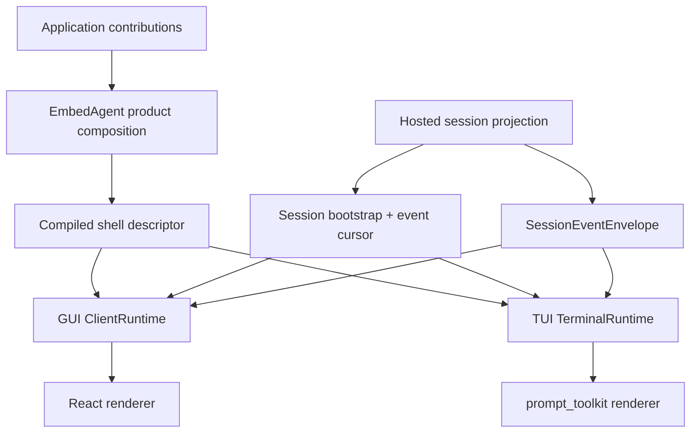

# Frontend Shell Convergence Design

> 状态：`active`
> 类型：`temporary design spec`
> 负责人：`frontend and platform maintainers`
> 最后同步日期：`2026-08-03`
> 关闭条件：完成全部验收条件，将持续真相同步到领域权威后归档本 spec

## 1. Decision Summary

前端采用“严格协议内核 + 薄 shell”架构。GUI 和 TUI 在同一收敛计划中分阶段切换，共享 Protocol DTO、产品注册来源、session/event 语义和一致性测试，但保留各自语言内聚的 runtime 与 renderer。

GUI 以 `reference/t3code` 的桌面主干体验为持续参考，以 `reference/pi` 的最小 Agent 交互面和扩展哲学控制范围。t3code 不是运行时依赖或架构权威；当其变化引入远程环境、多端同步或其他不属于本产品的问题时，本项目优先保持最小、稳定、离线、可提取的 Agent shell。

本轮是 pre-release strict cutover：不保留旧 wire shape、字段别名、双读双写、fallback catalog、转发 facade 或 feature flag。

## 2. Goals

- 修复 session event gap recovery、重连取消和 session 切换竞争问题。
- 让 GUI 的 ProtocolAdapter/ClientRuntime 成为 HTTP/WebSocket 的唯一所有者。
- 让 TUI 通过 TerminalRuntime 消费与 GUI 相同的 descriptor、bootstrap 和 envelope 语义。
- 由 product composition 编译唯一的 shell 注册结果；GUI/TUI 不内建 application 能力列表。
- 将 GUI 收敛为 Pi 式最小工作面，同时保留 t3code 质量的桌面视觉和交互。
- 将 terminal、source control、tasks、plan、preview 和 C/C++ 专用体验降为可选 contribution。
- 从 Protocol、Host 通用投影和 shell state 中移除 C/C++ 专用展开字段。
- 删除 `t3-*`、`parity-*` 和迁移阶段命名，拆分过大的 runtime、timeline、model 和 style 所有者。
- 用机械架构门禁阻止直接网络调用、双 schema、固定应用能力和跨包反向依赖回流。

## 3. Non-Goals

- 不移植 t3code 的 Effect、Atom、远程 environment、多端同步、账号协作或云状态体系。
- 不增加 Node.js runtime；Node.js 仍只用于 webapp 构建和测试。
- 不增加任意运行时 JavaScript 注入、远程 UI registry、marketplace 或在线依赖安装。
- 不要求 GUI 与 TUI 共享实现代码、布局或快捷键，只要求共享协议和能力语义。
- 不把 terminal、source control、任务管理或 C/C++ workflow 重新定义成 Agent shell 核心能力。
- 不用本地 Chromium、CI 或 WebView2 smoke 替代真实 Windows 7 验收。

## 4. Current Gaps

- GUI gap recovery 在重新加载 bootstrap 后保留旧 `lastAppliedSeq`，下一条 live event 会再次触发 gap。
- GUI 重连 timer 不受 controller close 管理，组件卸载后仍可能创建新 socket。
- ProtocolAdapter 已定义 endpoint methods，但生产 controller 主要使用 raw `fetchJson` 或直接 `fetch()`。
- app bootstrap、session capability 和 frontend normalizer 接受多套 camel/snake shape。
- TUI 使用固定 `WORKBENCH_COMMANDS`、surface 列表和 command branches，没有消费产品 shell descriptor。
- Protocol/Host/frontend 仍展开 `current_phase`、`discipline_profile`、`task_items` 等上层 workflow 字段。
- GUI 根组件组装大量 controller，active source 和 CSS 仍包含 `t3`/`parity` 迁移命名。

## 5. Architecture Boundaries

### Protocol

`embedagent-protocol` 只拥有 JSON-safe、workflow-neutral contracts：

- `AppBootstrap` 和 compiled shell descriptors；
- `ThreadDetailSnapshot` / session bootstrap；
- `CapabilitySnapshot`；
- `SessionEventEnvelope`；
- command、interaction、mode、tool-presentation 和 generic surface descriptors。

Protocol 不定义 layout，不执行 command，不恢复 session，不授予 permission，也不导入 application packages。

### Product Composition

`embedagent` product 编译 generic shell defaults 和 selected `AgentApplicationRecord` contributions。编译过程必须拒绝 duplicate ids、unsupported renderer kinds 和 invalid dispatch records。最终结果同时注入 GUI 和 TUI；shell 不直接读取 `product_catalog.py`。

静态 shell metadata 与 session-dynamic capabilities 是不同的权威数据族。shell runtime 以确定性规则将二者合成为一个 effective registry，不从本地 fallback list 补充缺失记录。

### Shell Runtimes

GUI 拥有 JavaScript `ClientRuntime`，TUI 拥有 Python `TerminalRuntime`。各 runtime 负责 transport/port calls、bootstrap installation、event ordering、effect dispatch、cancellation 和 view projections。renderer 只接收 frozen selectors 和 actions。

React components 和 TUI views 不知道 endpoint paths、Host methods、application ids、tool names 或 workflow classes。

### Applications

Applications 贡献 capability records、workflow projections、commands、tool presentations 和 optional surfaces。C/C++ behavior 保留在 `embedagent-workflow-cpp` 和 product registration 之后。generic shells 可以渲染 declared summary/items/metadata，但不解释 `TaskGraph`、phases 或 discipline profiles。

## 6. Canonical Data Flow

前端只接受三种权威输入：

1. `AppBootstrap`：product/workspace metadata 和 compiled shell descriptors。
2. `SessionBootstrap`：frozen thread、snapshot、history、capabilities、generic workflow 和 `event_cursor`。
3. `SessionEventEnvelope`：installed cursor 之后的连续 live changes。

所有 wire DTO 只使用当前 `snake_case` shape 和明确 `schema_version`。JavaScript 可在 ProtocolAdapter 内一次性转换成 camelCase。missing fields、unknown schema versions 和 invalid enum values 必须 fail closed；consumer 不接受 alternate casing 或 retired fields。

所有用户操作进入一个 command dispatcher。command descriptor 声明 identity、argument schema、availability 和 dispatch kind。shell runtime 校验 command 后调用 Protocol port。component 不拼接 HTTP URL，也不调用 Host-specific method。

## 7. Event Cursor And Recovery

`SessionBootstrap.event_cursor` 与 hosted projection 在 live sequence allocation 使用的同一 session synchronization boundary 内原子生成。

Activation 和 recovery 使用同一个 state machine：

1. 建立 event channel，并为 selected session 缓冲 events；
2. 加载 bootstrap，原子安装 projection 和 cursor；
3. 丢弃 cursor 及之前的 buffered events；
4. 只应用 cursor 之后的连续 events；
5. 发现 gap 时冻结 live projection，加载 replacement bootstrap/cursor，再排空 buffer；
6. session switch 取消上一代 bootstrap、buffer 和 subscription scope；
7. close 取消 socket、timers、requests 和 buffered work。

duplicate event ids 被忽略。非 selected session 的 events 不修改 selected-session projection。obsolete generation 的 stale bootstrap 或 callback 不能修改当前 state。

## 8. Minimal Experience

### GUI

核心 desktop structure 是：

- collapsible session rail；
- one central timeline；
- composer；
- compact status/footer；
- commands、session selection、mode selection 和 interactions overlays。

Messages、reasoning、tools、errors、workflow summaries、file references 和 diffs inline render。narrow window 收敛为 one column。shell core 不要求 permanent right panel 或 bottom drawer。

GUI 为保留流程复制 t3code 的 interaction 和 visual decisions：information density、message/tool hierarchy、composer behavior、command palette、session navigation、typography、spacing、loading 和 failure states。active implementation names 使用 EmbedAgent domain vocabulary，不记录 reference provenance。

### TUI

TUI 保留 startup/session header、transcript、replaceable editor/interaction area 和 status/footer。它暴露与 GUI 相同的 effective commands、availability 和 interaction lifecycle。terminal capability differences 可以改变 presentation，但不能改变 product semantics。

## 9. Extension Model

支持的 shell contribution kinds 是：

- `command`；
- `tool_presentation`；
- `timeline_item`；
- `interaction`；
- optional `surface`，placement 仅为 overlay 或 secondary。

Contributions 只包含 descriptors 和 structured data。renderer factories 在 product build time 注册并实现 generic kinds。workspace Python extensions 可以选择已声明的 generic renderer keys，但不能注入 JavaScript、下载 dependencies 或替换 built-in tools。

Terminal、source control、task lists、plan inspectors、standalone previews 和 C/C++ quality views 都是 optional contributions。移除它们后必须保留完整可用的 minimal Agent shell。

## 10. T3code Tracking Policy

`reference/t3code` 可以在实施期间更新。reference change 只有满足以下条件才可吸收：

- 改善 retained session/timeline/composer/tool/command flow；
- 符合现有 descriptor 和 runtime boundaries；
- 保持 offline 和 WebView2 109 compatibility；
- 不增加第二个 state source、transport owner 或 long-lived parity layer；
- 不把 remote-environment、mobile 或 collaboration architecture 带入 shell core。

拒绝吸收的 reference change 不自动进入 roadmap。reference review 的理由记录在 design/ADR 层；production names 不包含 `t3` 或 `parity`。

## 11. Migration Stages

### Stage 1: Transport Correctness

增加 atomic event cursors、buffering、generation cancellation 和 closeable retry ownership。只有 gap recovery 能接受下一条 live event，且 closed runtime 不能重开 connection 时才退出。

### Stage 2: Protocol Authority

将全部 GUI HTTP/WebSocket operations 移入 ProtocolAdapter/ClientRuntime，将全部 TUI operations 移入 TerminalRuntime。所有 DTO 切换到 canonical current shape，并在同一 change 删除 alternate readers。

### Stage 3: Shared Registration

在 product composition 编译唯一 shell descriptor 并注入两个 shell。删除固定 TUI commands/surfaces 和 GUI fallback catalogs。只有 GUI/TUI parity tests 从相同 compiled descriptor 派生时才退出。

### Stage 4: Minimal Workbench

安装 Pi-style GUI/TUI core experience。将 non-core workbench features 转为 optional contributions，并验证没有这些贡献时 shell 仍可用。

### Stage 5: Boundary And Structure Cleanup

删除 application-specific flattened fields，拆分 runtime/timeline/model/style ownership，移除 migration names，并同步全部 active architecture documents。

每一阶段都可独立合并，并保持 repository runnable。replacement 与 deletion 必须发生在同一阶段，不存在 compatibility interval。

## 12. Verification And Debt Gates

Behavior tests 必须覆盖：

- bootstrap、contiguous events、duplicate events、gap recovery 和 close；
- bootstrap 期间到达的 events 和 rapid session switches；
- unknown schema、missing fields 和 invalid command/renderer ids；
- GUI/TUI command 和 availability parity；
- generic application 在没有 C/C++ contributions 时启动；
- C/C++ behavior 只在 contribution registration 后出现；
- optional contribution removal 不影响 shell 启动和主干交互。

Rendered GUI flows 必须覆盖 empty state、session activation、streaming output、tool lifecycle、interaction、command palette、recovery 和 narrow viewport。screenshots 保护 EmbedAgent 已接受的 UI，不对持续变化的 t3code checkout 做 pixel matching。

Architecture guards 强制：

- `/api/`、`fetch` 和 `WebSocket` 只出现在 declared transport owners；
- GUI/TUI 不包含 fixed application command/tool/workflow catalogs；
- Protocol 和 generic shells 不包含 C/C++ field 或 tool vocabulary；
- active source 不包含 `t3-*`、`parity-*` 或 dual-casing normalization；
- `App.jsx` 不创建 runtime controller；
- Python-generated canonical fixtures 被 JavaScript 和 TUI contract tests 共同接受。

每阶段运行 focused red/green tests、architecture guards、full Python partition、lint、webapp tests 和 `AGENTS.md` 要求的 webapp build。Windows 7 evidence 保持独立 external release gate。

## 13. Plan Decomposition

本设计是一个有顺序依赖的 product program，不写成单个跨子系统 implementation plan。实施文档按以下五个 plan 独立创建、执行和关闭：

1. frontend transport correctness；
2. strict protocol authority；
3. shared shell registration；
4. minimal GUI/TUI workbench；
5. workflow boundary and structural cleanup。

后一 plan 只能依赖前一 plan 已合并的公开边界，不能预埋兼容层或同时维护两种结构。每个 plan 都有自己的 TDD steps、删除清单、focused tests、architecture guards 和 commit boundaries。

## 14. Completion Criteria

只有满足以下条件才关闭切片：

- GUI 和 TUI 消费同一 compiled registration truth；
- 一个 ProtocolAdapter/ClientRuntime 拥有 GUI effects，一个 TerminalRuntime 拥有 TUI effects；
- bootstrap cursor recovery 和 lifecycle cancellation 有测试证据；
- 只保留当前 strict wire schema；
- 移除全部 optional application contributions 后仍有稳定、可用的 Agent shell；
- 重新注册 contributions 不需要修改 shell code；
- Protocol、Host 和 generic frontends 不包含 C/C++ application semantics；
- active source 和 documentation 不包含 migration/reference naming 或错误完成声明；
- 全部 required local verification gates 通过。
