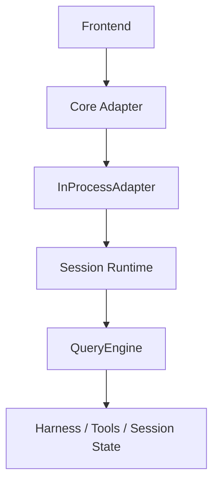

# Agent Core

## Metadata

> 状态：`active`
> 类型：`module`
> 负责人：`project maintainers`
> 最后同步日期：`2026-04-08`
> 对应代码范围：`src/embedagent/query_engine.py`, `src/embedagent/inprocess_adapter.py`, `src/embedagent/session_runtime.py`

## 1. Purpose And Scope

本模块文档说明 EmbedAgent 的 Agent Core 执行主链路，重点覆盖 session 级 `QueryEngine`、产品宿主适配层 `InProcessAdapter` 和 runtime host 状态 `ManagedSession` 的分工。

## 2. Responsibilities

- 会话级 `QueryEngine` 执行 owner
- `InProcessAdapter` host / bridge 边界
- session runtime host 状态

`Agent Core` 的职责是把前端、slash command、tool runtime、harness、session state 和 transcript 组织成单一正式执行主链路，避免并行 owner 或平行 workflow path。

## 3. Code Mapping

- 目录：`src/embedagent/`
- 入口文件：`src/embedagent/query_engine.py`
- 核心对象：`QueryEngine`、`InProcessAdapter`、`ManagedSession`
- 上游依赖：frontend / core adapter / slash commands
- 下游影响：harness、tools runtime、session snapshot、transcript
- 相关测试：`tests/test_query_engine_refactor.py`、`tests/test_inprocess_adapter_frontend_api.py`、`tests/test_gui_backend_api.py`
- 相关契约：`docs/overall-solution-architecture.md`、`docs/agent-harness-v2.md`、`docs/frontend-protocol.md`

## 4. Dependencies And Consumers

上游消费者：

- `src/embedagent/core/adapter.py`
- `src/embedagent/frontend/`
- slash command 路径和 API bridge

下游依赖：

- `src/embedagent/harness/`
- `src/embedagent/tools/`
- `src/embedagent/session.py`
- `src/embedagent/transcript_store.py`
- `src/embedagent/session_projector.py`

## 5. Data / Control Flow

`QueryEngine` 负责 turn/step/interactions 的实际执行，`InProcessAdapter` 负责把 CLI/TUI/GUI 的请求接到 session owner 上，`ManagedSession` 负责持有线程锁、状态和 durable `Session` 引用。

关键边界：

- `QueryEngine` 是 session-scoped execution owner。
- `InProcessAdapter` 不应生成第二套 workflow identity。
- runtime host 负责承载，而不是替代 engine 执行逻辑。

## 6. Verification And Tests

推荐回归入口：

- `tests/test_query_engine_refactor.py`
- `tests/test_query_engine_build_full_spec.py`
- `tests/test_query_engine_build_lite.py`
- `tests/test_query_engine_debug_lite.py`
- `tests/test_inprocess_adapter_frontend_api.py`
- `tests/test_gui_backend_api.py`

当变更影响 step anchor、resume pipeline、bootstrap 或 adapter/frontend contract 时，应优先重跑这些测试。

## 7. Change Triggers

以下变化必须同步更新本文件：

- `QueryEngine` owner 边界变化
- `InProcessAdapter` 承担的职责变化
- `ManagedSession` 或 session runtime host 结构变化
- turn/step/interactions 的正式主链路变化
- frontend 到 engine 的桥接边界变化

## 8. Related Documents

- `docs/overall-solution-architecture.md`
- `docs/agent-harness-v2.md`
- `docs/frontend-protocol.md`
- `docs/references/code-doc-matrix.md`
- `docs/references/glossary.md`
