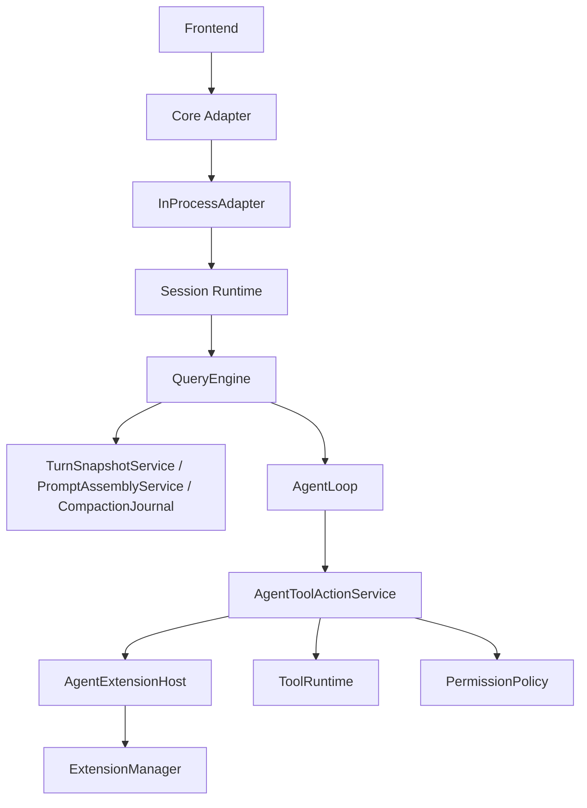

# Agent Core

## Metadata

> 状态：`active`
> 类型：`module`
> 负责人：`project maintainers`
> 最后同步日期：`2026-07-02`
> 对应代码范围：`src/embedagent_core/`, `src/embedagent_host/`, `src/embedagent/prompt_assembly_service.py`, `src/embedagent/project_extensions.py`, `src/embedagent/session_runtime.py`

## 1. Purpose And Scope

本模块文档说明 EmbedAgent 的通用 Agent Core 与 hosted product composition 执行主链路，重点覆盖 `embedagent_core` 中的 session 级 `QueryEngine` facade、`AgentLoop`、`AgentToolActionService`、`AgentExtensionHost`，以及 `embedagent_host` 中的 `InProcessAdapter`、hosted command/interaction services 和 runtime host 状态 `ManagedSession` 的分工。

## 2. Responsibilities

- session-scoped `QueryEngine` facade and transcript/session mutation owner
- `AgentLoop` Pi-style open turn-loop continuation boundary
- `AgentToolActionService` non-LLM tool action execution boundary
- `AgentExtensionHost` extension dispatch and active schema projection boundary
- hosted `InProcessAdapter` shared `ExtensionManager` ownership
- hosted command and interaction service boundaries
- provider snapshot, workflow prompt, and compaction journal helper boundaries
- default extension assembly and manifest-gated project-local extension loading
- session runtime host state

`Agent Core` 的职责是提供 workflow-neutral session engine、extension boundary、permission policy、reducers、turn snapshots 与 capability read models。`embedagent_host` 把 Core、选定 workflow packages、slash command、tool runtime、session state、transcript 与 UI shells 组织成单一正式产品执行主链路，避免并行 owner 或平行 workflow path。

## 3. Code Mapping

- Core 目录：`src/embedagent_core/`
- Host 目录：`src/embedagent_host/`
- Core 入口文件：`src/embedagent_core/query_engine.py`
- 核心对象：`QueryEngine`、`AgentLoop`、`AgentToolActionService`、`AgentExtensionHost`、`InProcessAdapter`、`HostedCommandService`、`HostedInteractionService`、`TurnSnapshotService`、`PromptAssemblyService`、`CompactionJournal`、`ManagedSession`、`ExtensionManager`
- 上游依赖：frontend / core adapter / slash commands
- 下游影响：harness、tools runtime、session snapshot、transcript
- 相关测试：`tests/test_query_engine_refactor.py`、`tests/test_inprocess_adapter_frontend_api.py`、`tests/test_gui_backend_api.py`、`tests/test_capability_extensions.py`、`tests/test_dynamic_tool_registration.py`、`tests/test_project_extensions.py`、`tests/test_local_resources.py`、`tests/test_workflow_extensions.py`
- 相关契约：`docs/overall-solution-architecture.md`、`docs/agent-harness-v2.md`、`docs/frontend-protocol.md`

## 4. Dependencies And Consumers

上游消费者：

- `src/embedagent/core/adapter.py`
- `src/embedagent/frontend/`
- slash command 路径和 API bridge

下游依赖：

- `src/embedagent/workflow_packages/c_cpp/`
- `src/embedagent/tools/`
- `src/embedagent_core/extensions.py`
- `src/embedagent/agent_applications.py`
- `src/embedagent/workflow_packages/c_cpp/application.py`
- `src/embedagent/project_extensions.py`
- `src/embedagent/session.py`
- `src/embedagent/transcript_store.py`
- `src/embedagent/session_projector.py`

## 5. Data / Control Flow

`QueryEngine` 是 session-scoped facade，保留 transcript/session mutation 与 interaction suspend/resume ownership。`AgentLoop` 承担 Pi-style open turn-loop continuation 边界，负责 agent step、context/provider attempt、compact retry、guard-stop、abort 与显式 loop safety-limit 兼容 transition；默认 hosted 路径不再因为 8 个 model/tool cycles 被截断。`AgentToolActionService` 承担非 LLM tool action execution，`AgentExtensionHost` 承担 extension dispatch、dynamic tool registration、active schema projection 与 workflow patching。`TurnSnapshotService` 承担 provider snapshot 元数据组装，`PromptAssemblyService` 承担 workflow prompt append/dedupe，`CompactionJournal` 承担 compact boundary / compacted history payload 组装。`InProcessAdapter` 负责把 CLI/TUI/GUI 的请求接到 session owner 上，并持有 hosted runtime 的 shared `ExtensionManager`；slash command 与 pending interaction glue 分别由 `HostedCommandService` 和 `HostedInteractionService` 承担。扩展对象只有通过 `extension_capabilities()` 返回 `ExtensionCapability` 记录才会参与这些 hook；单纯定义同名方法不会被自动注册。

关键边界：

- `QueryEngine` 是 session-scoped facade 和 transcript/session mutation owner。
- `AgentLoop`、`AgentToolActionService`、`AgentExtensionHost` 是 loop/action/extension dispatch 子边界。
- `TurnSnapshotService`、`PromptAssemblyService`、`CompactionJournal` 是 snapshot/prompt/compaction helper 子边界。
- `InProcessAdapter` 不应生成第二套 workflow identity，也不应重新拥有 slash-command 或 pending-interaction helper 逻辑。
- `HostedCommandService` owns slash-command dispatch and command-result emission; `HostedInteractionService` owns approve/reject/reply/respond glue.
- hosted product paths 通过 selected `AgentApplication` 安装 bundled/default workflow packages，并通过 `AgentApplication.refresh_managed_session()` 刷新应用拥有的 workflow/session projection；也可通过 `project_extensions.py` 加载 manifest-gated local extensions。
- selected agent profile 的 prompt、write-glob、base-tool 和 mode-switch runtime policy 由 `src/embedagent/agent_profile_runtime.py` 提供；`InProcessAdapter` 只组合这些策略，不内联专用 agent 行为。
- selected `AgentApplication.workspace_profile_detectors` 可向 hosted workspace profile 注入专用文件信号；通用 workspace profile 不持有 C/C++ 文件或构建系统常量。
- hosted application registry 直接持有 profile-only base records，workflow-backed built-in records 通过 lazy record list 暴露；构建通用/非 C agent 不会导入默认 C/C++ workflow package。
- runtime host 负责承载，而不是替代 engine 执行逻辑。

## 6. Verification And Tests

推荐回归入口：

- `tests/test_query_engine_refactor.py`
- `tests/test_query_engine_build_full_spec.py`
- `tests/test_query_engine_build_lite.py`
- `tests/test_query_engine_debug_lite.py`
- `tests/test_inprocess_adapter_frontend_api.py`
- `tests/test_gui_backend_api.py`
- `tests/test_capability_extensions.py`
- `tests/test_dynamic_tool_registration.py`
- `tests/test_project_extensions.py`
- `tests/test_local_resources.py`
- `tests/test_workflow_extensions.py`

当变更影响 step anchor、resume pipeline、bootstrap、extension dispatch、dynamic tools、resource reload、project extension loading、hosted command/interaction services、provider snapshots、compaction payloads 或 adapter/frontend contract 时，应优先重跑这些测试。

## 7. Change Triggers

以下变化必须同步更新本文件：

- `QueryEngine` owner 边界变化
- `AgentLoop`、`AgentToolActionService` 或 `AgentExtensionHost` 职责变化
- `TurnSnapshotService`、`PromptAssemblyService`、`CompactionJournal` 职责变化
- `InProcessAdapter` 承担的职责变化
- `HostedCommandService` 或 `HostedInteractionService` 职责变化
- default extension assembly 或 project-local extension loading 路径变化
- `ManagedSession` 或 session runtime host 结构变化
- turn/step/interactions 的正式主链路变化
- frontend 到 engine 的桥接边界变化

## 8. Related Documents

- `docs/overall-solution-architecture.md`
- `docs/agent-harness-v2.md`
- `docs/frontend-protocol.md`
- `docs/references/code-doc-matrix.md`
- `docs/references/glossary.md`
