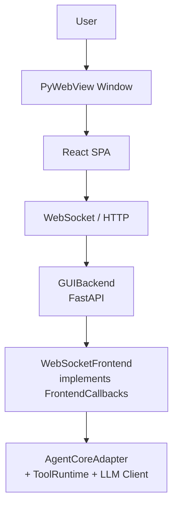

# Frontend GUI

## Metadata

> 状态：`active`
> 类型：`module`
> 负责人：`project maintainers`
> 最后同步日期：`2026-04-09`
> 对应代码范围：`src/embedagent/frontend/gui/`

## 1. Purpose And Scope

本模块文档说明 EmbedAgent 的桌面图形用户界面（GUI）前端实现。GUI 使用 `pywebview` 窗口承载本地 FastAPI 服务器，前端为 React SPA，通过 HTTP 与 WebSocket 与后端通信。

## 2. Responsibilities

- 延迟加载 GUI 启动器（`__init__.py`）
- 运行时配置解析与 `AgentCoreAdapter` 装配（`launcher.py`）
- WebView2 运行时检测与渲染器策略（`launcher.py`）
- FastAPI 后端与静态资源服务（`backend/server.py`）
- 协议回调到 WebSocket 广播的实时转换（`backend/server.py`）
- WebSocket 断线重连与会话事件回放恢复（`webapp/`）

## 3. Code Mapping

- 目录：`src/embedagent/frontend/gui/`
- 入口文件：`src/embedagent/frontend/gui/__init__.py`、`src/embedagent/frontend/gui/launcher.py`
- 核心对象：
  - `launch_gui()` — 延迟加载入口
  - `create_core()` — 装配 Agent Core
  - `launch_gui()`（`launcher.py`）— 解析端口、启动 `GUIBackend`、打开 `pywebview` 窗口
  - `GUIBackend` — FastAPI 后端包装
  - `WebSocketFrontend` — `FrontendCallbacks` 的 WebSocket 实现
  - `BlockingResult` / `ThreadsafeAsyncDispatcher` — 线程安全阻塞与异步调度
- 上游依赖：`embedagent.cli` 调用 `launch_gui`
- 下游影响：`AgentCoreAdapter`、`OpenAICompatibleClient`、`ToolRuntime`、`PermissionPolicy`、`ProjectMemoryStore`
- 相关测试：`tests/test_gui_backend_api.py`、`tests/test_gui_runtime.py`、`tests/test_gui_sync.py`
- 相关契约：`docs/frontend-protocol.md`、`docs/overall-solution-architecture.md`

## 4. Dependencies And Consumers

上游依赖：

- `pywebview`、`fastapi`、`uvicorn`、`websockets`
- `embedagent.core`（`AgentCoreAdapter`）
- `embedagent.protocol`（`FrontendCallbacks`、`CoreInterface`）
- `embedagent.llm`、`embedagent.tools`、`embedagent.permissions`

下游消费者：

- `embedagent.cli` — 通过 `launch_gui` 启动 GUI
- 最终用户通过桌面窗口与 React SPA 交互

## 5. Data / Control Flow

用户通过 `pywebview` 窗口与 React SPA 交互；SPA 通过 WebSocket/HTTP 访问 FastAPI 后端；`GUIBackend` 将 `WebSocketFrontend` 注册为 `AgentCoreAdapter` 的回调目标；对于权限或用户输入请求，`BlockingResult` 会阻塞 Core 线程直到用户通过前端响应。

关键边界：

- `WebSocketFrontend` 实现了完整的 `FrontendCallbacks` 接口。
- `BlockingResult` 用于同步阻塞 Core 线程等待用户响应。
- React SPA 负责自动重连和会话事件回放恢复。

## 6. Workbench Shell

The GUI shell is a T3code-inspired workbench composed of a thread/project
sidebar, central Agent timeline, rich composer, thread-scoped right-panel
surfaces, optional bottom drawer, command palette, and keybinding resolver.

The workbench contract lives under
`src/embedagent/frontend/gui/webapp/src/workbench/` and is frontend-local. It
consumes existing backend snapshots, bootstrap history, runtime projections,
task projections, permission context, artifacts, file trees, recipes, and tool
catalog read models. It does not own workflow policy, permission decisions,
tool activation, transcript history, extension loading, or provider behavior.

The webapp build continues to target `chrome109` for bundled WebView2 Fixed
Version 109 and Windows 7 compatibility. GUI runtime deployment must remain
offline and must not require Electron, CDN assets, runtime Node, Docker, WSL,
VS Code, or external online services.

## 7. Verification And Tests

推荐回归入口：

- `tests/test_gui_backend_api.py` — API 合约、错误翻译、bootstrap、事件回放
- `tests/test_gui_runtime.py` — 启动器、阻塞等待器、调度器、WebSocket 生命周期、适配器快照投影
- `tests/test_gui_sync.py` — 端到端待处理输入解析、`CallbackBridge` 刷新行为、元数据保留

当新增 Core 回调、会话事件 schema、WebView2/渲染器策略或 React 前端状态结构变化时，应优先重跑这些测试。

## 8. Change Triggers

以下变化必须同步更新本文件：

- 新增 Core 回调需要在 `WebSocketFrontend` 和 React reducer 中同步实现
- 会话事件 schema 变化影响 `session_events.py`、`state-helpers.js`、`event-log.js`
- WebView2/运行时策略变化
- FastAPI 路由或 WebSocket 广播协议变化
- `FrontendCallbacks` 或 `CoreInterface` 接口签名变化

## 9. Related Documents

- `docs/frontend-protocol.md`
- `docs/overall-solution-architecture.md`
- `docs/modules/agent-core.md`
- `docs/modules/protocol-and-core.md`
- `docs/references/code-doc-matrix.md`
- `docs/references/glossary.md`
