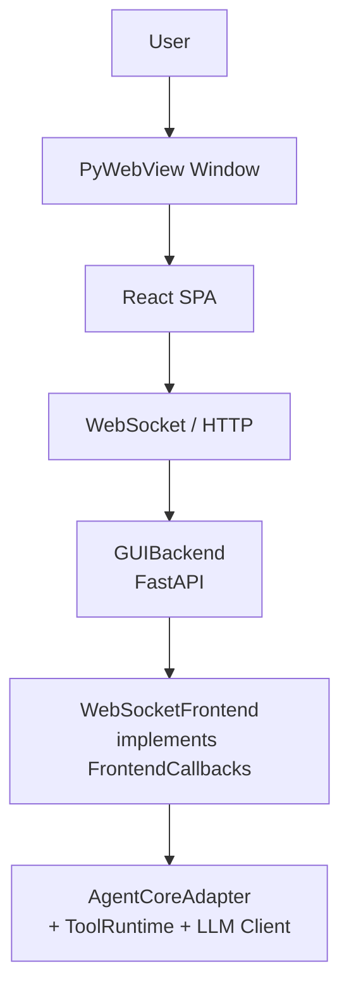

# Frontend GUI

## Metadata

> 状态：`active`
> 类型：`module`
> 负责人：`project maintainers`
> 最后同步日期：`2026-06-17`
> 对应代码范围：`src/embedagent/frontend/gui/`

## 1. Purpose And Scope

本模块文档说明 EmbedAgent 的桌面图形用户界面（GUI）前端实现。GUI 使用 `pywebview` 窗口承载本地 FastAPI 服务器，前端为 React SPA，通过 HTTP 与 WebSocket 与后端通信。

## 2. Responsibilities

- 延迟加载 GUI 启动器（`__init__.py`）
- 运行时配置解析与 `AgentCoreAdapter` 装配（`launcher.py`）
- WebView2 运行时检测与渲染器策略（`launcher.py`）
- FastAPI 后端与静态资源服务（`backend/server.py`）
- GUI app-shell bootstrap/read model（`backend/app_shell.py`、`webapp/src/app-shell/`）
- 协议回调到 WebSocket 广播的实时转换（`backend/server.py`）
- WebSocket 断线重连与会话事件回放恢复（`webapp/`）
- T3code-inspired Agent timeline rows、composer interaction panel、Diff right-panel surface、neutral workbench visual language（`webapp/src/session-runtime/`、`webapp/src/components/`、`webapp/src/styles.css`）
- 开发机可视调试 harness：启动真实 GUI、执行场景、截图、检查 console/DOM（`scripts/gui-visual-debug.mjs`）

## 3. Code Mapping

- 目录：`src/embedagent/frontend/gui/`
- 入口文件：`src/embedagent/frontend/gui/__init__.py`、`src/embedagent/frontend/gui/launcher.py`
- 核心对象：
  - `launch_gui()` — 延迟加载入口
  - `create_core()` — 装配 Agent Core
  - `launch_gui()`（`launcher.py`）— 解析端口、启动 `GUIBackend`、打开 `pywebview` 窗口
  - `GUIBackend` — FastAPI 后端包装
  - `AppShellService` — GUI-local app bootstrap/read-model boundary
  - `WebSocketFrontend` — `FrontendCallbacks` 的 WebSocket 实现
  - `BlockingResult` / `ThreadsafeAsyncDispatcher` — 线程安全阻塞与异步调度
- 上游依赖：`embedagent.cli` 调用 `launch_gui`
- 下游影响：`AgentCoreAdapter`、`OpenAICompatibleClient`、`ToolRuntime`、`PermissionPolicy`、`ProjectMemoryStore`
- 相关测试：`tests/test_gui_backend_api.py`、`tests/test_gui_runtime.py`、`tests/test_gui_sync.py`、`src/embedagent/frontend/gui/webapp/test/`
- 相关开发脚本：`scripts/gui-visual-debug.mjs`、`npm run visual:gui`
- 相关契约：`docs/frontend-protocol.md`、`docs/overall-solution-architecture.md`

## 4. Dependencies And Consumers

上游依赖：

- `pywebview`、`fastapi`、`uvicorn`、`websockets`
- `embedagent.core`（`AgentCoreAdapter`）
- `embedagent.protocol`（`FrontendCallbacks`、`CoreInterface`）
- `embedagent.llm`、`embedagent.tools`、`embedagent.permissions`

下游消费者：

- `embedagent.cli` — 通过 `launch_gui` 启动 GUI
- 最终用户通过桌面窗口与 React SPA 交互

## 5. Data / Control Flow

用户通过 `pywebview` 窗口与 React SPA 交互；SPA 通过 WebSocket/HTTP 访问 FastAPI 后端；`GUIBackend` 将 `WebSocketFrontend` 注册为 `AgentCoreAdapter` 的回调目标；对于权限或用户输入请求，`BlockingResult` 会阻塞 Core 线程直到用户通过前端响应。

关键边界：

- `WebSocketFrontend` 实现了完整的 `FrontendCallbacks` 接口。
- `BlockingResult` 用于同步阻塞 Core 线程等待用户响应。
- React SPA 负责自动重连和会话事件回放恢复。

## 6. Workbench Shell

The GUI shell is a T3code-inspired workbench composed of a thread/project
sidebar, central Agent timeline, rich composer, composer-local interaction
panel, thread-scoped right-panel surfaces, optional bottom drawer, command
palette, and keybinding resolver.

The workbench contract lives under
`src/embedagent/frontend/gui/webapp/src/workbench/` and is frontend-local. It
consumes existing backend snapshots, bootstrap history, runtime projections,
task projections, permission context, artifacts, file trees, recipes, and tool
catalog read models. It does not own workflow policy, permission decisions,
tool activation, transcript history, extension loading, or provider behavior.

The webapp build continues to target `chrome109` for bundled WebView2 Fixed
Version 109 and Windows 7 compatibility. GUI runtime deployment must remain
offline and must not require Electron, CDN assets, runtime Node, Docker, WSL,
VS Code, or external online services.

The visual language is intentionally close to T3code without copying its
implementation stack. The current GUI uses plain CSS tokens for neutral dark
workbench surfaces, soft borders, compact tabs, centered timeline width,
rounded composer shell, and restrained right-panel/diff chrome. This is a shell
style contract only; workflow semantics remain owned by Agent Core and
frontend-facing read models.

The app-level project/thread management surface is also frontend-local. The
shared `webapp/src/session-runtime/app-home-model.js` read model projects
existing app bootstrap workspace records and session summaries into the sidebar
and no-workspace home state. It may shape labels, counts, disabled rows, active
selection, and compact timestamps for display, but it does not own session
truth, workspace registry persistence, workflow policy, or Core lifecycle.
The project list is locally scroll-bounded so accumulated recent projects do
not push thread management out of the visible workbench.

Thread lifecycle controls are shaped by the same frontend-local read model.
Thread rows now expose a compact action rail for `Rename`, `Fork`, and
`Archive`, with action enablement gated by explicit lifecycle capabilities.
Those actions now call backend session lifecycle endpoints that update
summary/projection metadata for app thread lists. Rename changes display
metadata only, archive hides the thread from normal recent-thread navigation
without deleting transcript history, and fork copies transcript history into a
new session id. The GUI must not simulate persistent thread metadata locally,
rewrite transcripts, create source-control checkpoints, or make the frontend a
second session-history source.

The GUI app-shell boundary is the desktop/app layer above workspaces and
sessions. `AppShellService` wraps the existing GUI app host and returns a
credential-free envelope for `/api/app/bootstrap` and `/api/app/workspaces*`:
workspace registry projection, active workspace metadata, safe host/runtime/
renderer diagnostics, app command metadata, right-panel app surfaces, and
GUI-local settings. The React app-shell model normalizes that envelope and
drives the Settings and Diagnostics right-panel surfaces. This boundary may
help the GUI feel like a standalone app, but it must not own Agent Core
sessions, workflow truth, transcript history, tool activation, permission
policy, extension loading, provider settings, or runtime reducer state.

## 7. Timeline, Interaction, And Diff Surfaces

`webapp/src/session-runtime/t3-timeline.js` projects existing session/runtime
items into T3-style rows. The projection is frontend-only: it groups user,
assistant, work, changed-file, interaction, and turn-fold rows without changing
session history truth or backend policy.

Pending permission and user-input interactions render in the composer through
`components/composer/ComposerInteractionPanel.jsx`. The inspector can still
show interaction diagnostics, but the primary decision surface stays near the
next user action.

Changed-files rows render a T3code-like directory tree derived by
`t3-timeline.js`. The tree is a frontend-local projection over existing
timeline items: it normalizes path separators, compacts single-child
directories, rolls additions/deletions up to directory rows, and keeps file
clicks wired to the Diff surface.

The Diff surface is a right-panel surface (`kind = "diff"`) backed by
`session-runtime/diff-model.js` and `components/diff/DiffPanel.jsx`. `/diff`
command results and diff-capable timeline entries open this surface with parsed
unified-diff file summaries. It uses a T3code-like header, changed-file rail,
and focused diff viewport; narrow right panels and mobile layouts stack the rail
above the diff viewport. Rendering uses the existing `DiffView` wrapper with a
raw fallback for malformed diffs. This surface is display-only; Git execution
remains backend/tool-owned.

## 8. Verification And Tests

推荐回归入口：

- `tests/test_gui_backend_api.py` — API 合约、错误翻译、bootstrap、事件回放
- `tests/test_gui_runtime.py` — 启动器、阻塞等待器、调度器、WebSocket 生命周期、适配器快照投影
- `tests/test_gui_sync.py` — 端到端待处理输入解析、`CallbackBridge` 刷新行为、元数据保留
- `cd src/embedagent/frontend/gui/webapp && npm test` — frontend reducer、timeline、interaction、diff、workbench、T3 visual-language CSS contract 和 visual harness helper 合约
- `cd src/embedagent/frontend/gui/webapp && npm run visual:gui -- --scenario all --bundle-root <bundle-root>` — dev-only Playwright visual harness；启动真实 GUI、执行 app/load/chat/diff/responsive/timeline/interaction、生成截图和 `summary.json`，并检查 console warning/error

当新增 Core 回调、会话事件 schema、WebView2/渲染器策略或 React 前端状态结构变化时，应优先重跑这些测试。

`npm run visual:gui` 是开发机调试入口，不是产品运行时依赖。Playwright
和浏览器缓存只用于当前 Win10/Win11 开发流程；离线 Win7 bundle 仍通过
PyWebView/WebView2 Fixed Version 109 运行，且不要求 Node 或 Playwright。

The visual harness opens the GUI with `?visual_debug=1`. Only under that
explicit query parameter does the React app expose
`window.__EMBEDAGENT_VISUAL_DEBUG__`. The visual harness now includes
deterministic `timeline`, `interaction`, and `thread` fixtures in addition to
app/load/chat/diff/responsive. These fixtures open controlled T3-style timeline
rows, changed-file summaries, composer-local pending interaction states, and
thread lifecycle action rails so Codex can inspect real rendered GUI states.
This hook is a development-only visual QA affordance. It is not a frontend
protocol contract, not backend policy, not an Agent Core capability, and not
available through normal product navigation.

The visual runner also launches the GUI with an isolated
`EMBEDAGENT_GUI_APP_HOME` under its output directory. This keeps temporary
app/workspace scenarios from polluting the developer machine's normal recent
project registry while still exercising the real backend registry and GUI app
host paths.

## 9. Change Triggers

以下变化必须同步更新本文件：

- 新增 Core 回调需要在 `WebSocketFrontend` 和 React reducer 中同步实现
- 会话事件 schema 变化影响 `session_events.py`、`state-helpers.js`、`event-log.js`
- WebView2/运行时策略变化
- FastAPI 路由或 WebSocket 广播协议变化
- `FrontendCallbacks` 或 `CoreInterface` 接口签名变化
- Timeline row、composer interaction、diff surface、visual language tokens/rules 或 visual harness 场景变化

## 10. Related Documents

- `docs/frontend-protocol.md`
- `docs/overall-solution-architecture.md`
- `docs/modules/agent-core.md`
- `docs/modules/protocol-and-core.md`
- `docs/references/code-doc-matrix.md`
- `docs/references/glossary.md`
