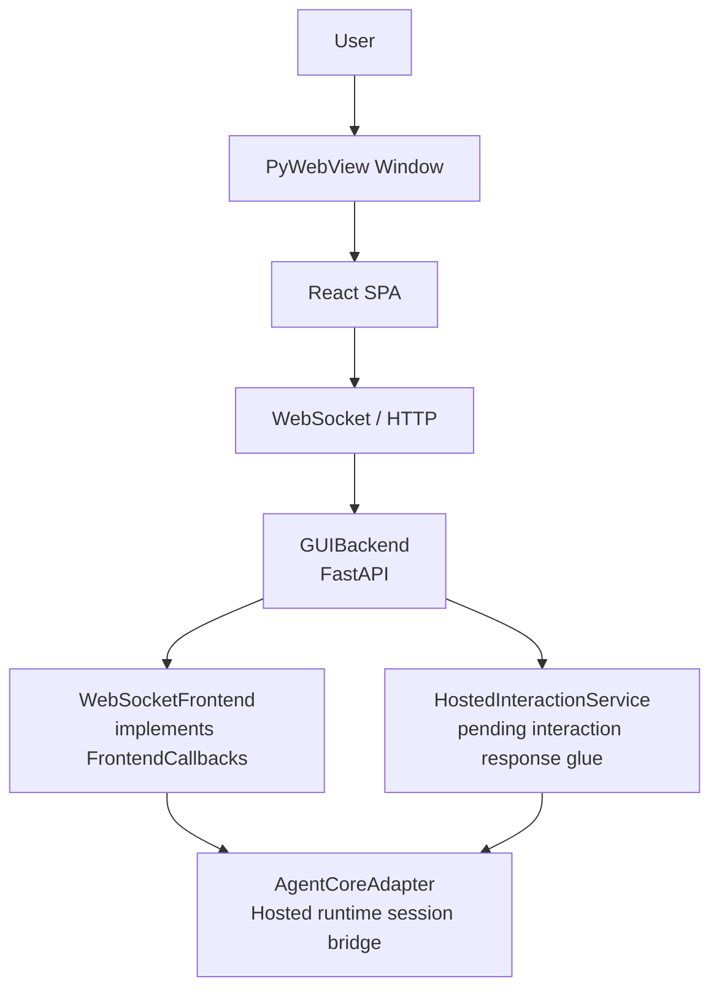

# Frontend GUI

## Metadata

> 状态：`active`
> 类型：`module`
> 负责人：`project maintainers`
> 最后同步日期：`2026-07-04`
> 对应代码范围：`src/embedagent/frontend/gui/`

## 1. Purpose And Scope

本模块文档说明 EmbedAgent 的桌面图形用户界面（GUI）前端实现。GUI 使用 `pywebview` 窗口承载本地 FastAPI 服务器，前端为 React SPA，通过 HTTP 与 WebSocket 与后端通信。

## 2. Responsibilities

- 延迟加载 GUI 启动器（`__init__.py`）
- 运行时配置解析与 `AgentCoreAdapter` 装配（`launcher.py`）
- WebView2 运行时检测与渲染器策略（`launcher.py`）
- FastAPI 后端与静态资源服务（`backend/server.py`）
- GUI app-shell bootstrap/read model（`backend/app_shell.py`、`webapp/src/app-shell/`）
- GUI app-runtime boundary for frontend-only socket effect derivation, session/app loader request orchestration, session bootstrap projection, terminal runtime action orchestration, and dev-only visual fixtures（`webapp/src/app-runtime/`）
- GUI app-shell hosted source-control read model（`backend/source_control_service.py`、`webapp/src/source-control/`）
- 协议回调到 WebSocket 广播的实时转换（`backend/server.py`）
- WebSocket 断线重连与会话事件回放恢复（`webapp/`）
- T3code-inspired Agent timeline rows、structured tool detail expansion、timeline file-link activation、composer interaction panel、app-shell-declared Preview/File/Diff/Files right-panel surface chrome and surface titles、renderer-local workbench UI state persistence、neutral workbench visual language（`webapp/src/session-runtime/`、`webapp/src/workbench/`、`webapp/src/components/`、`webapp/src/styles.css`）
- 开发机可视调试 harness：启动真实 GUI、执行场景、截图、检查 console/DOM（`scripts/gui-visual-debug.mjs`）

## 3. Code Mapping

- 目录：`src/embedagent/frontend/gui/`
- 入口文件：`src/embedagent/frontend/gui/__init__.py`、`src/embedagent/frontend/gui/launcher.py`
- 核心对象：
  - `launch_gui()` — 延迟加载入口
  - `create_core()` — 装配 Agent Core
  - `launch_gui()`（`launcher.py`）— 解析端口、启动 `GUIBackend`、打开 `pywebview` 窗口
  - `GUIBackend` — FastAPI 后端包装
  - `AppShellService` — GUI-local app bootstrap/read-model boundary
  - `SourceControlService` — active-workspace-bound, read-only local Git status/diff service
  - `WebSocketFrontend` — `FrontendCallbacks` 的 WebSocket 实现
  - `ThreadsafeAsyncDispatcher` — 从工作线程向 FastAPI 事件循环调度 WebSocket 广播
- 上游依赖：`embedagent.cli` 调用 `launch_gui`
- 下游影响：`AgentCoreAdapter`、`OpenAICompatibleClient`、`ToolRuntime`、`PermissionPolicy`、`ProjectMemoryStore`
- 相关测试：`tests/test_gui_backend_api.py`、`tests/test_gui_runtime.py`、`tests/test_gui_sync.py`、`src/embedagent/frontend/gui/webapp/test/`
- 相关开发脚本：`scripts/gui-visual-debug.mjs`、`npm run visual:gui`
- 相关契约：`docs/frontend-protocol.md`、`docs/overall-solution-architecture.md`

## 4. Dependencies And Consumers

上游依赖：

- `pywebview`、`fastapi`、`uvicorn`、`websockets`
- `embedagent.core`（`AgentCoreAdapter`）
- `embedagent.protocol`（`FrontendCallbacks`、`CoreInterface`）
- `embedagent.llm`、`embedagent.tools`、`embedagent_core.permissions`

下游消费者：

- `embedagent.cli` — 通过 `launch_gui` 启动 GUI
- 最终用户通过桌面窗口与 React SPA 交互

## 5. Data / Control Flow

用户通过 `pywebview` 窗口与 React SPA 交互；SPA 通过 WebSocket/HTTP 访问 FastAPI 后端；`GUIBackend` 将 `WebSocketFrontend` 注册为 `AgentCoreAdapter` 的回调目标。权限与 user-input 交互的可见真相来自 `Session.pending_interaction` / `pending_interaction_valid` 快照字段和 backend-owned interaction session events；GUI 通过统一的 `respond_to_interaction(session_id, interaction_id, payload)` 路径提交响应；`HostedInteractionService` 负责 pending ticket glue，实际恢复继续回到 Agent Core 的 action pipeline。

Preview surface chrome, File Preview chrome, source-control panel chrome,
bottom drawer run-output chrome, terminal chrome, thread lifecycle actions,
command palette copy, surface titles, and surface descriptors are declared by
`/api/app/bootstrap` app-shell capabilities. Renderer modules normalize and
consume those descriptors; they must not become a second source of
agent/workflow-specific display defaults. Frontend API helpers for preview,
terminal, and source-control do not provide their own request-failure copy when
the backend omits error details; controllers fall through to app-shell chrome.
Command-result run-output log labels are likewise payload-driven through
fields such as `log_label` / `log_detail`; the socket effects module must not
derive visible bottom-drawer log copy from slash command names or success
booleans.
Session bootstrap projection and renderer session normalization preserve the
backend snapshot's explicit `workflow_state`; they do not fill missing values
with the legacy `chat` state name. GUI workflow display uses the separate
generic `workflow` payload.

关键边界：

- `WebSocketFrontend` 只负责把 Core/session 回调广播为 WebSocket 消息；它不拥有 permission 或 user-input 的阻塞等待状态。
- `permission_request` / `user_input_request` 原始 WebSocket 消息只用于唤醒当前交互 UI/传输路径；renderer 不从这些消息合成历史、activity 或第二套 pending state。
- React SPA 负责自动重连、会话 bootstrap reload，以及从 `snapshot.pending_interaction` 渲染当前可响应交互。

## 6. Workbench Shell

The GUI shell is a T3code-inspired workbench composed of a thread/project
sidebar, central Agent timeline, rich composer, composer-local interaction
panel, thread-scoped right-panel surfaces, optional bottom drawer, command
palette, and keybinding resolver.

The workbench contract lives under
`src/embedagent/frontend/gui/webapp/src/workbench/` and is frontend-local. It
consumes existing backend snapshots, bootstrap history, runtime projections,
task projections, permission context, artifacts, file trees, recipes, and tool
catalog read models. It does not own workflow policy, permission decisions,
tool activation, transcript history, extension loading, or provider behavior.

The workbench has a T3code-style renderer UI-state store in
`webapp/src/workbench/ui-state.js`. It sanitizes and persists only app-shell
display state in browser `localStorage`: active workbench session key,
right-panel open/width, bottom-drawer open/kind/height, and shallow
session-scoped right-panel surface descriptors plus active surface id. It
intentionally strips command palette open/query state, file contents, preview
snapshots, terminal output, tool data, backend snapshots, transcript history,
workflow state, permission state, and runtime reducer state. `store.js`
activates the saved session surface stack on `session_activated`, matching
T3code's per-thread tab restoration without making the frontend a second
session-history source.

Thread/session selection and composer draft state are now separate T3-style
renderer modules rather than root fields on the global reducer state:
`webapp/src/session-runtime/thread-state.js` owns session summaries, active
thread id, and history-integrity display state, while
`webapp/src/composer/composer-state.js` owns the local composer draft. `App.jsx`,
the command palette, terminal controller, sidebar, timeline, and composer read
these states through focused read models. `store.js` remains the reducer
composition point for now, but new GUI code must not add root-level
`sessions`, `currentSessionId`, `composer`, `historyIntegrity`, or retired
sidebar tab sidecar state/actions.

The webapp build continues to target `chrome109` for bundled WebView2 Fixed
Version 109 and Windows 7 compatibility. GUI runtime deployment must remain
offline and must not require Electron, CDN assets, runtime Node, Docker, WSL,
VS Code, or external online services.

The visual language is intentionally close to T3code without copying its
implementation stack. The current GUI uses plain CSS tokens for neutral dark
workbench surfaces, soft borders, compact tabs, centered timeline width,
rounded composer shell, and restrained right-panel/diff chrome. This is a shell
style contract only; workflow semantics remain owned by Agent Core and
frontend-facing read models.

The app-level project/thread management surface is also frontend-local. The
shared `webapp/src/session-runtime/app-home-model.js` read model projects
existing app bootstrap workspace records and session summaries into the sidebar
and no-workspace home state. It may shape labels, counts, disabled rows, active
selection, and compact timestamps for display, but it does not own session
truth, workspace registry persistence, workflow policy, or Core lifecycle.
The no-workspace screen reads its product kicker from backend app metadata
(`app.productName`) and its copy from `capabilities.home` /
`capabilities.emptyState`; it must not hard-code the default product or agent
name, and app-shell normalization preserves missing product names as empty.
The project list is locally scroll-bounded so accumulated recent projects do
not push thread management out of the visible workbench.

The left sidebar owns workspace and thread navigation only. File browsing is
owned by the right-panel `FilesSurface`, which renders the single file tree and
opens file preview tabs through right-panel surface descriptors. The
`FilesSurface` panel title is also read from the active surface descriptor, not
from renderer-local default copy. The sidebar
must not render a second Files tab or duplicate file tree; file navigation
remains GUI app-shell display state and must not become workflow truth. The
sidebar no longer has a separate `sidebarTab` / `set_sidebar` reducer sidecar.

### T3-Style GUI Shell Parity

The GUI workbench now treats right-panel surfaces, terminal grouping, floating
menus, and timeline row expansion as app-shell display state. These models are
derived in the webapp and do not write transcript history, workflow state,
permission policy, runtime reducers, extension loading state, telemetry, or
source-control checkpoints.

The right panel follows the T3 Code surface model: ordered surface descriptors,
an active surface id, resource-specific file/preview/terminal surfaces,
singleton local surfaces, and floating tab menus outside tab-scroll clipping.
Terminal UI uses one shared shell for bottom drawer and right-panel owners
while continuing to consume the existing GUI terminal backend service. Timeline
rows are projected through the frontend-local T3 row model; compact/context
display is turn-associated display metadata, not Agent Core context policy.

### T3 Timeline Chrome

- The Timeline renders `/api/sessions/{id}/bootstrap` history activities plus
  live session activity rows through the frontend-local T3 row model. It is
  display state only and does not become durable history truth, workflow state,
  provider/runtime policy, permission policy, telemetry, extension loading, or
  Agent Core behavior.
- Timeline log aria labels, empty/history/termination copy, work-group labels,
  activity-row labels/status/timer templates, and changed-files card
  summary/action labels are declared under `/api/app/bootstrap`
  `capabilities.chrome.timeline`; renderer Timeline modules may consume that
  chrome but must not keep parallel English defaults for those fields.
- `webapp/src/session-runtime/t3-timeline.js` may project display data such as
  turn-fold `createdAt`, `completedAt`, and `interrupted`, but must not
  precompute renderer chrome labels that belong to `capabilities.chrome.timeline`.

### T3 File Preview Chrome

- The right-panel `FilePreviewSurface` renders a T3code-style file viewer over an
  already-loaded file preview: a compact `surface-subheader`, horizontally
  scrollable project/directory/file breadcrumbs, language/line-count metadata,
  icon-style app-shell actions, a numbered code gutter, and a code/markdown
  preview mode toggle for `.md`/`.mdx` files (markdown defaults to the rendered
  preview).
- Breadcrumb, mode, gutter, and metadata logic live in the frontend-local pure
  module `webapp/src/session-runtime/file-preview-model.js`; the breadcrumb and
  markdown-mode helpers are ported one-to-one from
  `reference/t3code/apps/web/src/components/files/`.
- File-link reveal requests reuse T3code's clamp/highlight semantics: the
  frontend clamps requested lines to the loaded file range, marks both the
  gutter row and content row with `data-file-link-reveal`, and scrolls the
  target row into view when the surface reveal request changes.
- The open/explorer affordances are GUI-local app-shell controls. The open
  action copies the workspace-relative path when browser clipboard access is
  available; the explorer action opens the existing right-panel `FilesSurface`.
  They do not call external editors, mutate source control, or require Electron.
- File Preview labels, loading/error fallback copy, retry/copy/explorer action
  copy, metadata separators, line labels, default file/project labels, and
  language labels are declared under `/api/app/bootstrap`
  `capabilities.surfaces.chrome.file_preview`; renderer file-preview modules
  may consume that chrome but must not keep parallel English defaults.
- This is GUI app-shell display/read-model work only: it renders existing file
  preview content and never edits/saves files, writes transcript history, or
  changes Agent Core, backend protocol, workflow state, permission policy, or
  runtime reducers. T3's editing, save coordinator, comment annotation, and
  `@pierre/diffs` editor surfaces are intentionally out of scope.

### T3 Diff Panel Chrome

- The right-panel `DiffPanel` renders already-projected unified diff text from
  command results, timeline actions, or the GUI-local source-control read-only
  diff route. It remains a display surface and does not own Git policy,
  workflow state, transcript history, permissions, reducers, telemetry, or
  extension loading.
- Diff default titles, empty-state copy, selection/control aria labels, view
  toggle titles, file rail labels, collapse labels, and source-control diff
  title templates are declared under `/api/app/bootstrap`
  `capabilities.surfaces.chrome.diff_panel`; renderer Diff modules may consume
  that chrome but must not keep parallel English defaults.

### T3 Preview Surface Shell

- The right-panel `PreviewSurface` is a T3code-style browser/preview shell in
  the GUI app-shell. It is a manually addable right-panel surface, command
  palette command (`surface.preview` / `/preview`), and default keybinding
  target (`mod+4`).
- `backend/preview_service.py` owns the GUI-local preview runtime boundary:
  local-only URL normalization, loopback HTTP probing, in-memory preview tab
  snapshots, refresh/close, and open-in-system-browser actions. The backend
  routes live under `/api/sessions/{id}/preview*` and
  `/api/app/preview/open-external`.
- `webapp/src/preview/preview-api.js` and
  `webapp/src/session-runtime/preview-surface-model.js` own frontend API
  helpers, URL display formatting, local-server empty-state projection, and
  T3code-style `idle` / `loading` / `success` / `failed` runtime-state mapping.
  Opening a local server replaces the empty `right:preview` placeholder with a
  concrete URL surface descriptor, matching T3's tab behavior without creating a
  second session-history source.
- The current shell renders compact URL chrome, refresh/open/annotation
  affordances, deterministic local-server cards, local preview loading and
  unreachable states, and an embedded-preview unavailable state. It rejects
  remote/non-HTTP URLs before probing, does not execute browser automation,
  embed an external browser runtime, call remote services, or depend on
  Electron.
- This is GUI app-shell display/read-model work only: preview surface state does
  not write `transcript.jsonl`, workflow state, runtime reducers, permission
  policy, provider configuration, source-control checkpoints, telemetry, or
  Agent Core state. Future live-preview runtime work must remain optional,
  local/offline, Windows 7 compatible, and outside Agent Core.

Thread lifecycle controls are shaped by the same frontend-local read model.
Thread rows now expose a compact action rail for `Rename`, `Fork`, and
`Archive`, with action enablement gated by explicit lifecycle capabilities.
Those actions now call backend session lifecycle endpoints that update
summary/projection metadata for app thread lists. Rename changes display
metadata only, archive hides the thread from normal recent-thread navigation
without deleting transcript history, and fork copies transcript history into a
new session id. The GUI must not simulate persistent thread metadata locally,
rewrite transcripts, create source-control checkpoints, or make the frontend a
second session-history source.

The GUI app-shell boundary is the desktop/app layer above workspaces and
sessions. `AppShellService` wraps the existing GUI app host and returns a
credential-free envelope for `/api/app/bootstrap` and `/api/app/workspaces*`:
workspace registry projection, active workspace metadata, safe host/runtime/
renderer diagnostics, app command metadata, right-panel app surfaces, and
GUI-local settings. The React app-shell model normalizes that envelope and
drives the Settings and Diagnostics right-panel surfaces. This boundary may
help the GUI feel like a standalone app, but it must not own Agent Core
sessions, workflow truth, transcript history, tool activation, permission
policy, extension loading, provider settings, or runtime reducer state.

App-shell chrome copy is also declared by `/api/app/bootstrap` under
`capabilities.chrome`. Header actions, sidebar brand/thread aria copy, composer
placeholder/actions/hints, composer interaction labels, and legacy
Settings/Diagnostics/Plan panel labels are normalized through
`webapp/src/app-shell/model.js` before React components consume them. The GUI no
longer keeps a parallel `strings.js`/`LangContext` translation table or an
unused `InteractionPanel.jsx`; new shell copy that depends on the active
base/specialized agent must enter through app-shell descriptors rather than a
renderer-local global string registry.
The Composer slash-command and file-context menu follows the same rule:
`capabilities.chrome.composer.command_menu` supplies menu aria labels, empty
states, path/kind labels, and fallback command group copy, while slash command
group names reuse `capabilities.command_palette.groups`. Composer search and
interaction helpers must not own a second English group/copy table.

Workbench command-palette entries, right-panel add-surface launchers,
bottom-drawer tabs, and keybinding targets are now filtered from the
`/api/app/bootstrap` capability declaration. The renderer still owns local
React components plus mounting, resource, close-behavior, and persistence
metadata for supported surfaces, but titles, icons, descriptions, command
labels, slash metadata, launcher ordering, and keywords come only from
app-shell surface descriptors. Missing `app_commands`, `workspace_commands`,
`surfaces.right_panel`, or `surfaces.bottom_drawer` arrays are treated as no
visible app-shell entrypoints rather than silently filling GUI defaults.

The terminal bottom drawer is a GUI app-shell hosted surface implemented by
`backend/terminal_service.py`, `backend/routes_terminal.py`, and the React
`webapp/src/terminal/` model/API helpers. It starts workspace-bound
subprocesses with Python stdlib pipes for Windows 7/offline compatibility and
streams `terminal_event` messages to the GUI. It is not a full PTY and does not
add ConPTY, `node-pty`, `pywinpty`, `pexpect`, runtime Node, Electron, Docker,
WSL, VS Code, or online-service dependencies. Terminal history buffers are
ephemeral GUI display state; they must not be written to transcript history,
telemetry, workflow state, source-control checkpoints, or Agent Core reducers.
Terminal labels, notices, toolbar actions, placeholders, empty states, and
failure copy are declared under `/api/app/bootstrap`
`capabilities.terminal.chrome`; renderer terminal modules may consume that
chrome but must not keep a second terminal string registry.

The Source Control right-panel and composer Branch Toolbar are GUI app-shell
hosted surfaces implemented by `backend/source_control_service.py`,
`backend/routes_source_control.py`, and the React `webapp/src/source-control/`
model/API helpers plus `components/source-control/SourceControlPanel.jsx` and
`components/workbench/BranchToolbar.jsx`. They are active-workspace bound and
read-only: the backend invokes bundled/workspace MinGit for local status and
staged/unstaged diff views, while the frontend displays grouped changes,
checkout context, and opens the existing Diff surface for selected files. They
do not implement remote providers, push/pull, staging, commit, checkpoint
mutation, or network behavior, and they must not write transcript history,
workflow state, telemetry, permission policy, provider/runtime configuration,
extension loading state, or Agent Core reducers.
Source-control panel labels, empty states, count labels, group labels,
provider labels, runtime labels, Branch Toolbar labels, and fallback notices
are declared under `/api/app/bootstrap`
`capabilities.source_control.chrome`; renderer source-control modules may
consume that chrome but must not keep parallel English defaults.
The Diff surface opened from a selected changed file uses the separate
`capabilities.surfaces.chrome.diff_panel.source_control_title_template` for
its right-panel title, keeping Source Control read-model copy separate from the
generic Diff display chrome.

`backend/server.py` remains the GUI backend composition root. App-shell,
session/core, terminal, source-control, and preview HTTP route registration is
delegated to `routes_app.py`, `routes_sessions.py`, `routes_terminal.py`,
`routes_source_control.py`, and `routes_preview.py`; new backend route families
should follow that split rather than accumulating decorators in `server.py`.

## 7. Timeline, Interaction, And Diff Surfaces

`webapp/src/session-runtime/t3-timeline.js` projects existing session/runtime
items into T3-style rows. The projection is frontend-only: it groups user,
assistant, work, changed-file, interaction, and turn-fold rows without changing
session history truth or backend policy.

### T3 Timeline Rich Projection

- The React webapp owns a frontend-local T3 timeline row projection in `webapp/src/session-runtime/t3-timeline.js`.
- Thinking, reasoning, compact boundaries, command results, review results, tool/work rows, diff summaries, interactions, and system notices are display rows derived from existing session bootstrap/timeline/WebSocket state.
- Tool/work rows project a frontend-local `detailModel` for tool-aware field keys and section kinds; `components/timeline/ToolDetail.jsx` renders paths, grep matches, file previews, recipe output, diff/change summaries, stdout, and stderr as structured details instead of raw JSON for normal tool data. Field labels, section titles, and match fallback labels come from `capabilities.chrome.timeline.tool_detail`, not renderer-local defaults. Plain text fallback is reserved for simple error/string summaries.
- Tool/work row preview text, command/file request kind, and changed-file path inference are catalog-driven. `t3-timeline.js` resolves the tool descriptor from session capabilities and uses safe `metadata.preview_arg`, `metadata.changed_path_arg`, and `permission_category`; it does not infer previews or changed paths from built-in names such as `bash`, `read_file`, `write_file`, `grep_text`, or workflow-package tool names.
- Review result rows are payload-driven: `t3-timeline.js` projects them only when a command result carries structured `data.review` or `review` content, not because a command name is `/review`.
- Command-result row labels are payload/app-shell driven: the projection keeps
  `commandName` as structured data but does not synthesize visible
  `/${commandName}` labels, and `TimelineRows.jsx` falls back only to
  app-shell `activity_rows.commandDefaultName`.
- Timeline markdown file links, grep match rows, changed-file/file rows, and review findings may call the existing GUI `openFile(path, line)` callback and open the right-panel `FilePreviewSurface` with the T3code-style reveal-line marker pair. Remote URLs and hash-only anchors remain normal markdown links.
- `TimelineRows.jsx` mirrors T3code's work-log grouping behavior for visible work rows: consecutive work/tool rows are rendered by a local `WorkGroupSection`, collapsed groups show the latest entry, backend-declared overflow labels expand older entries, and the component preserves the nearest vertical scroller's anchor during expand/collapse.
- Work-row default headings, fallback icon names, and status aria labels come from `capabilities.chrome.timeline.work_row`; `t3-timeline.js` may infer structural presentation state but does not own renderer-local default work-row copy.
- Running timeline display uses T3code-style pulsing dots and a self-updating `WorkingTimer` label when GUI-local timestamps are available. Activity-row labels, status text, count templates, and timer templates come from `capabilities.chrome.timeline.activity_rows` rather than renderer-local English defaults.
- Turn-fold rows expose timing/interruption data to the renderer; their elapsed
  and stopped labels are formatted from `activity_rows` templates in
  `TimelineRows.jsx`, not in the T3 timeline projection.
- Timeline and right-panel CSS keep stable scrollbars visible, avoid fixed narrow-layout center-column pressure, and allow surface tabs/source-control actions to shrink or wrap under zoomed or narrow layouts.
- `TimelineRows.jsx` renders these rows; `timeline-ui-state.js` owns transient expansion state only.
- Frontend-local `createdAt` / `completedAt` values used by these labels are GUI display/read-model state only. This projection is not session-history truth, does not write `transcript.jsonl`, does not read `timeline.jsonl` as history, and does not change Agent Core, backend protocol truth, workflow packages, permission policy, provider configuration, extension loading, telemetry, or runtime reducers.

### GUI App Runtime Boundary

`webapp/src/app-runtime/` owns frontend-only runtime interpretation helpers.
`session-loaders.js` owns private loader request vocabulary, loader request
execution against injected GUI callbacks, while
`session-activation-controller.js` owns session bootstrap activation from the
official `/api/sessions/{id}/bootstrap` payload. `socket-message-effects.js`
maps existing WebSocket messages into private webapp descriptors: reducer
actions, session transport events, and loader requests.
`session-transport-controller.js` owns WebSocket connect/reconnect/error
lifecycle and reload-by-bootstrap recovery; it must not call
session event replay HTTP routes as history APIs. `terminal-controller.js`
coordinates existing terminal API helpers and reducer actions for bottom-drawer
terminal actions plus right-panel terminal open/split/activate/close behavior.
`App.jsx` remains the composition layer for HTTP route calls, reducer dispatch,
session activation wiring, task/artifact refreshes, and render composition in
this slice. `visual-debug-fixtures.js` owns the
development-only `?visual_debug=1` fixtures used by the visual harness. The
fixture module uses private `dev_fixture_*` descriptors internally, then
expands them into ordinary product reducer actions such as
`app_shell_bootstrap_loaded`, `session_activated`, `sessions_loaded`,
`file_tree_loaded`, `file_preview_loaded`, `source_control_status_loaded`, and
`workbench_surface_opened`. Product reducers must not add `visual_*fixture`
cases. This boundary is not a backend protocol, not session-history truth, and
does not change Agent Core, workflow packages, permission policy, terminal
execution, source-control execution, provider configuration, extension
loading, telemetry, or runtime reducers.

Pending permission and user-input interactions render in the composer through
`components/composer/ComposerInteractionPanel.jsx`. The inspector can still
show interaction diagnostics, but the primary decision surface stays near the
next user action. User-input rows are classified by `kind` /
`sourceActivityKind`; if `tool_name` is absent, the renderer leaves the tool
name empty instead of filling in the built-in `ask_user` name.

Changed-files rows render a T3code-like directory tree derived by
`t3-timeline.js`. The tree is a frontend-local projection over existing
timeline items: it normalizes path separators, compacts single-child
directories, rolls additions/deletions up to directory rows, and keeps file
clicks wired to the Diff surface.

The Diff surface is a right-panel surface (`kind = "diff"`) backed by
`session-runtime/diff-model.js` and `components/diff/DiffPanel.jsx`. Command
results carrying structured `data.diff` and diff-capable timeline entries open
this surface with parsed unified-diff file summaries. It now copies T3code's right-panel chrome more
closely: a `surface-subheader`, a horizontal diff-selection chip strip,
stacked/split view controls, line-wrap and whitespace display toggles, a
collapsible changed-file rail, and a focused scrollable diff viewport. Rendering
still uses the existing `DiffView` wrapper with a raw fallback for malformed
diffs. Split/whitespace controls are GUI-local presentation state in this
slice; Git execution and diff generation remain backend/tool-owned. This
surface is display-only and does not stage, commit, checkpoint, or write
transcript/workflow truth.

## 8. Verification And Tests

推荐回归入口：

- `tests/test_gui_backend_api.py` — API 合约、错误翻译、bootstrap、事件回放
- `tests/test_gui_source_control_service.py`、`tests/test_gui_source_control_api.py` — GUI source-control service、workspace path guard、read-only Git status/diff routes 和错误映射
- `tests/test_gui_terminal_service.py`、`tests/test_gui_terminal_api.py` — GUI terminal service、workspace/cwd guard、HTTP routes、event broadcast 和错误映射
- `tests/test_gui_runtime.py` — 启动器、阻塞等待器、调度器、WebSocket 生命周期、适配器快照投影
- `tests/test_gui_sync.py` — 端到端待处理输入解析、`CallbackBridge` 刷新行为、元数据保留
- `cd src/embedagent/frontend/gui/webapp && npm test` — frontend reducer、timeline、interaction、diff、workbench、T3 visual-language CSS contract 和 visual harness helper 合约
- `cd src/embedagent/frontend/gui/webapp && npm run visual:gui -- --scenario all --bundle-root <bundle-root>` — dev-only Playwright visual harness；启动真实 GUI、执行 app/load/chat/diff/responsive/timeline/interaction、生成截图和 `summary.json`，并检查 console warning/error

当新增 Core 回调、会话事件 schema、WebView2/渲染器策略或 React 前端状态结构变化时，应优先重跑这些测试。

`npm run visual:gui` 是开发机调试入口，不是产品运行时依赖。Playwright
和浏览器缓存只用于当前 Win10/Win11 开发流程；离线 Win7 bundle 仍通过
PyWebView/WebView2 Fixed Version 109 运行，且不要求 Node 或 Playwright。

The visual harness opens the GUI with `?visual_debug=1`. Only under that
explicit query parameter does the React app expose
`window.__EMBEDAGENT_VISUAL_DEBUG__`. The visual harness now includes
deterministic `timeline`, `interaction`, and `thread` fixtures in addition to
app/load/chat/diff/responsive. These fixtures open controlled T3-style timeline
rows, changed-file summaries, composer-local pending interaction states, and
thread lifecycle action rails so Codex can inspect real rendered GUI states.
This hook is a development-only visual QA affordance. It is not a frontend
protocol contract, not backend policy, not an Agent Core capability, and not
available through normal product navigation.

Generated GUI static assets under `src/embedagent/frontend/gui/static/` remain
committed release artifacts in the current packaging model so offline bundles
can be prepared without requiring Node on the target machine. Normal source
review should prefer `src/embedagent/frontend/gui/webapp/src/` and the webapp
tests; `static/assets/app.js` changes are expected only after
`cd src/embedagent/frontend/gui/webapp && npm run build`.

The visual runner also launches the GUI with an isolated
`EMBEDAGENT_GUI_APP_HOME` under its output directory. This keeps temporary
app/workspace scenarios from polluting the developer machine's normal recent
project registry while still exercising the real backend registry and GUI app
host paths.

## 9. Change Triggers

以下变化必须同步更新本文件：

- 新增 Core 回调需要在 `WebSocketFrontend` 和 React reducer 中同步实现
- 会话事件 schema 变化影响 `session_events.py`、`state-helpers.js`、`session-transport-state.js`
- WebView2/运行时策略变化
- FastAPI 路由或 WebSocket 广播协议变化
- Source Control app-shell routes、capability metadata、read-only Git service 或 right-panel surface 变化
- `FrontendCallbacks` 或 `CoreInterface` 接口签名变化
- Timeline row、composer interaction、diff surface、visual language tokens/rules 或 visual harness 场景变化

## 10. Related Documents

- `docs/frontend-protocol.md`
- `docs/overall-solution-architecture.md`
- `docs/modules/agent-core.md`
- `docs/modules/protocol-and-core.md`
- `docs/references/code-doc-matrix.md`
- `docs/references/glossary.md`
