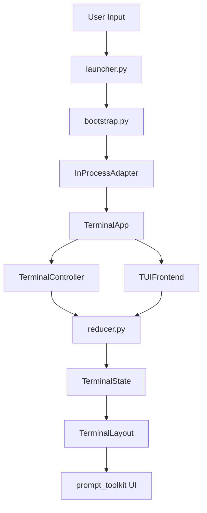

# Frontend TUI

## Metadata

> 状态：`active`
> 类型：`module`
> 负责人：`project maintainers`
> 最后同步日期：`2026-04-09`
> 对应代码范围：`src/embedagent/frontend/tui/`

## 1. Purpose And Scope

本模块文档说明 EmbedAgent 的终端用户界面（TUI）前端实现。TUI 基于 `prompt_toolkit` 提供全屏、键盘驱动的终端应用，作为用户与 Agent Core 运行时的交互层。

## 2. Responsibilities

- CLI 参数解析与环境准备（`launcher.py`）
- 依赖加载与安全回退，连接 `InProcessAdapter`（`bootstrap.py`）
- `TerminalApp` 生命周期与应用容器管理（`app.py`）
- 用户交互逻辑、命令解析、键盘事件、会话生命周期（`controller.py`）
- 协议 compliant 的前端适配桥（`frontend_adapter.py`）

## 3. Code Mapping

- 目录：`src/embedagent/frontend/tui/`
- 入口文件：`src/embedagent/frontend/tui/launcher.py`
- 核心对象：
  - `launch_tui()` / `main()` — CLI 入口
  - `run_tui()` — bootstrap 入口
  - `TerminalApp` — 应用容器
  - `TerminalController` — 事件处理与命令
  - `TUIFrontend` — 协议回调实现
  - `TerminalLayout` — UI 构建与键绑定
  - `TerminalState` / `reducer.py` — 纯状态树与变换
- 上游依赖：CLI（`__main__`）或外部 API 入口
- 下游影响：`InProcessAdapter`（后端核心）
- 相关测试：`tests/test_architecture.py`（`TestFrontendTUIImport`）、`tests/test_terminal_frontend.py`
- 相关契约：`docs/frontend-protocol.md`、`docs/agent-harness-v2.md`

## 4. Dependencies And Consumers

上游依赖：

- `prompt_toolkit`、`rich`
- `embedagent_protocol`、`embedagent.config`、`embedagent_host.runtime.context`
- `embedagent_host.inprocess_adapter`、`embedagent.llm`、`embedagent.modes`
- `embedagent_core.permissions`、`embedagent.project_memory`、`embedagent.tools`

下游消费者：

- CLI：`python -m embedagent.frontend.tui.launcher`
- `embedagent.tui.py`
- 任何以编程方式调用 `launch_tui()` 或 `run_tui()` 的入口

## 5. Data / Control Flow

用户输入经 `launcher` 参数解析后由 `bootstrap` 装配 `InProcessAdapter`，再实例化 `TerminalApp`。`TerminalController` 与 `TUIFrontend` 分别处理传统事件和协议回调，统一通过 `reducer` 更新 `TerminalState`，最终由 `TerminalLayout` 渲染为 `prompt_toolkit` UI。

关键边界：

- `TerminalController` 负责传统事件处理，`TUIFrontend` 面向协议回调。
- `reducer.py` 保持纯函数，不直接依赖后端对象。
- `bootstrap.py` 负责把所有后端依赖安全装配到 `TerminalApp`。

## 6. Workbench Shell

The TUI mirrors the GUI workbench vocabulary using prompt_toolkit: shared
command IDs, slash names, right-panel surfaces, bottom-drawer names, command
palette state, and keyboard-first overlays.

The TUI remains usable in raw console and low-color hosts. Pi-inspired
overlays and selectors are implemented as prompt_toolkit layout surfaces over
the existing reducer/controller/service boundaries. They do not change Agent
Core policy, workflow package ownership, tool activation, permission rules, or
session-history truth.

## 7. Verification And Tests

推荐回归入口：

- `tests/test_architecture.py` — 验证 `TerminalApp`、`TUIFrontend`、`launch_tui` 的懒加载
- `tests/test_terminal_frontend.py` — 测试补全器、`TerminalState` 行为、文件/工件/会话补全

当 TUI 命令、布局、键绑定、`prompt_toolkit`/`rich` 版本或后端会话/时间线 API 变化时，应优先重跑这些测试。

## 8. Change Triggers

以下变化必须同步更新本文件：

- TUI 命令或键盘事件变化（`controller.py`、`commands.py`）
- `FrontendCallbacks` 接口变化（需同步 `frontend_adapter.py`）
- `InProcessAdapter` 或后端会话/时间线 API 变化
- 新增权限或用户输入交互模式
- `prompt_toolkit` 或 `rich` 版本升级可能影响布局或 headless 模式

## 9. Related Documents

- `docs/frontend-protocol.md`
- `docs/agent-harness-v2.md`
- `docs/modules/agent-core.md`
- `docs/modules/protocol-and-core.md`
- `docs/references/code-doc-matrix.md`
- `docs/references/glossary.md`
