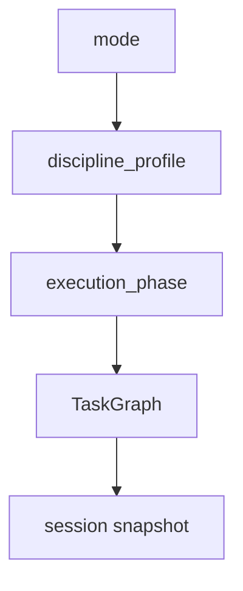

# Harness

## Metadata

> 状态：`active`
> 类型：`module`
> 负责人：`project maintainers`
> 最后同步日期：`2026-04-08`
> 对应代码范围：`src/embedagent/harness/`

## 1. Purpose And Scope

本模块文档说明 Harness 负责的执行纪律和任务结构，覆盖 mode registry、discipline defaults、phase advancement、prompt stack 与 `TaskGraph` 投影。

## 2. Responsibilities

- mode registry
- discipline defaults
- phase advancement
- prompt stack construction
- task graph generation

Harness 的职责是把 workflow 结构从 ad-hoc prompt 行为中抽离出来，形成稳定的 `mode + discipline_profile + execution_phase + TaskGraph` 正式模型。

## 3. Code Mapping

- 目录：`src/embedagent/harness/`
- 入口文件：`src/embedagent/harness/runner.py`
- 核心对象：`HarnessRunner`、`TaskGraph`、`advance_phase()` / `advance_until_stable()`
- 上游依赖：`QueryEngine`、`modes.py`
- 下游影响：`task_status`、session snapshots、frontend runtime
- 相关测试：`tests/test_harness_runner_taskgraph.py`、`tests/test_harness_runner_debug.py`、`tests/test_harness_runner_verify.py`、`tests/test_harness_task_projection.py`、`tests/test_harness_contracts.py`
- 相关契约：`docs/agent-harness-v2.md`、`docs/mode-schema.md`、`docs/tool-contracts.md`

## 4. Dependencies And Consumers

上游依赖：

- `src/embedagent/query_engine.py`
- `src/embedagent/modes.py`

下游消费者：

- session task snapshot
- `task_status`
- frontend runtime / task 面板
- tool pack 选择和 phase 约束

## 5. Data / Control Flow

Harness 先根据 `mode` 与 discipline 选择执行轨道，再由 `phase_engine.py` 依据 artifact flags 推进 `execution_phase`，最终把结果收敛到 `TaskGraph` 和 session snapshot。

## 6. Verification And Tests

推荐回归入口：

- `tests/test_harness_runner_taskgraph.py`
- `tests/test_harness_runner_debug.py`
- `tests/test_harness_runner_verify.py`
- `tests/test_harness_task_projection.py`
- `tests/test_harness_contracts.py`
- `tests/test_modes.py`

当 mode 词汇、phase 推进、task projection 或 discipline behavior 改变时，应优先重跑这些测试。

## 7. Change Triggers

以下变化必须同步更新本文件：

- mode registry 变化
- `discipline_profile` 或 `execution_phase` 语义变化
- `TaskGraph` 结构变化
- phase advancement 规则变化
- task projection 到 session snapshot 的路径变化

## 8. Related Documents

- `docs/agent-harness-v2.md`
- `docs/mode-schema.md`
- `docs/tool-contracts.md`
- `docs/references/code-doc-matrix.md`
- `docs/references/glossary.md`
