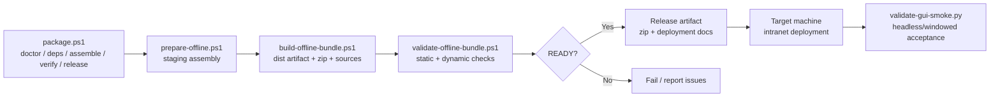

# Packaging And Deployment

## Metadata

> 状态：`active`
> 类型：`module`
> 负责人：`project maintainers`
> 最后同步日期：`2026-06-14`
> 对应代码范围：`scripts/`

## 1. Purpose And Scope

本模块文档说明 EmbedAgent 的零依赖、单文件夹可移植 Windows 7 x64 离线包构建与内网部署流程。覆盖从资产解析、分级 assembly、分发制品生成到现场验证和部署的完整链路。

## 2. Responsibilities

- 第三方资产解析与下载（`prepare-offline.ps1`）
- 分级 bundle assembly 与清单生成（`prepare-offline.ps1`）
- 分发制品、zip 与 sources seed 生成（`build-offline-bundle.ps1`）
- 包完整性静态与动态校验（`validate-offline-bundle.ps1`）
- runtime-invoked bundled external tool 契约维护（`offline-runtime-contract.json`）
- GUI 端到端冒烟验收（`validate-gui-smoke.py`）
- 统一编排与结构化报告输出（`package.ps1`）

## 3. Code Mapping

- 目录：`scripts/`
- 入口文件：`scripts/package.ps1`
- 核心对象/脚本：
  - `package.ps1` — 统一编排入口（`doctor` / `deps` / `assemble` / `verify` / `release`）
  - `prepare-offline.ps1` — 分级 bundle assembly
  - `build-offline-bundle.ps1` — 分发制品 + zip + sources seed
  - `validate-offline-bundle.ps1` — 静态与动态校验门禁
  - `offline-runtime-contract.json` — runtime-invoked bundled external tools 单一契约
  - `validate-gui-smoke.py` — headless/windowed 端到端 GUI 验收
  - `package-lib.ps1` — PowerShell 共享库（配置解析、报告构建、GUI asset 检查）
- bundle 目录布局：
  ```text
  EmbedAgent/
  ├── embedagent.cmd / embedagent-tui.cmd / embedagent-gui.cmd
  ├── manifests/
  │   ├── bundle-manifest.json
  │   ├── checksums.txt
  │   └── licenses/
  ├── runtime/
  │   ├── python/
  │   ├── site-packages/
  │   └── webview2-fixed-runtime/   # Win7 Chromium 基线（109）
  ├── app/
  │   └── embedagent/
  ├── bin/
  │   ├── git/
  │   ├── rg/
  │   ├── ctags/
  │   └── llvm/
  ├── config/
  └── docs/
  ```
- 核心组件清单：
  | 组件 | 目标位置 | 状态 |
  |---|---|---|
  | Python 3.8 embeddable distribution | `runtime/python/` | integrated |
  | vendored Python packages | `runtime/site-packages/` | integrated |
  | EmbedAgent 应用代码 | `app/embedagent/` | ready |
  | MinGit portable | `bin/git/` | integrated |
  | ripgrep | `bin/rg/` | integrated |
  | Universal Ctags | `bin/ctags/` | integrated |
  | LLVM/Clang bundle | `bin/llvm/` | contract-validated |
  | Fixed Version WebView2 109 | `runtime/webview2-fixed-runtime/` | Win7 GUI 必需 |
- 上游依赖：`src/embedagent/`、GUI 静态资源、`scripts/offline-assets.json`、`scripts/package.config.json`、`scripts/offline-runtime-contract.json`
- 下游影响：`build/offline-dist/<artifact>.zip`、内网目标机
- 相关验证：`validate-offline-bundle.ps1`、`validate-gui-smoke.py`、Win7 目标机部署前检查
- 相关契约：`README.md`、`docs/implementation-roadmap.md`

## 4. Dependencies And Consumers

上游依赖：

- Node/npm（GUI 静态资源构建）
- PowerShell、Python venv
- `scripts/offline-assets.json`（第三方资产清单）
- `scripts/package.config.json`（打包配置）
- `scripts/offline-runtime-contract.json`（运行时外部工具契约）
- 第三方资产 URL 或本地归档
- GUI 额外 Python 依赖：`pywebview`、`fastapi`、`uvicorn`、`websockets`
- Win7 GUI 需携带 Fixed Version WebView2 109 运行时

下游消费者：

- CI 流水线
- 发布工程师
- 内网部署流程与目标机器

## 5. Data / Control Flow

`package.ps1` 按 `doctor` → `deps` → `assemble` → `verify` → `release` 的顺序驱动整个流水线。`assemble` 阶段先运行 `prepare-offline.ps1` 生成分级目录，再由 `build-offline-bundle.ps1` 晋升为分发制品；`verify` 阶段运行 `validate-offline-bundle.ps1` 做静态与动态门禁；最终通过验收的制品可部署到目标机并运行 `validate-gui-smoke.py` 做端到端确认。



关键边界：

- `package.ps1` 是人类/CI 唯一-facing 的入口。
- `prepare-offline.ps1` 生成中间分级树，不直接产出最终 zip。
- `validate-offline-bundle.ps1` 是 release-ready 的强制门禁，并消费 `offline-runtime-contract.json` 验证所有 runtime-invoked bundled external tools。
- `validate-gui-smoke.py` 在目标机或 CI 上运行，验证 GUI 真实可用。

## 6. Verification And Tests

推荐回归入口：

- `scripts/validate-offline-bundle.ps1` — 文件完整性、manifest 可解析性、checksum、launcher 合约、Python `.pth` 补丁、editable link 清除、runtime contract 静态/动态检查
- `scripts/check-bundle-dependencies.py` — Python 依赖、manifest、runtime contract 与外部工具存在性检查
- `scripts/validate-gui-smoke.py` — 模拟 OpenAI 服务器、GUI 启动、WebSocket 会话、工具调用、权限/用户输入流、`/review`
- Win7 GUI 验收标准（窗口模式）：
  - `renderer_report.renderer == "edgechromium"`
  - `renderer_report.runtime_source == "bundle"`
  - `assistant_text` 包含预期回复，工具事件完整
- Win7 目标机部署前检查：静态文件完整、launcher 可启动、各二进制可输出版本

当 `src/embedagent/`、GUI 前端代码、`offline-assets.json`、`package.config.json`、`offline-runtime-contract.json`、第三方工具版本或 Win7 兼容性策略变化时，应优先重跑这些验证。

## 7. Change Triggers

以下变化必须同步更新本文件：

- `scripts/` 下打包脚本职责或入口变化
- `offline-assets.json` 或 `package.config.json` 结构变化
- `offline-runtime-contract.json` 的工具、路径、动态检查或 LLVM child executable 列表变化
- 新增或移除第三方依赖/工具
- Win7 兼容性策略或 WebView2 版本策略变化
- 部署目录结构或配置模板变化
- GUI 静态资源构建方式变化

## 8. Related Documents

- `docs/implementation-roadmap.md`
- `docs/guides/configuration-guide.md`
- `docs/guides/intranet-deployment.md`
- `docs/guides/win7-gui-validation.md`
- `docs/guides/win7-preflight-checklist.md`
- `docs/references/code-doc-matrix.md`
- `docs/references/glossary.md`
