# Packaging And Deployment

## Metadata

> 状态：`active`
> 类型：`module`
> 负责人：`project maintainers`
> 最后同步日期：`2026-07-19`
> 对应代码范围：`scripts/`

## 1. Purpose And Scope

本模块文档说明 EmbedAgent 的零依赖、单文件夹可移植 Windows 7 x64 离线包构建与内网部署流程。覆盖从资产解析、分级 assembly、分发制品生成到现场验证和部署的完整链路。

## 2. Responsibilities

- 第三方资产解析与下载（`prepare-offline.ps1`）
- 六个 Python distribution 的清洁 wheel 构建、边界检查和 Python 3.8
  隔离安装冒烟
- 项目 distribution wheel-only 安装、受控第三方依赖构建与离线
  `site-packages` 暂存
- 分级 bundle assembly 与清单生成（`prepare-offline.ps1`）
- 分发制品、zip 与 sources seed 生成（`build-offline-bundle.ps1`）
- 包完整性静态与动态校验（`validate-offline-bundle.ps1`）
- runtime-invoked bundled external tool 契约维护（`offline-runtime-contract.json`）
- C/C++ release smoke 验证（`validate-cpp-smoke.py`）
- GUI 端到端冒烟验收（`validate-gui-smoke.py`）
- 统一编排与结构化报告输出（`package.ps1`）

## 3. Code Mapping

- 目录：`scripts/`
- 入口文件：`scripts/package.ps1`
- 核心对象/脚本：
  - `package.ps1` — 统一编排入口（`doctor` / `deps` / `assemble` / `verify` / `release`）
  - `build-python-distributions.py` — 清理已知构建缓存并构建六个 wheel
  - `check-python-distributions.py` — 校验 wheel 集合、归属、项目 distribution DAG 和 Win7 路径安全
  - `smoke-python-distributions.py` — 在临时 Python 3.8 venv 中对六个项目 distribution 执行 no-index/no-deps 导入冒烟
  - `export-dependencies.py` — 构建并检查项目 wheel，准备锁定第三方依赖，再以 wheel-only 方式安装六个项目 distribution
  - `build-gui-launcher.ps1` — 构建 Win32 GUI native launcher
  - `launcher/embedagent_gui_launcher.cpp` — 薄原生 GUI 启动器源码
  - `prepare-offline.ps1` — 分级 bundle assembly
  - `build-offline-bundle.ps1` — 分发制品 + zip + sources seed
  - `validate-offline-bundle.ps1` — 静态与动态校验门禁
  - `offline-runtime-contract.json` — runtime-invoked bundled external tools 单一契约
  - `validate-cpp-smoke.py` — bundle 内 Clang + C smoke workspace 验收
  - `validate-gui-smoke.py` — headless/windowed 端到端 GUI 验收
  - `package-lib.ps1` — PowerShell 共享库（配置解析、报告构建、GUI asset 检查）
- bundle 目录布局：
  ```text
  EmbedAgent/
  ├── EmbedAgent.exe / embedagent-gui.exe
  ├── embedagent.cmd / embedagent-tui.cmd / embedagent-gui.cmd
  ├── validate-cpp-smoke.cmd / validate-gui-smoke.cmd
  ├── manifests/
  │   ├── bundle-manifest.json
  │   ├── checksums.txt
  │   └── licenses/
  ├── runtime/
  │   ├── python/
  │   ├── site-packages/
  │   └── webview2-fixed-runtime/   # Win7 Chromium 基线（109）
  ├── app/
  │   └── embedagent/
  ├── bin/
  │   ├── git/
  │   ├── rg/
  │   ├── ctags/
  │   └── llvm/
  ├── config/
  ├── data/
  │   └── workspace-template/       # bundled C smoke workspace
  ├── tools/
  │   └── validation/
  └── docs/
  ```
- 核心组件清单：
  | 组件 | 目标位置 | 状态 |
  |---|---|---|
  | Python 3.8 embeddable distribution | `runtime/python/` | integrated |
  | vendored Python packages | `runtime/site-packages/` | integrated |
  | Core / Protocol / Host / Composition | `runtime/site-packages/` | checked wheel install |
  | EmbedAgent 产品代码 | `app/embedagent/` | checked wheel install |
  | MinGit portable | `bin/git/` | integrated |
  | ripgrep | `bin/rg/` | integrated |
  | Universal Ctags | `bin/ctags/` | integrated |
  | LLVM/Clang bundle | `bin/llvm/` | contract-validated |
  | Fixed Version WebView2 109 | `runtime/webview2-fixed-runtime/` | Win7 GUI 必需 |
  | Native GUI launcher | `EmbedAgent.exe`, `embedagent-gui.exe` | integrated |
- 上游依赖：六个 Python distribution、GUI 静态资源、`scripts/offline-assets.json`、`scripts/package.config.json`、`scripts/offline-runtime-contract.json`
- 下游影响：`build/offline-dist/<artifact>.zip`、内网目标机
- 相关验证：`validate-offline-bundle.ps1`、`validate-cpp-smoke.py`、`validate-gui-smoke.py`、Win7 目标机部署前检查
- 相关契约：`README.md`、`docs/implementation-roadmap.md`

## 4. Dependencies And Consumers

上游依赖：

- Node/npm（GUI 静态资源构建）
- `cl.exe` 或 `clang-cl.exe`（native GUI launcher 构建；运行时不需要）
- PowerShell、Python venv
- `scripts/offline-assets.json`（第三方资产清单）
- `scripts/package.config.json`（打包配置）
- `scripts/offline-runtime-contract.json`（运行时外部工具契约）
- 第三方资产 URL 或本地归档
- GUI 额外 Python 依赖：`pywebview`、`fastapi`、`uvicorn`、`websockets`
- Win7 GUI 需携带 Fixed Version WebView2 109 运行时

Python distribution 依赖图固定为：Host 只依赖 Core 和 Protocol；Core、
Protocol、Composition 无运行时依赖；C/C++ workflow 只依赖 Core；产品聚合
包依赖全部五个下层 workspace distribution。Composition 是 build-time Agent
编译/导出层，不进入 Core 的运行时依赖图。GUI 依赖只属于产品聚合包。
bundle staging 不直接复制开发源码树，也不接受 editable link 作为发行输入。METADATA 检查只验证项目
distribution DAG，不声称完整审计第三方版本。第三方导出对 uv 和 pip 都
是独立、受控的构建时步骤，可构建锁定 sdist；当前
`proxy-tools==0.1.0` 使用该路径。目标 runtime 仍完全离线。binary-only
第三方供应需要补齐来源、license 与 hash 固化，属于 release hardening。

下游消费者：

- CI 流水线
- 发布工程师
- 内网部署流程与目标机器

## 5. Data / Control Flow

`package.ps1 doctor` 是独立预检。正常发布运行一次 `package.ps1 release`；release 内部依次执行 `deps` → `assemble` → `verify`，遇到 blocking issue 即停止。`deps` 先构建清洁 wheelhouse，要求检查器确认恰好六个合法 wheel 及其项目依赖 DAG，再准备锁定第三方依赖，并用 no-index/no-deps 安装项目 wheel。`assemble` 阶段先构建 GUI native launcher，再运行 `prepare-offline.ps1` 从已安装 distribution 生成分级目录，并由 `build-offline-bundle.ps1` 晋升为分发制品；`verify` 阶段运行 `validate-offline-bundle.ps1` 做静态与动态门禁，release profile 会执行 contract-backed C/C++ smoke gate；最终通过验收的制品可部署到目标机并运行 `validate-gui-smoke.py` / `validate-cpp-smoke.py` 做端到端确认。

```mermaid
flowchart LR
    P["package.ps1 doctor<br/>standalone preflight"] --> A["package.ps1 release"]
    A --> W["deps<br/>six checked wheels + locked third parties"]
    W --> L["assemble<br/>native launcher + staging"]
    L --> B["prepare-offline.ps1<br/>staging assembly"]
    B --> C["build-offline-bundle.ps1<br/>dist artifact + zip + sources"]
    C --> D["validate-offline-bundle.ps1<br/>static + dynamic checks"]
    D --> J["validate-cpp-smoke.py<br/>bundled Clang C smoke"]
    J --> E{READY?}
    E -->|Yes| F["Release artifact<br/>zip + deployment docs"]
    E -->|No| G["Fail / report issues"]
    F --> H["Target machine<br/>intranet deployment"]
    H --> I["validate-gui-smoke.py<br/>headless/windowed acceptance"]
```



关键边界：

- `package.ps1` 是主要 release orchestration 入口；直接 Python/PowerShell 脚本和 Make targets 仍是支持的诊断与 CI gate。
- `build-python-distributions.py` 是 wheel 构建入口。仓库内输出目录只清理已知生成物；外部 wheelhouse 必须是普通目录，不能经过 reparse point，且只能预存普通 `.whl` 文件，出现其他文件时构建直接失败。
- `check-python-distributions.py` 必须在安装、归档或 bundle staging 之前通过；它拒绝缺失/多余 wheel、跨 distribution 文件、错误的项目依赖 DAG、非法 archive path 和 Win7 文件名碰撞，但不审计全部第三方版本。
- `smoke-python-distributions.py` 必须使用精确 Python 3.8，临时 venv 安装使用 `--isolated --no-index --no-deps`，不读取开发树或用户 site-packages。独立/组合场景覆盖六个项目 distribution，包括产品包来自 venv 的证明；它不启动完整 GUI、provider 或 hosted runtime。
- `build-gui-launcher.ps1` 只在构建机生成薄 Win32 launcher；运行时仍使用 bundle 内 Python/WebView2。
- `prepare-offline.ps1` 生成中间分级树，不直接产出最终 zip。
- `validate-offline-bundle.ps1` 是 release-ready 的强制门禁，并消费 `offline-runtime-contract.json` 验证所有 runtime-invoked bundled external tools。
- `validate-cpp-smoke.py` 是 bundle-local C/C++ release gate，默认只接受 bundle 内 `bin/llvm/bin/clang.exe`，不会把系统 PATH 上的 clang 当作发布证明。
- `validate-gui-smoke.py` 在目标机或 CI 上运行，验证 GUI 真实可用；bundle launcher 默认传入 `--require-fixed-webview2`。

## 6. Verification And Tests

推荐回归入口：

```powershell
uv sync
uv run python scripts/build-python-distributions.py --dist-dir dist
uv run python scripts/check-python-distributions.py --dist-dir dist
uv run python scripts/smoke-python-distributions.py --dist-dir dist --python .venv/Scripts/python.exe
powershell -ExecutionPolicy Bypass -File scripts/package.ps1 doctor
powershell -ExecutionPolicy Bypass -File scripts/package.ps1 release
```

需要定位 distribution 问题时，使用上面的直接 build/check/smoke 命令；正式
组包以 doctor + release 为准。release 的 deps 阶段负责 dependency export，
不需要在正常发布流程前手工重复运行 `export-dependencies.py`。

- `scripts/validate-offline-bundle.ps1` — 文件完整性、manifest 可解析性、checksum、launcher 合约、Python `.pth` 补丁、editable link 清除、runtime contract 静态/动态检查
- `scripts/check-bundle-dependencies.py` — Python 依赖、manifest、runtime contract、release gate 资产与外部工具存在性检查
- `scripts/validate-cpp-smoke.py` — 使用 bundle 内 Clang 编译 `data/workspace-template/main.c` 到 `.embedagent/smoke-build/main.obj`，JSON 报告必须显示 `runtime_source == "bundle"` 才能作为 release 证据
- `scripts/validate-gui-smoke.py` — 模拟 OpenAI 服务器、GUI 启动、WebSocket 会话、工具调用、权限/用户输入流、`/review`，bundle 验证可要求 Fixed Version WebView2 109
- Win7 GUI 验收标准（窗口模式）：
  - `renderer_report.renderer == "edgechromium"`
  - `renderer_report.runtime_source == "bundle"`
  - `assistant_text` 包含预期回复，工具事件完整
- Win7 目标机部署前检查：静态文件完整、launcher 可启动、各二进制可输出版本

当前仓库门禁能够证明 wheel 边界、离线安装路径、bundle 结构和 bundle-local
C smoke 契约。它不能证明真实 Windows 7 窗口渲染。发布前仍必须在目标式
bundle 上记录 bundled WebView2 109 的 clean Win7 windowed GUI smoke 证据；
缺少该证据时只能声明本地/仓库门禁通过，不能声明 Win7 GUI 交付完成。

当任一 workspace distribution、产品代码、GUI 前端代码、`offline-assets.json`、`package.config.json`、`offline-runtime-contract.json`、第三方工具版本或 Win7 兼容性策略变化时，应优先重跑这些验证。

## 7. Change Triggers

以下变化必须同步更新本文件：

- `scripts/` 下打包脚本职责或入口变化
- `offline-assets.json` 或 `package.config.json` 结构变化
- `offline-runtime-contract.json` 的工具、路径、动态检查或 LLVM child executable 列表变化
- `offline-runtime-contract.json` 的 `release_gates`、C smoke workspace 或 smoke 脚本变化
- 新增或移除第三方依赖/工具
- Python distribution 依赖、源码归属、wheel 文件集合或 bundle staging 方式变化
- Win7 兼容性策略或 WebView2 版本策略变化
- 部署目录结构或配置模板变化
- GUI 静态资源构建方式变化

## 8. Related Documents

- `docs/implementation-roadmap.md`
- `docs/guides/configuration-guide.md`
- `docs/guides/intranet-deployment.md`
- `docs/guides/win7-gui-validation.md`
- `docs/guides/win7-preflight-checklist.md`
- `docs/references/code-doc-matrix.md`
- `docs/references/glossary.md`
## 9. Phase 7 release identity and acceptance states

Release packaging is bound to one credential-free `manifests/release-identity.json`. The identity records the source revision, version, exact six project wheel names and SHA-256 values, GUI static hash, asset manifest hash, and runtime-contract hash. `prepare-offline.ps1` stages the product only from `build/offline-cache/site-packages-export/site-packages/embedagent`; the product package and product dist-info are absent from `runtime/site-packages`, while the five lower distributions remain there with their checked metadata.

A release zip is provisional during assembly. `validate-offline-bundle.ps1 -RequireComplete` and `check-bundle-dependencies.py` must pass before the package report can reach `TARGET_READY`. `TARGET_READY` means repository-side and bundle-local gates passed; it is not a Win7 delivery claim and does not mean the artifact is publishable as accepted evidence. `ACCEPTED` is written only by the offline evidence validator after a copied report proves Windows 7 SP1 AMD64, Fixed Version WebView2 109 from the bundle, `edgechromium`, bundle C smoke, zero tool fallback, zero command failures, and no blocking errors.

The target-machine command is:

```cmd
runtime\python\python.exe tools\validation\validate-release-evidence.py --identity manifests\release-identity.json --report manifests\evidence\win7-evidence.json --json-report manifests\evidence\acceptance-report.json
```

Do not use local Windows 10 output or a system PATH tool as a substitute for the Win7 report. See `docs/guides/win7-release-runbook.md` for the structured evidence handoff.

## 10. Phase 7R provenance and reproducibility

Every package configuration declares `metadata.config_origin` as either
`production` or `fixture`. Production reports carry a run id, source revision,
execution kind, resolved report/artifact roots, and config path. Unknown origins
are rejected before a package command runs. Fixture tests must deep-copy the
mock config into a temporary directory and redirect all writable roots; fixture
runs must never update `build/offline-reports/latest.json`.

Use the two-run gate for a local release candidate:

```powershell
powershell -ExecutionPolicy Bypass -File scripts/package.ps1 release `
  -Reproducible -ReproducibilityRoot build/phase7-repro
```

The command creates `run-a` and `run-b` child configs, writes child reports and
artifacts under those roots, and invokes `scripts/compare-release-artifacts.py`.
The comparator ignores only the explicit generated evidence paths in
`tests/fixtures/packaging/reproducibility-config.json` and normalizes the
manifest's declared operational path/timestamp fields. A stable file, source
revision, identity, wheel filename/hash, GUI static hash, asset-manifest hash, or
runtime-contract hash difference blocks the outer report. The outer report is
`TARGET_READY` only when both children and the comparison pass; it remains
`publishable=false` and `acceptance_status=PENDING_WIN7` until target evidence is
collected.

Atomic report writes use sibling temporary files and replacement on the same
volume. Never treat a report path, duration, log tail, or local Windows 10 smoke
result as target-machine acceptance evidence.

## 11. Phase 7B handoff and offline cache

The current repository-side release gate reaches TARGET_READY with
acceptance_status=PENDING_WIN7 and publishable=false. Phase 7B code and docs are
committed in main at 65e1946a; the recorded pre-commit report remains
diagnostic until the release is regenerated from that clean revision. The passing local gates
include exact six-wheel export, wheel-only staging, GUI headless smoke,
bundle-local C smoke, and zip extraction re-validation. This remains a local
candidate state, not a Windows 7 delivery claim.

The wheel builder and dependency exporter expose explicit cache controls:

    uv run python scripts/build-python-distributions.py --dist-dir build/offline-cache/site-packages-export/wheels --cache-dir .uv-cache --offline
    uv run python scripts/export-dependencies.py --output-dir build/offline-cache/site-packages-export --cache-dir .uv-cache --offline

The release profile supplies the same project-local cache and offline flag
through package.ps1. Third-party wheels/sdists may be prepared in a controlled
build-time step; the bundle runtime never resolves dependencies or reaches the
network.

The bundle GUI smoke must report renderer=edgechromium,
runtime_source=bundle, and fixed_webview2.runtime_major=109. A real Windows 7
SP1 x64 windowed run is still required. Runbook evidence must be copied into
manifests/evidence/win7-evidence.json and validated with
tools/validation/validate-release-evidence.py; only ACCEPTED from that
validator closes Phase 7B. A release report produced from a dirty worktree is
diagnostic only and must be regenerated after committing the source revision.