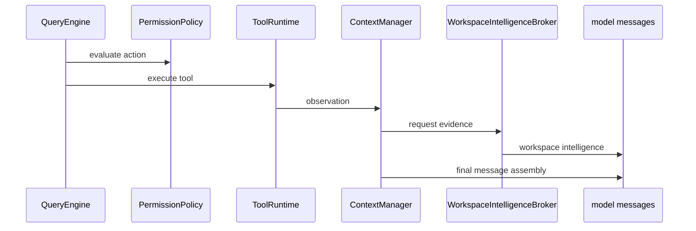

# Permissions And Context

## Metadata

> 状态：`active`
> 类型：`module`
> 负责人：`project maintainers`
> 最后同步日期：`2026-04-08`
> 对应代码范围：`src/embedagent/permissions.py`, `src/embedagent/context.py`, `src/embedagent/workspace_intelligence.py`

## 1. Purpose And Scope

本模块文档说明权限决策、上下文预算与 workspace intelligence 的协作关系，覆盖 `PermissionPolicy`、`ContextManager` 与 `WorkspaceIntelligenceProvider` / `WorkspaceIntelligenceBroker`。

## 2. Responsibilities

- permission rule matching and explanation rendering
- context budgeting and reducer routing
- workspace intelligence evidence assembly

该模块确保工具审批、消息组装与 workspace 证据注入围绕统一规则运行，而不是由 prompt 文本隐式驱动。

## 3. Code Mapping

- 目录：`src/embedagent/`
- 入口文件：`src/embedagent/permissions.py`, `src/embedagent/context.py`
- 核心对象：`PermissionPolicy`、`ContextManager`、`WorkspaceIntelligenceProvider`、`WorkspaceIntelligenceBroker`
- 上游依赖：query engine、tool runtime
- 下游影响：tool approval UX、message assembly、verify context quality
- 相关测试：`tests/test_permissions.py`、`tests/test_context_config.py`、`tests/test_query_engine_refactor.py`、`tests/test_architecture.py`
- 相关契约：`docs/permission-model.md`、`docs/overall-solution-architecture.md`

## 4. Dependencies And Consumers

上游依赖：

- `src/embedagent/query_engine.py`
- `src/embedagent/tools/runtime.py`

下游消费者：

- tool approval / ask-user UX
- model message assembly
- diagnostics / quality evidence summary
- verify 模式与 review 相关上下文质量

## 5. Data / Control Flow

`QueryEngine` 在执行 tool action 前调用 `PermissionPolicy` 做决策，经 `ToolRuntime` 产出 observations 后，`ContextManager` 与 workspace intelligence 共同组装最终提供给模型的消息上下文。

## 6. Verification And Tests

推荐回归入口：

- `tests/test_permissions.py`
- `tests/test_context_config.py`
- `tests/test_query_engine_refactor.py`
- `tests/test_architecture.py`

当 permission 分类、解释文本、context budgeting、reducer 路径或 workspace intelligence 证据聚合变化时，应优先重跑这些测试。

## 7. Change Triggers

以下变化必须同步更新本文件：

- 权限规则匹配结构变化
- explanation text 语义变化
- context budgeting / reducer routing 变化
- workspace intelligence provider/broker 结构变化
- tool approval UX 或 message assembly 边界变化

## 8. Related Documents

- `docs/permission-model.md`
- `docs/overall-solution-architecture.md`
- `docs/references/code-doc-matrix.md`
- `docs/references/glossary.md`
