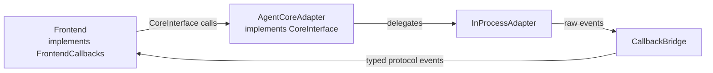

# Protocol And Core

## Metadata

> 状态：`active`
> 类型：`module`
> 负责人：`project maintainers`
> 最后同步日期：`2026-07-02`
> 对应代码范围：`src/embedagent/protocol/`, `src/embedagent/core/`

## 1. Purpose And Scope

本模块文档说明 EmbedAgent 的前后端正式契约层（`protocol`）以及把契约桥接到 hosted runtime 的适配层（`core`）。
`protocol` 定义了所有前端实现必须遵守的共享数据结构和双向接口；`core` 提供 `AgentCoreAdapter`，把 `embedagent_host.InProcessAdapter` 的产品负载翻译成稳定协议对象。

## 2. Responsibilities

- 声明共享 `dataclass`、枚举和双向接口（`CoreInterface`、`FrontendCallbacks`）
- 把 hosted runtime 负载翻译成协议快照和事件
- 把引擎回调按正确类型和元数据转发给前端
- 在变更型工具完成后触发前端数据刷新
- expose resource reload through the stable core API
- carry `extensions.local_resources`, `extensions.project_extensions`, and `extension_diagnostics` through snapshots
- keep tool catalog visibility aligned with the hosted runtime's shared `ExtensionManager`

## 3. Code Mapping

- 目录：`src/embedagent/protocol/`, `src/embedagent/core/`
- 入口文件：`src/embedagent/core/__init__.py`
- 核心对象：
  - `protocol/__init__.py` — `CoreInterface`、`FrontendCallbacks`、`Message`、`ToolCall`、`SessionSnapshot` 等全部数据类
  - `core/adapter.py` — `AgentCoreAdapter`、`CallbackBridge`
- 上游依赖：`InProcessAdapter`（hosted runtime）
- 下游影响：`frontend/tui/frontend_adapter.py`、`frontend/gui/backend/server.py`
- 相关测试：`tests/test_architecture.py`、`tests/test_gui_sync.py`、`tests/test_gui_runtime.py`、`tests/test_gui_backend_api.py`、`tests/test_local_resources.py`、`tests/test_project_extensions.py`、`tests/test_capability_extensions.py`
- 相关契约：`docs/frontend-protocol.md`、`docs/overall-solution-architecture.md`

## 4. Dependencies And Consumers

上游依赖：

- `src/embedagent_host/inprocess_adapter.py`
- `src/embedagent_core/query_engine.py`

下游消费者：

- `src/embedagent/frontend/tui/frontend_adapter.py` — 实现 `FrontendCallbacks`
- `src/embedagent/frontend/gui/backend/server.py` — `WebSocketFrontend` 实现 `FrontendCallbacks`
- `src/embedagent/frontend/gui/launcher.py` — 实例化 `AgentCoreAdapter`

## 5. Data / Control Flow

用户动作通过 `CoreInterface` 进入 `AgentCoreAdapter`，再委托给 `InProcessAdapter`；引擎产生事件后由 `CallbackBridge` 转换为协议对象，最终送达 `FrontendCallbacks`。

关键边界：

- `protocol` 只依赖标准库，不耦合后端内部实现。
- `AgentCoreAdapter` 是 `CoreInterface` 的唯一实现，负责所有翻译逻辑。
- `CallbackBridge` 不知道内部引擎细节，只使用协议类型。
- resource reload、project extension state 和 extension diagnostics 只作为 backend-owned health/diagnostics state 透出；前端不拥有 extension execution policy。

## 6. Verification And Tests

推荐回归入口：

- `tests/test_architecture.py` — 协议对象创建、`MockFrontend`、导入检查
- `tests/test_gui_sync.py` — `CallbackBridge` 事件翻译、刷新推送语义、端到端交互路由
- `tests/test_gui_runtime.py` — 适配器 API、`WebSocketFrontend` 广播与错误处理、启动器连线
- `tests/test_gui_backend_api.py`
- `tests/test_local_resources.py`
- `tests/test_project_extensions.py`
- `tests/test_capability_extensions.py`

当新增事件类型、会话快照字段、resource reload API、extension diagnostics 字段或前端刷新触发条件变化时，应优先重跑这些测试。

## 7. Change Triggers

以下变化必须同步更新本文件：

- `InProcessAdapter` 新增事件类型，需要在 `CallbackBridge.emit` 中补充映射
- 会话快照字段变化，需要更新 `_session_snapshot_from_dict` 和 `SessionSnapshot`
- resource reload 或 extension diagnostics API/字段变化
- 新增应在完成后触发 UI 刷新的工具，需要在工具目录元数据声明 `read_model_invalidations`，并通过工具事件传递给 GUI；不要新增 Core/GUI 侧工具名刷新列表
- 新增前端形态（CLI、移动端等）需要实现 `FrontendCallbacks`
- `CoreInterface` 或 `FrontendCallbacks` 接口签名变化

## 8. Related Documents

- `docs/frontend-protocol.md`
- `docs/overall-solution-architecture.md`
- `docs/modules/frontend-tui.md`
- `docs/modules/frontend-gui.md`
- `docs/references/code-doc-matrix.md`
- `docs/references/glossary.md`
