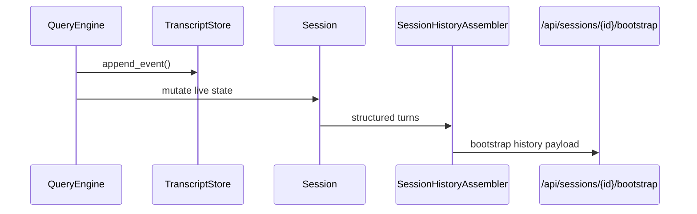

# Session Runtime

## Metadata

> 状态：`active`
> 类型：`module`
> 负责人：`project maintainers`
> 最后同步日期：`2026-07-02`
> 对应代码范围：`src/embedagent/session.py`, `src/embedagent/session_history.py`, `src/embedagent/session_projector.py`, `src/embedagent/transcript_store.py`

## 1. Purpose And Scope

本模块文档说明会话真相层与历史恢复链路，重点覆盖 `Session`、`transcript.jsonl`、`SessionHistoryAssembler`、`SessionSnapshotProjector` 和 GUI bootstrap 的协作关系。

## 2. Responsibilities

- `Session` live structured state
- `transcript.jsonl` durable ledger
- `SessionHistoryAssembler` GUI history serialization
- bootstrap / projector / restore boundaries
- `Session.workflow_state` generic workflow and extension state carrier
- session snapshot projection for `extensions.local_resources`, `extensions.project_extensions`, and `extension_diagnostics`
- transcript-backed resource reload diagnostics

该模块保证历史、恢复、bootstrap 与前端显示都围绕统一 session truth 工作，而不是由 replay tail 或临时汇总结果拼装。

## 3. Code Mapping

- 目录：`src/embedagent/`
- 入口文件：`src/embedagent/session.py`
- 核心对象：`Session`、`SessionHistoryAssembler`、`SessionSnapshotProjector`、`TranscriptStore`
- 上游依赖：`QueryEngine`
- 下游影响：GUI bootstrap、history rendering、resume path
- 相关测试：`tests/test_session_restore.py`、`tests/test_inprocess_adapter_frontend_api.py`、`tests/test_gui_backend_api.py`、`tests/test_transcript_store.py`、`tests/test_capability_extensions.py`、`tests/test_local_resources.py`、`tests/test_project_extensions.py`
- 相关契约：`docs/overall-solution-architecture.md`、`docs/frontend-protocol.md`

## 4. Dependencies And Consumers

上游依赖：

- `src/embedagent_core/query_engine.py`
- `src/embedagent_host/inprocess_adapter.py`

下游消费者：

- `src/embedagent/frontend/gui/backend/server.py`
- GUI / TUI bootstrap 与 history 渲染路径
- resume / restore 相关入口

## 5. Data / Control Flow

`QueryEngine` 写入 transcript 与 live `Session`，`SessionSnapshotProjector` 负责构建快照，`SessionHistoryAssembler` 负责把 transcript-backed `Session` 转成 GUI history DTO，最终通过 `/api/sessions/{id}/bootstrap` 暴露给 GUI。

Session runtime stores generic workflow and extension state; it does not execute project-local Python extensions. Hosted adapter loading and `ExtensionManager` registration happen before session snapshots project extension state to frontends.

关键边界：

- `transcript.jsonl` 是唯一 durable session-history ledger。
- `Session` / `session.turns` 是唯一 live structured state。
- `SessionHistoryAssembler` 是 GUI 历史序列化唯一正式路径。
- bootstrap 读取 session truth，而不是拼装 replay tail。
- `Session.workflow_state` 承载 generic workflow state、local resource reload state、project extension state 和 extension diagnostics 投影输入。

## 6. Verification And Tests

推荐回归入口：

- `tests/test_session_restore.py`
- `tests/test_transcript_store.py`
- `tests/test_inprocess_adapter_frontend_api.py`
- `tests/test_gui_backend_api.py`
- `tests/test_session_store.py`
- `tests/test_capability_extensions.py`
- `tests/test_local_resources.py`
- `tests/test_project_extensions.py`

当变更影响 transcript append、restore、自举 payload、GUI history 或 projector 语义时，应优先重跑这些测试。

## 7. Change Triggers

以下变化必须同步更新本文件：

- `Session` live state 模型变化
- `Session.workflow_state` workflow / extension state 结构变化
- `transcript.jsonl` 写入或恢复规则变化
- `SessionHistoryAssembler` 序列化边界变化
- `SessionSnapshotProjector` 字段或职责变化
- `/api/sessions/{id}/bootstrap` contract 变化

## 8. Related Documents

- `docs/overall-solution-architecture.md`
- `docs/frontend-protocol.md`
- `docs/references/code-doc-matrix.md`
- `docs/references/glossary.md`
