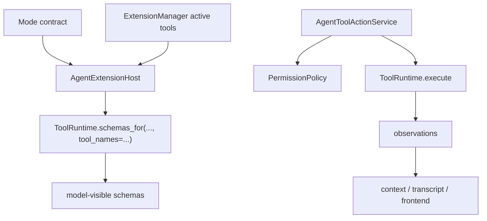

# Tools And Tooling

## Metadata

> 状态：`active`
> 类型：`module`
> 负责人：`project maintainers`
> 最后同步日期：`2026-06-12`
> 对应代码范围：`src/embedagent/tools/`, `src/embedagent/tooling/`

## 1. Purpose And Scope

本模块文档说明官方工具运行时、工具契约、tool packs 和 recipe/quality 执行路径，覆盖 `ToolRuntime` 及其周边 tooling 结构。

## 2. Responsibilities

- official tool runtime facade
- tool packs and contracts
- schema / catalog metadata
- recipe execution and quality reporting
- explicit active schema projection through `ToolRuntime.schemas_for(...)`
- source-aware dynamic tool registration
- file-only local resource reload
- extension tool catalog metadata and permission categories

本模块的目标是保证产品路径只围绕官方工具集合工作，不重新引入平行 runtime 或 legacy duplicate tools。

## 3. Code Mapping

- 目录：`src/embedagent/tools/`, `src/embedagent/tooling/`
- 入口文件：`src/embedagent/tools/runtime.py`
- 核心对象：`ToolRuntime`、`ToolDefinition`、tool ops modules、tool pack registry functions (`register_pack`, `list_packs`)
- 上游依赖：harness、query engine、`AgentExtensionHost`、`AgentToolActionService`
- 下游影响：tool execution、context reduction、frontend tool catalog
- 相关测试：`tests/test_tools_package.py`、`tests/test_tools_v2_runtime.py`、`tests/test_tool_execution.py`、`tests/test_tool_commit.py`、`tests/test_tooling_budget_v2.py`、`tests/test_dynamic_tool_registration.py`、`tests/test_local_resources.py`、`tests/test_project_extensions.py`、`tests/test_workflow_extensions.py`
- 相关契约：`docs/tool-contracts.md`、`docs/overall-solution-architecture.md`

## 4. Dependencies And Consumers

上游依赖：

- `src/embedagent/workflow_packages/c_cpp/`
- `src/embedagent_core/query_engine.py`
- `src/embedagent_core/agent_extension_host.py`
- `src/embedagent_core/agent_tool_action_service.py`

下游消费者：

- context reduction / replacement
- transcript / tool result persistence
- frontend tool catalog
- recipe execution 与 quality report 路径

## 5. Data / Control Flow

`AgentExtensionHost` 把 workflow-neutral mode contract 与 shared `ExtensionManager` 的 active tools 合并后，通过 `ToolRuntime.schemas_for(..., tool_names=...)` 请求显式 schema。`ExtensionManager` 只消费扩展通过 `extension_capabilities()` 返回的 `ExtensionCapability` 记录；动态工具注册、active tool names 和 extension-owned tools 都必须显式声明。`AgentToolActionService` 在执行时先走 `PermissionPolicy` 与 extension hooks，再由 `ToolRuntime` 调度具体 tool ops；产出的 observations 进入 transcript、context 和前端可见工具结果投影。

## 6. Verification And Tests

推荐回归入口：

- `tests/test_tools_package.py`
- `tests/test_tools_v2_runtime.py`
- `tests/test_tool_execution.py`
- `tests/test_tool_commit.py`
- `tests/test_tool_result_store.py`
- `tests/test_tooling_budget_v2.py`
- `tests/test_dynamic_tool_registration.py`
- `tests/test_local_resources.py`
- `tests/test_project_extensions.py`
- `tests/test_workflow_extensions.py`

当 schema/catalog、dynamic tool registration、resource reload、tool pack 选择、observation 结构、recipe 执行或 quality report 语义变化时，应优先重跑这些测试。

## 7. Change Triggers

以下变化必须同步更新本文件：

- 官方工具集合变化
- `ToolRuntime` facade 结构变化
- tool pack 与 tooling contract 变化
- dynamic tool registration、source metadata 或 permission category 变化
- local resource reload 语义变化
- recipe / quality report 正式路径变化
- tool catalog 前端投影变化

## 8. Related Documents

- `docs/tool-contracts.md`
- `docs/overall-solution-architecture.md`
- `docs/references/code-doc-matrix.md`
- `docs/references/glossary.md`
