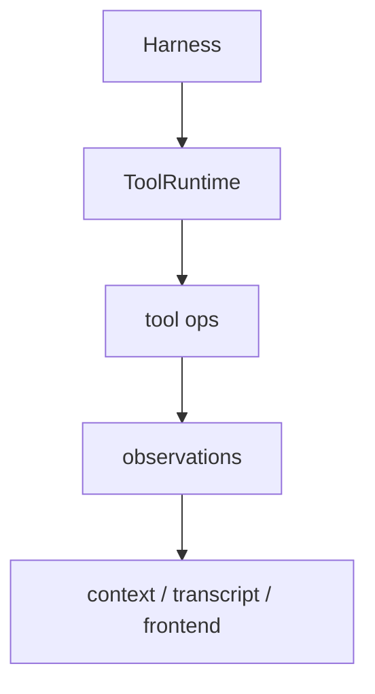

# Tools And Tooling

## Metadata

> 状态：`active`
> 类型：`module`
> 负责人：`project maintainers`
> 最后同步日期：`2026-04-08`
> 对应代码范围：`src/embedagent/tools/`, `src/embedagent/tooling/`

## 1. Purpose And Scope

本模块文档说明官方工具运行时、工具契约、tool packs 和 recipe/quality 执行路径，覆盖 `ToolRuntime` 及其周边 tooling 结构。

## 2. Responsibilities

- official tool runtime facade
- tool packs and contracts
- schema / catalog metadata
- recipe execution and quality reporting

本模块的目标是保证产品路径只围绕官方工具集合工作，不重新引入平行 runtime 或 legacy duplicate tools。

## 3. Code Mapping

- 目录：`src/embedagent/tools/`, `src/embedagent/tooling/`
- 入口文件：`src/embedagent/tools/runtime.py`
- 核心对象：`ToolRuntime`、tool ops modules、tool packs
- 上游依赖：harness、query engine
- 下游影响：tool execution、context reduction、frontend tool catalog
- 相关测试：`tests/test_tools_package.py`、`tests/test_tools_v2_runtime.py`、`tests/test_tool_execution.py`、`tests/test_tool_commit.py`、`tests/test_tooling_budget_v2.py`
- 相关契约：`docs/tool-contracts.md`、`docs/overall-solution-architecture.md`

## 4. Dependencies And Consumers

上游依赖：

- `src/embedagent/harness/`
- `src/embedagent/query_engine.py`

下游消费者：

- context reduction / replacement
- transcript / tool result persistence
- frontend tool catalog
- recipe execution 与 quality report 路径

## 5. Data / Control Flow

Harness 选择工具包后，由 `ToolRuntime` 统一调度具体 tool ops；产出的 observations 进入 transcript、context 和前端可见工具结果投影。

## 6. Verification And Tests

推荐回归入口：

- `tests/test_tools_package.py`
- `tests/test_tools_v2_runtime.py`
- `tests/test_tool_execution.py`
- `tests/test_tool_commit.py`
- `tests/test_tool_result_store.py`
- `tests/test_tooling_budget_v2.py`

当 schema/catalog、tool pack 选择、observation 结构、recipe 执行或 quality report 语义变化时，应优先重跑这些测试。

## 7. Change Triggers

以下变化必须同步更新本文件：

- 官方工具集合变化
- `ToolRuntime` facade 结构变化
- tool pack 与 tooling contract 变化
- recipe / quality report 正式路径变化
- tool catalog 前端投影变化

## 8. Related Documents

- `docs/tool-contracts.md`
- `docs/overall-solution-architecture.md`
- `docs/references/code-doc-matrix.md`
- `docs/references/glossary.md`
