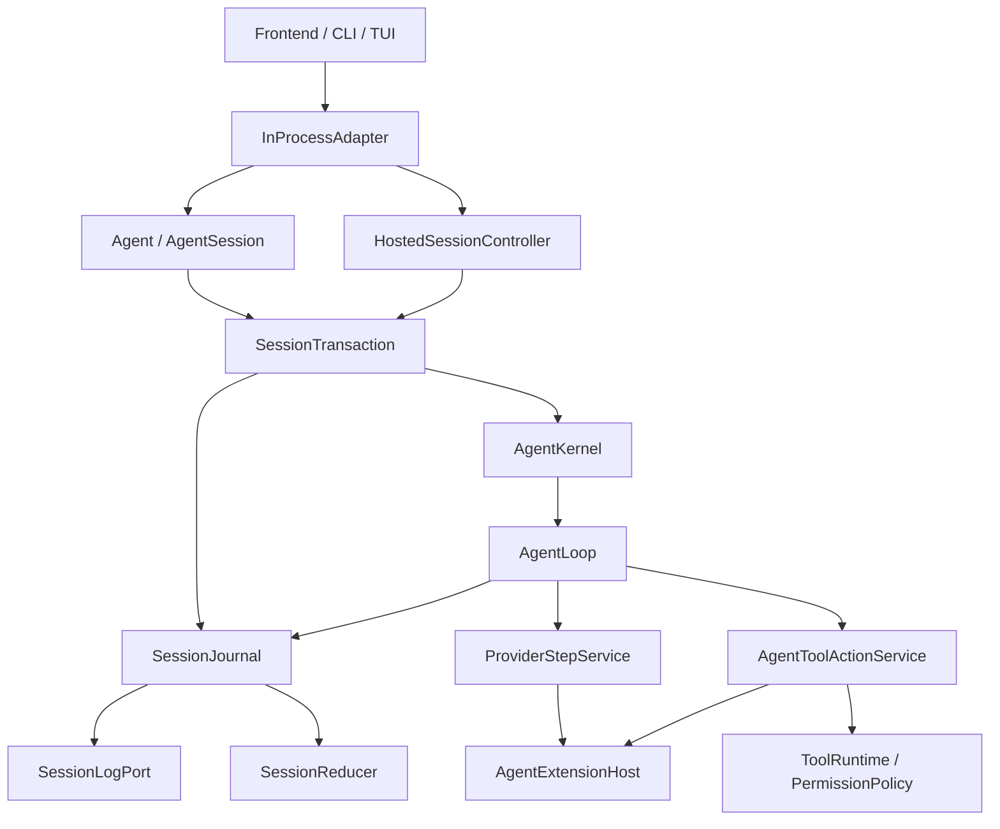

# Agent Core

## Metadata

> 状态：`active`
> 类型：`platform authority`
> 负责人：`Agent platform maintainers`
> 最后同步日期：`2026-08-03`
> 对应代码范围：`packages/embedagent-core/src/embedagent_core/`, `packages/embedagent-host/src/embedagent_host/`

## 1. Purpose And Scope

本文档说明通用 Agent Core 以及受支持的 Core/Host 边界。公开入口是 `Agent` / `AgentSession` / `AgentPorts`；内部状态主链是 `SessionTransaction`、`SessionJournal`、`SessionReducer`、`AgentKernel` 和 `AgentLoop`；Host 只通过 `HostedSessionController` 获取冻结投影。

`QueryEngine`、`SessionRestorer`、Host 持有 mutable Core `Session`、`ExecutionTracer` 和 `CircuitBreaker` 已删除，且没有兼容别名。

### Standalone Public Surface

`embedagent_core` 根包拥有可独立提取的稳定入口：

- execution handles：`Agent`, `AgentSession`, `AgentPorts`, `RuntimeDefinition`, `UserTurn`, `InteractionReply`, `AgentResult`；
- focused collaborators：`ModelClient`, `ToolRuntimePort`, `SessionLogPort`, `ContextAssemblerPort`, `SessionRestorePolicyPort`, `SessionProjectionPort`；
- safe stdlib defaults：`PermissionPolicy`, `InMemorySessionLog`, `NoopContextAssembler`, `NoopSessionProjection`, `StrictSessionRestorePolicy`；
- provider/tool DTOs：`Action`, `AssistantReply`, `Observation`, `PreparedToolObservation`；
- execution errors：`ModelClientError`, `ToolError`, `SessionLeaseConflict`, `SessionRecoveryRequired`。

`AgentPorts` 仍要求调用方显式提供 model、tools、session log、context 和 permissions；Core 不从 Host 或 product 查找隐式默认值。`RuntimeDefinition.application_policy` 是上层应用注入的执行策略载体，Core 不选择产品 mode、prompt、workspace provider 或 workflow。根包不导出 `HostedSessionController`、Kernel、Loop、mutable `Session` 或具体 provider/tool 实现。高级 extension authoring contract 保持由其所属 Core 子模块拥有，不为示例另造 facade。

`examples/standalone_agent.py` 是最小可执行参考，使用根包 API 和显式 ports 完成运行、user-input 挂起及同一 session 恢复。`scripts/smoke-python-distributions.py` 的 `core_only` 场景在只安装 Core wheel 的隔离环境中直接执行该示例，并拒绝 Host、Protocol、Composition、workflow 和 product 分发。

## 2. Responsibilities

- public standalone `Agent` / durable `AgentSession` SDK and explicit `AgentPorts`
- `SessionTransaction` lease, restore, input dispatch, and result/host projection
- `SessionJournal` append-before-apply commit and restore fold
- `SessionReducer` as the only live/restore state writer
- `AgentKernel` planning and accepting context, provider, and two-phase tool effects
- `AgentLoop` commit-execute-resume driver with five required collaborators and one observer boundary
- `AgentToolActionService` serial tool preparation and prepared invocation execution
- `AgentExtensionHost` declared extension dispatch and active schema projection
- supported non-root `HostedSessionController` frozen Core/Host bridge
- hosted `InProcessAdapter` shared `ExtensionManager` and session-handle ownership
- hosted command, interaction, maintenance, projection, and history services

Agent Core 提供 workflow-neutral execution、session reducer、permission policy、turn snapshot 与 capability read model。Host 注入 provider、tool runtime、context、store 和 selected application；任何具体工作流行为都由上层应用扩展提供。

## 3. Code Mapping

- Core public API：`packages/embedagent-core/src/embedagent_core/api.py`
- runtime assembly / low-level entry：`packages/embedagent-core/src/embedagent_core/runner.py`
- transaction：`packages/embedagent-core/src/embedagent_core/session_transaction.py`
- durable journal：`packages/embedagent-core/src/embedagent_core/session_journal.py`
- closed reducer：`packages/embedagent-core/src/embedagent_core/session_reducer.py`
- private effects：`packages/embedagent-core/src/embedagent_core/agent_effects.py`
- kernel / driver：`packages/embedagent-core/src/embedagent_core/agent_kernel.py`, `packages/embedagent-core/src/embedagent_core/agent_loop.py`
- provider / tool execution：`packages/embedagent-core/src/embedagent_core/provider_step_service.py`, `packages/embedagent-core/src/embedagent_core/agent_tool_action_service.py`
- extension boundary：`packages/embedagent-core/src/embedagent_core/agent_extension_host.py`, `packages/embedagent-core/src/embedagent_core/extensions.py`
- frozen read views：`packages/embedagent-core/src/embedagent_core/session_view.py`
- hosted Core bridge：`packages/embedagent-core/src/embedagent_core/hosting.py`
- Host runtime：`packages/embedagent-host/src/embedagent_host/inprocess_adapter.py`, `packages/embedagent-host/src/embedagent_host/runtime/session_runtime.py`

## 4. Dependencies And Consumers

Core 仅依赖 Python 标准库，并通过 `AgentPorts` 消费 model、tool、log、context、permission、restore、projection 和 extension collaborators。Core 不得导入 Host、Protocol、product、GUI 或 workflow packages。

Host 依赖 Core 和 Protocol，提供 generic providers、tools、stores、context、session hosting 与 projections。Product composition 选择 application/workflow package；Host 不得反向导入 product，也不得恢复 mutable Core `Session` ownership。

## 5. Data / Control Flow

`AgentSession.submit` 调用低层 `run_agent`，进入一个 leased `SessionTransaction`。Transaction 从 `SessionJournal` 恢复或创建内部状态，输入策略生成事件/effect，`AgentLoop` 先提交 `KernelStep.events`，再执行一个 closed effect，并把 typed result 交回 `AgentKernel`。实际 canonical event append 成功后，`SessionReducer` 才更新 live state；restore 使用同一 reducer。

Provider 或 command 产生 action 后，Kernel 先提交 deterministic assistant message 和 planned `tool_call`，再计划 `PrepareToolBatchEffect`。`AgentToolActionService` 按 source order 完成 active-tool、source-aware hook、permission、write-path、interaction 和 runtime metadata preparation，不触发 runtime dispatch。Kernel 接受 `ToolBatchPrepared` 后，只为 ready invocation 提交 `operation_started(kind="tool_call")`；提交成功后，Loop 才执行 `ExecutePreparedToolBatchEffect`。blocked、denied、invalid、truncated 和 suspended action 没有 execution-start record。

Durable invocation id 为 `tool:<assistant_message_id>:<source_index>`；provider call id 只用于消息关联。交互 checkpoint 保存原 assistant identity、source index、已准备前缀和 immediate results，回复后仍通过 `AgentKernel.resume_preparation(...)` 与同一个 Loop driver 继续。Preparation 始终串行；execute 只并行连续的 `read_only && concurrency_safe` invocation，canonical results 始终恢复为 source order。截断且带 actions 的 provider reply 只生成 `truncated_tool_arguments` observations，不进入 hook、permission、path 或 runtime execution。

`HostedSessionController` 通过同一个 transaction 边界执行 trusted hosted operations，返回冻结 `HostedSessionProjection`。Host 的 `ManagedSession` 只保存 session id、`AgentSession` / controller handles、projection/history、diagnostics 与 worker/UI state。

关键边界：

- `AgentSession` 是 public durable transaction handle，不暴露内部 `Session`。
- `SessionJournal` 在 actual append 前用 detached state 预检；append 成功后才由 `SessionReducer` 更新 live state。
- `SessionReducer` 是 live execution 与 restore 的唯一 session mutator。
- `AgentKernel` 仅拥有 context/provider/tool 三类 private effect family；tool family 内部使用 prepare/execute 两阶段。
- 任何 runtime tool dispatch 都必须晚于对应 stable invocation 的 durable `operation_started` commit。
- command 与 interaction resume 不旁路 Loop；两者均构造 Kernel step 并进入同一个 commit-execute-resume driver。
- `AgentLoop` 不拥有 callback bag、workflow package policy 或直接 session mutator。
- `AgentExtensionHost` 集中 declared extension dispatch；不得在 transaction、loop 或 Host facade 重建 hook 分发。
- Host ports 接收 `SessionReadView`，hosted operations 返回 `HostedSessionProjection`。
- 应用由 product composition 通过公开 registry 注入；generic Core/Host 没有具体工作流的 constructor fallback。

## 6. Verification And Tests

推荐回归入口：

- `tests/test_agent_core_public_api.py`
- `tests/test_standalone_agent_example.py`
- `tests/test_python_distribution_smoke.py`
- `tests/test_agent_runtime_integration.py`
- `tests/test_session_journal.py`
- `tests/test_session_reducer.py`
- `tests/test_session_reducer_restore.py`
- `tests/test_agent_effect_kernel.py`
- `tests/test_agent_loop_driver.py`
- `tests/test_agent_tool_effects.py`
- `tests/test_session_read_view.py`
- `tests/test_host_agent_facade.py`
- `tests/test_host_package_composition.py`
- `tests/test_current_architecture_boundaries.py`
- `tests/test_pre_release_architecture_guards.py`

涉及 Core/Host 边界时还必须运行仓库根目录 `AGENTS.md` 中的 pre-merge architecture gate，以及针对目标 bundle plan 的 build/check/smoke gate。

## 7. Change Triggers

以下变化必须同步更新本文件：

- public `Agent` / `AgentSession` contract
- `SessionTransaction`, `SessionJournal`, or `SessionReducer` ownership
- private effect families or `AgentKernel` transition rules
- `AgentLoop`, `ProviderStepService`, `AgentToolActionService`, or `AgentExtensionHost` responsibilities
- `SessionReadView` / `HostedSessionProjection` contract
- `ManagedSession` ownership or Host restore/projection flow
- turn, step, interaction, compaction, or recovery durable event semantics

## 8. Related Documents

- `AGENTS.md`
- `README.md`
- `docs/overall-solution-architecture.md`
- `docs/implementation-roadmap.md`
- `docs/platform/session-runtime.md`
- `docs/platform/protocol.md`
- `docs/platform/tools-and-extensions.md`
- `docs/platform/frontend-protocol.md`
