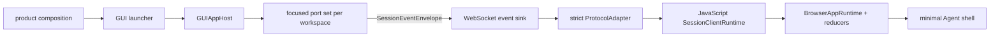

# GUI Frontend

## Metadata

> 状态：`active`
> 类型：`platform implementation`
> 负责人：`GUI maintainers`
> 最后同步日期：`2026-08-14`
> 对应代码范围：`src/embedagent/frontend/gui/`

## 1. Purpose And Boundary

GUI 是聚焦 frontend ports 之上的可注册图形 shell。它由 Python app host、local HTTP/WebSocket backend、React renderer 和 `pywebview` launcher 组成。shell 消费 product-compiled `ShellDescriptor`、session capabilities、tool metadata 和 generic workflow projection，不内建某个 Agent 应用的能力集。

GUI 不拥有 Agent Core policy、session history、workflow transition、permission decision、tool activation 或 application registry。产品 launcher 将 port factory、agent capabilities、shell compiler、文案和默认组合注入 GUI。

## 2. Architecture

| Layer | Ownership |
|---|---|
| `launcher.py` | 解析启动选项，接收产品组合，启动 local backend 和 webview |
| `backend/app_host.py` | workspace registry，按 workspace 创建/切换 `FrontendPortSet(session, workspace)`，将 event sink 传给 port factory |
| `backend/server.py`, routes/services | HTTP/WebSocket 协议、session/app bootstrap、files、preview、terminal、source control |
| `backend/app_shell.py` | 将 product-compiled `ShellDescriptor` 放入 app bootstrap；不维护本地 catalog |
| `webapp/src/client-runtime/` | HTTP/WebSocket transports、strict protocol adapter、runtime reducer 和 React binding |
| `webapp/src/session-runtime/session-client-runtime.js` | transport-neutral session activation、cursor、event ordering/recovery、interaction、descriptor dispatch 和 close |
| `webapp/src/app-runtime/browser-app-runtime.js` | browser-only controller/effect orchestration；组合 `SessionClientRuntime`，不成为跨 shell 合同 |
| `webapp/src/session-runtime/` | pure session/activity/read-model projection；timeline 按 activity、tool 和 diff 分属聚焦模块 |
| `webapp/src/components/shell/` | session rail、timeline、composer、interaction overlay 和 status 的最小核心布局 |
| `webapp/src/components/contributions/` | 可选 secondary surface 的 renderer registry 与单一 outlet |

## 3. Registration And Workspace Hosting

`GUIAppHost` 构造时接收 `port_factory(workspace, event_sink)`、一个 `SessionEventSink`、可选 `WorkspaceRegistry` 和 agent capability snapshot。切换 workspace 时关闭旧 port set、用同一个 sink 构造新 port set，并广播 workspace change。app host 只公开聚焦 session/workspace ports，不暴露内部 adapter。

app host 可以是 multi-workspace 或 `SingleWorkspaceAppHost`。新产品可注入不同 application registry 与 port composition，不需更改 GUI reducer 或增加 product-name branches。

## 4. Bootstrap And Event Flow

1. app bootstrap 加载 product metadata、workspaces、commands 和 surfaces；
2. workspace activation 获得一组 `FrontendSessionPort` / `FrontendWorkspacePort`；
3. `main.jsx` 组合 HTTP transport、socket transport 和 protocol adapter，React hook 创建一个 `BrowserAppRuntime`，其内部创建一个 JavaScript `SessionClientRuntime`；
4. session activation 先启动新 generation，再通过 named protocol method 获取 projection 与 Host-owned `event_cursor`；
5. activation 期间到达的 canonical `session_event` 按 session 缓冲，app-level shell notifications 保持独立；
6. bootstrap 安装以 cursor 为唯一 sequence 基线，只释放连续且尚未覆盖的 envelopes；
7. 通过 transport 接受的 envelope 进入同一个 protocol adapter 与 runtime reducer，按 `event_kind` 更新前端投影；
8. invalidation metadata 触发 controller 刷新 backend read models。

renderer 不从事件尾部重建历史。断线重连或 session 切换后，以新 session bootstrap 为准，不以 local persisted timeline 为准。

Host 在 event publication 同步边界内捕获 bootstrap cursor。sequence gap 只触发当前 generation 的一个 recovery；快速切换 session 会 abort 旧请求，旧 projection、cursor、buffered events、terminal summaries 和回调都不能覆盖新 session。

session transport controller 拥有 socket callbacks、retry timer、recovery promise 和 activation abort。`close()` 先关闭生命周期并递增 token，再取消 timer 和 bootstrap、解绑 socket callbacks；陈旧的 `onopen`、`onclose` 或已保存 timer 均不能重启 transport。关闭后的 controller 不可复用，重新连接必须构造新实例。

## 5. Minimal Shell And Contributions

最小 GUI 始终只由 session navigation、连续 timeline、composer/mode/command、blocking interaction 和 compact status 组成。移除全部 secondary surfaces 后，仍能创建/切换会话、发送/停止、响应 permission/user input、观察 tool lifecycle 和恢复状态。

product-compiled descriptors 拥有 commands、surfaces、keybindings、timeline items 和 interaction renderer keys。React 的冻结 shell selector 只生成 renderer-ready 投影；`App` 只绑定 browser runtime hook 并渲染 `AgentShell`。command palette 是核心 overlay。terminal、source control、preview、file browser 和独立 diff view 只有在 descriptor 注册 secondary surface 时，才通过单一 `ContributionOutlet` 和 build-time renderer registry 出现；它们不占用永久宽度或高度。

文件引用、diff、workflow summary 和 tool lifecycle 优先出现在连续 timeline 内。可选贡献面只提供更深查看或专用交互，不成为 session truth。未知 renderer key 在 descriptor 编译/验证阶段失败，不在 React 中以 fallback 猜测。

## 6. State Ownership

backend-owned：session status、history、workflow、pending interaction、permission context、capabilities、workspace files、source-control 和 terminal service state。

GUI-owned：session rail 折叠、timeline scroll anchor、draft、command palette、当前 contribution id、正在提交的 request ids、preview selection 和其他可丢失展示状态。不存在永久 panel/drawer state。持久化 renderer UI state 不得包含会话真相或 approval secrets。

## 7. Interaction And Safety

composer 渲染 permission/user-input request，通过 interaction response API 提交，并在 resolved/failed event 到达前防止重复点击。file/preview/terminal routes 执行 workspace-bound path validation。所有后端错误使用结构化响应，不将凭证、raw tool payload 或内部 exception 原文放入前端 diagnostics。

## 8. Runtime Compatibility

webapp 构建目标与 Windows 7 可用的 Chromium/WebView runtime 能力对齐，不在 runtime 依赖 Node.js。`pywebview` 选择、fixed browser runtime 资产和离线组装属于产品交付，见 `docs/product/packaging-and-deployment.md`。

## 9. Verification

- `tests/test_gui_runtime.py`
- `tests/test_gui_backend_api.py`
- `tests/test_gui_sync.py`
- `tests/test_gui_app_host.py`
- `tests/test_gui_app_shell.py`
- `tests/test_gui_frontend_port_integration.py`
- `src/embedagent/frontend/gui/webapp/test/client-runtime.test.mjs`
- `src/embedagent/frontend/gui/webapp/test/browser-app-runtime-boundary.test.mjs`
- `src/embedagent/frontend/gui/webapp/test/session-client-runtime-contract.test.mjs`
- `src/embedagent/frontend/gui/webapp/test/protocol-adapter.test.mjs`
- `src/embedagent/frontend/gui/webapp/test/protocol-envelope.test.mjs`
- `src/embedagent/frontend/gui/webapp/test/agent-shell-source.test.mjs`
- `src/embedagent/frontend/gui/webapp/test/shell-selectors.test.mjs`
- `src/embedagent/frontend/gui/webapp`: `npm test`, `npm run build`

webapp source 变更后必须提交 `src/embedagent/frontend/gui/static/` 生成资产。实机 Windows 7/browser runtime 验收属于 release evidence，不能由本地前端测试替代。

## 10. Related Documents

- `docs/platform/frontend-protocol.md`
- `docs/platform/protocol.md`
- `docs/platform/frontend-tui.md`
- `docs/product/composition.md`
- `docs/product/packaging-and-deployment.md`
