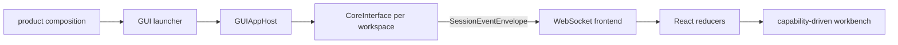

# GUI Frontend

## Metadata

> 状态：`active`
> 类型：`platform implementation`
> 负责人：`GUI maintainers`
> 最后同步日期：`2026-08-03`
> 对应代码范围：`src/embedagent/frontend/gui/`

## 1. Purpose And Boundary

GUI 是 `CoreInterface` / `FrontendCallbacks` 之上的可注册图形 shell 实现。它由 Python app host 和 local HTTP/WebSocket backend、React workbench renderer、`pywebview` launcher 组成。shell 消费 backend 声明的 app/session capabilities、commands、surfaces、tools 和 generic workflow projection，不内建某个 Agent 应用的能力集。

GUI 不拥有 Agent Core policy、session history、workflow transition、permission decision、tool activation 或 application registry。产品 launcher 将 core factory、agent capabilities、文案和默认组合注入 GUI。

## 2. Architecture

| Layer | Ownership |
|---|---|
| `launcher.py` | 解析启动选项，接收产品组合，启动 local backend 和 webview |
| `backend/app_host.py` | workspace registry，按 workspace 创建/切换 `CoreInterface`，绑定 frontend callback |
| `backend/server.py`, routes/services | HTTP/WebSocket 协议、session/app bootstrap、files、preview、terminal、source control |
| `backend/app_shell*.py` | backend-owned commands/surfaces/capability shell descriptors |
| `webapp/src/client-runtime/` | wire validation 与 protocol adaptation；尚未成为全部 HTTP/WebSocket effect 的唯一入口 |
| `webapp/src/app-runtime/` | controller/effect orchestration；拥有 session activation generation、event ordering/recovery 和 socket shutdown，仍有直接 endpoint 调用待迁移 |
| `webapp/src/session-runtime/` | pure session/activity/read-model reducers |
| `webapp/src/workbench/`, `components/` | renderer-local registries、UI state 和 visual surfaces |

## 3. Registration And Workspace Hosting

`GUIAppHost` 构造时接收 `core_factory`、可选 `WorkspaceRegistry` 和 agent capability snapshot。`bind_frontend(...)` 将 WebSocket frontend 注册到当前 core；切换 workspace 时构造新 core、重新绑定 callback、关闭旧 core，并广播 workspace change。

app host 可以是 multi-workspace 或 `SingleWorkspaceAppHost`。新产品可注入不同 core/application catalog，不需更改 GUI reducer 或增加 product-name branches。

## 4. Bootstrap And Event Flow

1. app bootstrap 加载 product metadata、workspaces、commands 和 surfaces；
2. workspace activation 获得一个 `CoreInterface`；
3. session activation 先启动新 generation，再调用 `/api/sessions/{id}/bootstrap` 获取 projection 与 Host-owned `event_cursor`；
4. activation 期间到达的 canonical `session_event` 按 session 缓冲，app-level shell notifications 保持独立；
5. bootstrap 安装以 cursor 为唯一 sequence 基线，只释放连续且尚未覆盖的 envelopes；
6. 通过 transport 接受的 envelope 进入同一个 protocol adapter 与 runtime reducer，按 `event_kind` 更新前端投影；
7. invalidation metadata 触发 controller 刷新 backend read models。

renderer 不从事件尾部重建历史。断线重连或 session 切换后，以新 session bootstrap 为准，不以 local persisted timeline 为准。

Host 在 event publication 同步边界内捕获 bootstrap cursor。sequence gap 只触发当前 generation 的一个 recovery；快速切换 session 会 abort 旧请求，旧 projection、cursor、buffered events、terminal summaries 和回调都不能覆盖新 session。

session transport controller 拥有 socket callbacks、retry timer、recovery promise 和 activation abort。`close()` 先关闭生命周期并递增 token，再取消 timer 和 bootstrap、解绑 socket callbacks；陈旧的 `onopen`、`onclose` 或已保存 timer 均不能重启 transport。关闭后的 controller 不可复用，重新连接必须构造新实例。

## 5. Capability-Driven Workbench

backend descriptors 拥有 modes、commands、tools、applications、workflow packages、surfaces、empty-state copy 和 chrome metadata。React 读模型计算当前可见 commands/surfaces，renderer-local registry 只将通用 kind 映射为 component/handler。

右面板、底部 drawer、command palette、timeline row 和 tool detail 的可见性主要由 descriptors 与 catalog metadata 驱动，但 terminal、source-control 和部分 controller 仍绕过 ProtocolAdapter 直接调用 endpoint。renderer 不以 application id、tool name 或 product name 推测能力；本地 fallback catalog 将随共享注册切换删除。

## 6. State Ownership

backend-owned：session status、history、workflow、pending interaction、permission context、capabilities、workspace files、source-control 和 terminal service state。

GUI-owned：active panel/tab、panel size、collapsed rows、scroll anchor、draft、command menu、正在提交的 request ids、preview selection 和其他可丢失展示状态。持久化 renderer UI state 不得包含会话真相或 approval secrets。

## 7. Interaction And Safety

composer 渲染 permission/user-input request，通过 interaction response API 提交，并在 resolved/failed event 到达前防止重复点击。file/preview/terminal routes 执行 workspace-bound path validation。所有后端错误使用结构化响应，不将凭证、raw tool payload 或内部 exception 原文放入前端 diagnostics。

## 8. Runtime Compatibility

webapp 构建目标与 Windows 7 可用的 Chromium/WebView runtime 能力对齐，不在 runtime 依赖 Node.js。`pywebview` 选择、fixed browser runtime 资产和离线组装属于产品交付，见 `docs/product/packaging-and-deployment.md`。

## 9. Verification

- `tests/test_gui_runtime.py`
- `tests/test_gui_backend_api.py`
- `tests/test_gui_sync.py`
- `tests/test_gui_app_host.py`
- `tests/test_gui_app_shell.py`
- `src/embedagent/frontend/gui/webapp`: `npm test`, `npm run build`

webapp source 变更后必须提交 `src/embedagent/frontend/gui/static/` 生成资产。实机 Windows 7/browser runtime 验收属于 release evidence，不能由本地前端测试替代。

## 10. Related Documents

- `docs/platform/frontend-protocol.md`
- `docs/platform/protocol.md`
- `docs/platform/frontend-tui.md`
- `docs/product/composition.md`
- `docs/product/packaging-and-deployment.md`
