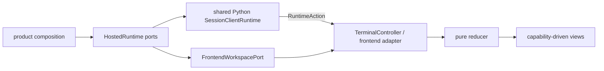

# TUI Frontend

## Metadata

> 状态：`active`
> 类型：`platform implementation`
> 负责人：`TUI maintainers`
> 最后同步日期：`2026-08-20`
> 对应代码范围：`src/embedagent/frontend/tui/`, `src/embedagent/frontend/runtime/`

## 1. Purpose And Boundary

TUI 是聚焦 frontend ports 之上的终端 shell，使用 `prompt_toolkit` 和 `rich` 提供键盘优先、低颜色可回退的最小 Agent 体验。它与 CLI 共享 Python `SessionClientRuntime`，与 GUI 遵守同一 bootstrap/envelope 状态机，并消费 product-compiled `ShellDescriptor`。

TUI 不持有 Host adapter、session truth、application catalog 或 restore policy。产品 launcher 解析统一 launch config，构造 `HostedRuntime(session, workspace)`，把 session port 绑定到共享 runtime，再将 workspace port 与 descriptor 注入 TUI。

## 2. Architecture

| Component | Ownership |
|---|---|
| `launcher.py` | bundle shell policy、统一 launch config、Host port set、application 与 descriptor 组合 |
| `frontend/runtime/session_client_runtime.py` | CLI/TUI 共用的 activation、单一 event queue、delivered-before-committed publication、cursor/recovery、interaction、descriptor dispatch 和 close |
| `bootstrap.py` | 校验注入对象，创建 app，单次绑定 runtime action dispatcher |
| `app.py` | `TerminalApp` 生命周期、组件容器与 workspace port |
| `controller.py`, `commands.py`, `shell_state.py` | 用户输入、`RuntimeAction` dispatch 和 descriptor-backed command/keybinding 投影 |
| `frontend_adapter.py` | canonical session action/event 到 reducer 的展示适配 |
| `state.py`, `reducer.py` | 可丢失终端投影与纯状态转换 |
| `layout.py`, `views/` | header、timeline、composer、status 与 overlays |
| `contributions.py` | secondary surface renderer-key 映射，不拥有 capability policy |

## 3. Runtime And Event Handling

`launch_tui()` 创建一个 `SessionClientRuntime`，在构造 Host 时把它作为唯一 `SessionEventSink`，随后绑定 `runtime.session` port。`run_tui()` 只接收共享 runtime、workspace port、workspace、session options 与 `ShellDescriptor`；它不构造 Host，也不读取私有对象。

`bootstrap.py` 将 `TerminalController.on_runtime_action` 单次绑定到 runtime。runtime 在 create/resume 前建立 generation，以单一 sync phase 和 ordered queue 接收 bootstrap、recovery 或 publication 期间的 envelopes，以 Host `event_cursor` 安装 projection，并只发布连续事件。runtime action 成功交给 controller 后才提交 event cursor、interaction lifecycle 和 terminal outcome，因此 input waiter 不会早于 permission/user-input prompt 被唤醒；sequence gap 通过同一个 bootstrap port 恢复。close 后拒绝新操作并忽略晚到事件。

bootstrap history 替换 terminal projection；terminal timeline 不是可恢复 transcript。`TUIFrontend` 只根据 canonical event 更新 timeline、snapshot、context diagnostics 和 pending interaction。

## 4. Minimal Shell And Contributions

TUI 固定核心只有 header、scrollable timeline、replaceable composer/interaction region 和一行 status。command palette 与 blocking interaction 以 overlay 出现。`TerminalState` 从 `ShellDescriptor` 初始化 commands、keybindings 和 secondary contributions；空 descriptor 不创建 explorer、editor、inspector、terminal、source-control、task 或 preview 状态。

secondary contribution 通过 `ContributionState` 和 renderer registry 覆盖显示，不占用永久宽度或高度。删除 descriptor 会同时删除其命令、快捷键、状态和视图。raw console 或低颜色 host 下的差异只是 presentation fallback，不是第二套产品能力。

## 5. State, Workspace And Interactions

`TerminalState` 只保存 session projection、timeline、composer、status、overlay、descriptor-backed shell state 和 contribution state。workspace tree/file/write 操作只调用 `FrontendWorkspacePort`。permission/user-input response 只调用共享 runtime 的 `respond_to_interaction(...)`，并由 `InteractionProjection` 提供 choice/question/default 形状；不得硬编码 `y/n` 或单一 `answers.answer`。resolved/response.failed/expired 状态都必须清除或更新 pending state。

reducer 不导入 Host、执行工具、修改权限规则或解释应用 workflow。TUI 退出时关闭共享 runtime；Host port 的生命周期随之结束。

## 6. Verification

- `tests/test_tui_launcher.py`
- `tests/test_terminal_frontend.py`
- `tests/test_tui_activity_timeline.py`
- `tests/test_session_client_runtime_contract.py`
- `tests/test_session_truth_boundaries.py`
- `tests/test_session_event_protocol.py`

## 7. Related Documents

- `docs/platform/frontend-protocol.md`
- `docs/platform/protocol.md`
- `docs/platform/frontend-gui.md`
- `docs/product/composition.md`
