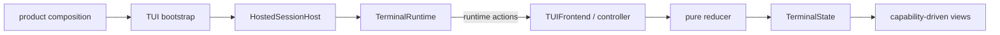

# TUI Frontend

## Metadata

> 状态：`active`
> 类型：`platform implementation`
> 负责人：`TUI maintainers`
> 最后同步日期：`2026-08-03`
> 对应代码范围：`src/embedagent/frontend/tui/`

## 1. Purpose And Boundary

TUI 是公开 Hosted Session 边界之上的终端 shell 实现，使用 `prompt_toolkit` 和 `rich` 提供键盘优先、低颜色可回退的 workbench。`TerminalRuntime` 将 `HostedSessionHost` 公开方法适配为与 GUI 相同的 canonical bootstrap/envelope 语义；command、mode、surface 与 task workbench 仍由本地固定 catalog 驱动，尚未完成与 GUI 共用产品注册真相的切换。

## 2. Architecture

| Component | Ownership |
|---|---|
| `launcher.py`, `bootstrap.py` | 接收产品组合与公开 `HostedSessionHost`，创建 `TerminalRuntime` 并启动 terminal app |
| `runtime.py` | 唯一 Host/effect owner；session activation、bootstrap cursor、event buffering/gap recovery、interaction/session/workspace calls 和 close |
| `app.py` | `TerminalApp` 生命周期、runtime action binding 和组件容器 |
| `frontend_adapter.py` | `TUIFrontend` 将 canonical `SessionEventEnvelope` 投影到 reducer |
| `controller.py`, `commands.py` | 用户输入、runtime action dispatch 和当前本地 command catalog |
| `state.py`, `reducer.py` | 可丢失终端投影与纯状态转换 |
| `workbench.py`, `layout.py`, `views/` | 当前固定 workbench catalog、layout、overlays、panels 和 rendering；descriptor cutover 尚未完成 |
| `services/editor.py` | 只拥有 editor buffer/diff presentation；文件副作用仍经 `TerminalRuntime` |

## 3. Registration And Event Handling

`run_tui()` 构造一个 `TerminalRuntime(session_host, dispatch=...)`，再把 runtime action dispatcher 单次绑定到 `TerminalController`。session create/resume/submit 只把 `TerminalRuntime.on_session_event(envelope)` 注册给 Host；TUI 不再暴露三参数 event callback，也不读取 `session_host.adapter`。

`TerminalRuntime` 在 session 启动或切换前建立新 generation，缓冲 bootstrap 期间的 live envelopes，以 Host `event_cursor` 安装 projection，并只释放连续事件；sequence gap 通过同一 bootstrap 路径恢复。`TUIFrontend.on_session_event(...)` 只消费 runtime 转发的 canonical envelope，根据 event kind 更新 timeline、snapshot、context diagnostics 和 pending interaction。

bootstrap history 替换 terminal projection；terminal buffer 不是可恢复 transcript。close 后 runtime 拒绝新操作并忽略晚到事件。

## 4. Current Registration Gap

command palette、mode selector、explorer 和 inspector 当前从 `WORKBENCH_COMMANDS`、`RIGHT_PANEL_SURFACES` 及 controller command branches 计算，不是 backend descriptor 的投影。`workflow.diff`、tasks explorer 等 product/application 能力也仍直接出现在 TUI shell 中。

当前收敛切片将由 product composition 注入唯一 shell descriptor，并让 TUI 只保留通用 renderer/handler registry。切换时必须删除固定 catalog 和 fallback，不保留双注册路径。

raw console 或低颜色 host 下必须保持可操作。终端支持差异是 presentation fallback，不是第二套产品能力。

## 5. State And Interactions

`TerminalState` 只保存当前 snapshot 投影、展示行、selection、layout、draft、last error 和 pending interaction。permission/user-input response 通过 `TerminalRuntime.respond_to_interaction(...)` 提交，仅在 resolved event 或后续 bootstrap/snapshot 到达后清除 pending state。

reducer 保持纯函数，不导入 Host 对象、执行工具或修改权限规则。

## 6. Verification

- `tests/test_architecture.py`
- `tests/test_terminal_frontend.py`
- `tests/test_tui_activity_timeline.py`
- `tests/test_tui_runtime.py`
- `tests/test_session_truth_boundaries.py`
- `tests/test_session_event_protocol.py`

## 7. Related Documents

- `docs/platform/frontend-protocol.md`
- `docs/platform/protocol.md`
- `docs/platform/frontend-gui.md`
- `docs/product/composition.md`
