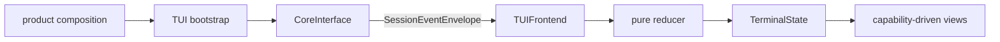

# TUI Frontend

## Metadata

> 状态：`active`
> 类型：`platform implementation`
> 负责人：`TUI maintainers`
> 最后同步日期：`2026-08-01`
> 对应代码范围：`src/embedagent/frontend/tui/`

## 1. Purpose And Boundary

TUI 是 `CoreInterface` / `FrontendCallbacks` 之上的可注册终端 shell 实现，使用 `prompt_toolkit` 和 `rich` 提供键盘优先、低颜色可回退的 workbench。它与 GUI 消费同一会话、capability、command、interaction 和 generic workflow 协议，不内建上层应用策略。

## 2. Architecture

| Component | Ownership |
|---|---|
| `launcher.py`, `bootstrap.py` | 接收产品组合，创建 core/host 并启动 terminal app |
| `app.py` | `TerminalApp` 生命周期和组件容器 |
| `frontend_adapter.py` | `TUIFrontend` 实现 canonical `on_session_event` |
| `controller.py`, `commands.py` | 用户输入、command dispatch 和 interaction response |
| `state.py`, `reducer.py` | 可丢失终端投影与纯状态转换 |
| `workbench.py`, `layout.py`, `views/` | capability-driven layout、overlays、panels 和 rendering |
| `services/` | 面向 `CoreInterface` 的 workspace/session/timeline/editor services |

## 3. Registration And Event Handling

bootstrap 将 `TUIFrontend` 注册到 core。`TUIFrontend.on_session_event(...)` 消费同一 canonical envelope，根据 event kind 更新 timeline、snapshot、context diagnostics 和 pending interaction，然后刷新 views。它不保留 per-event callback 接口，不将 tool/session events 重编码成 TUI 专用协议。

session 启动或切换时，TUI 使用 backend snapshot/history 替换状态。terminal buffer 是展示投影，不是可恢复 transcript。

## 4. Capability-Driven Workbench

command palette、mode selector、timeline、explorer、editor、diff、inspector 和 dialogs 从协议 descriptor 与 backend snapshot 计算可见性。TUI 可因终端能力限制使用更简化 renderer，但不修改 command semantics、tool activation、permission 或 workflow ownership。

raw console 或低颜色 host 下必须保持可操作。终端支持差异是 presentation fallback，不是第二套产品能力。

## 5. State And Interactions

`TerminalState` 只保存当前 snapshot 投影、展示行、selection、layout、draft、last error 和 pending interaction。permission/user-input response 通过 `CoreInterface.respond_to_interaction(...)` 提交，仅在 resolved event 或后续 snapshot 到达后清除 pending state。

reducer 保持纯函数，不导入 Host 对象、执行工具或修改权限规则。

## 6. Verification

- `tests/test_architecture.py`
- `tests/test_terminal_frontend.py`
- `tests/test_tui_activity_timeline.py`
- `tests/test_session_event_protocol.py`

## 7. Related Documents

- `docs/platform/frontend-protocol.md`
- `docs/platform/protocol.md`
- `docs/platform/frontend-gui.md`
- `docs/product/composition.md`
