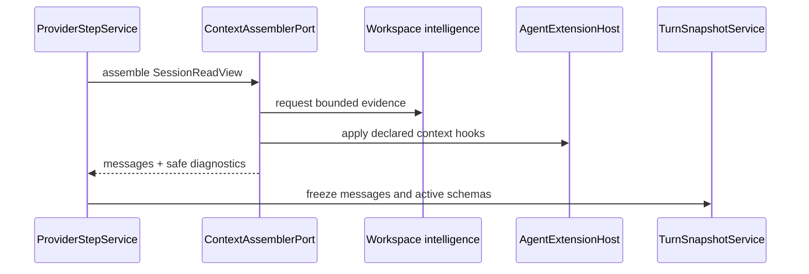

# Permissions And Context

## Metadata

> 状态：`active`
> 类型：`platform authority`
> 负责人：`Agent platform maintainers`
> 最后同步日期：`2026-08-01`
> 对应代码范围：`packages/embedagent-core/src/embedagent_core/permissions.py`, `packages/embedagent-core/src/embedagent_core/ports.py`, `packages/embedagent-host/src/embedagent_host/runtime/context.py`, workspace intelligence files

## 1. Purpose And Boundary

权限回答“这个 action 是否可以执行”；写路径策略回答“这个目标是否可写”；上下文组装回答“模型这一轮可以看到什么”。三者协作，但不是同一策略。

Core 使用聚焦的 `ContextAssemblerPort` 和 permission/write-path collaborators，不接收通用 service bag。Host 可实现具体 `ContextManager`、workspace intelligence 和规则加载；application 扩展只通过已声明 capability 提供 context patch 或 reducer。

## 2. Ownership

| Owner | Responsibility |
|---|---|
| `PermissionPolicy` | catalog-category-based allow/ask/deny 与可解释决策 |
| `WritePathPolicy` | workspace/path/glob 边界，与 permission 独立 |
| `ContextAssemblerPort` | Core 所见的模型消息组装端口 |
| Host `ContextManager` | budget、reducers、compaction/history 和安全上下文单元组装 |
| workspace intelligence | 文件/build-system/evidence 等可验证 workspace signals |
| `AgentExtensionHost` | 按 declared capabilities 合并扩展 context hooks |
| `ProviderStepService` | 在每次 provider request 前调用 context 组装并冻结 turn snapshot |

## 3. Permission And Action Flow

`AgentToolActionService` 从 active runtime catalog 查询 permission category，调用 `PermissionPolicy`，再独立应用 write-path policy。ask 决策会挂起 action；用户回应后重新进入同一 action pipeline。扩展 before/after hooks 不能跳过这两类检查。

权限 category、rule shape、默认值和 session memory 契约由 `docs/platform/permission-model.md` 拥有。

## 4. Context Assembly

一次 provider step 的通用管道：

1. 从交易中的 frozen `SessionReadView` 取得消息、turn 和 read models；
2. 运行 Host 注册的 context reducers 与预算策略；
3. 添加 workspace intelligence 证据和 workspace-bound resource prompt units；
4. 通过 `AgentExtensionHost` 应用 declared application/project context hooks；
5. 排除 archived/过期或超出预算内容，保留必需 anchors；
6. 将消息、active schemas 和安全 diagnostics 冻结到 `TurnSnapshot`。

## 5. Reducers And Read Models

context reducer 对 tool observations 生成可控缩的模型证据，不改写 durable history 或执行工具。compaction、recovery、runtime config、capability、workflow 和 turn experience 投影可作为 context 输入，但它们都是读模型，不选择 active tools、不授权、不恢复 session。

application-owned reducer 必须通过 extension capability 注册并携带 source identity。Core/Host 不根据 tool names 重建 application reducer 表。

## 6. Safety

上下文、snapshot diagnostics、workspace intelligence 和 permission explanation 不得泄漏 API keys、credentials、approval secrets、permission tokens、不必要的 raw tool output 或未请求的 source contents。telemetry 只消费另行约束的安全 envelope，不复用 model context 原文。

## 7. Verification

- `tests/test_permissions.py`
- `tests/test_agent_core_public_api.py`
- `tests/test_context_config.py`
- `tests/test_context_config.py`
- `tests/test_workspace_intelligence.py`
- `tests/test_turn_snapshot.py`
- `tests/test_dynamic_tool_registration.py`
- `tests/test_hosted_interaction_service.py`

## 8. Related Documents

- `docs/platform/permission-model.md`
- `docs/platform/tools-and-extensions.md`
- `docs/platform/tool-contracts.md`
- `docs/platform/session-runtime.md`
