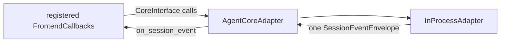

# Platform Protocol

## Metadata

> 状态：`active`
> 类型：`platform authority`
> 负责人：`Agent platform maintainers`
> 最后同步日期：`2026-08-03`
> 对应代码范围：`packages/embedagent-protocol/src/embedagent_protocol/`, `src/embedagent/core/`

## 1. Purpose And Boundary

`embedagent_protocol` 是通用 Host/UI 线协议发行包，只依赖 Python 标准库，拥有 JSON-safe DTO、`CoreInterface` 和 `FrontendCallbacks`。`src/embedagent/core/adapter.py` 实现 `AgentCoreAdapter`，将通用 hosted runtime 能力暴露为协议对象。

协议只传输冻结快照、capability descriptors、commands、interactions 和 canonical session events。它不暴露 mutable Core `Session`、不恢复历史、不决定 active tools 或权限、不定义某个前端的布局。

## 2. Public Interfaces

`CoreInterface` 覆盖：

- session create/resume/list/bootstrap/snapshot/lifecycle；
- submit/cancel/mode/interaction response；
- workspace、file、diff、plan 和 permission context；
- app/session capability queries；
- local resource reload；
- shutdown。

`FrontendCallbacks` 只保留 canonical `on_session_event(envelope)` live-session callback。注册前端实现该接口，并通过 `CoreInterface` 反向发起命令。新 GUI、TUI、CLI 或其他 shell 使用同一对接口，不增加前端专用 Core facade。

## 3. DTO Families

- session：`SessionSnapshot`, `ThreadShell`, `ThreadDetailSnapshot`, `PlanSnapshot`, `PermissionContext`；
- events：`SessionEventEnvelope`, `FailureRecord`；
- capabilities：`CapabilitySnapshot`, `ModeDescriptor`, `CommandDescriptor`, `ToolPresentation`, `WorkflowPackageDescriptor`, `AgentApplicationDescriptor`；
- app shell：`AppBootstrap` 及 workspace/surface descriptors；
- activity：`Message`, `ToolCall`, `ToolResult`, `CommandResult`, `InteractionActivity`；
- workspace：`WorkspaceInfo`, `DiffPreview`, `RuntimeEnvironmentSnapshot`。

当前 `SessionSnapshot` 仍包含 `current_phase`、`discipline_profile`、`current_activity`、`task_summary` 和 `task_items` 等上层 workflow 展开字段，尚未达到本节声明的通用边界。前端收敛切片将让消费者只读取 generic `workflow`，并在同一 strict cutover 中删除这些字段及其 Host/frontend 映射。

DTO 可以携带通用 `workflow` 字典和 capability metadata，但协议发行包不导入任何应用实现。

## 4. Adapter Rule

`AgentCoreAdapter` 可将 Host 的 snapshot dictionary 转换为协议 dataclass，但对 live events 只做 validation/forwarding：Host 创建一次 `SessionEventEnvelope`，adapter 不重命名 event kind、不重组 payload、不为不同 shell 重新编码。

## 5. Registration And Composition

`AgentCoreAdapter.register_frontend(...)` 绑定当前 shell callback。GUI app host 可按 workspace 创建/替换 `CoreInterface` 实例，TUI 可绑定单 workspace core。应用 registry、默认 workflow、provider、tools 和产品文案由 product composition 注入，不由 protocol 或 shell 写死。

## 6. Verification

- `tests/test_architecture.py`
- `tests/test_protocol_package_imports.py`
- `tests/test_session_event_protocol.py`
- `tests/test_gui_sync.py`
- `tests/test_terminal_frontend.py`
- `tests/test_inprocess_adapter_frontend_api.py`

## 7. Related Documents

- `docs/platform/frontend-protocol.md`
- `docs/platform/frontend-gui.md`
- `docs/platform/frontend-tui.md`
- `docs/platform/session-runtime.md`
- `docs/product/composition.md`
