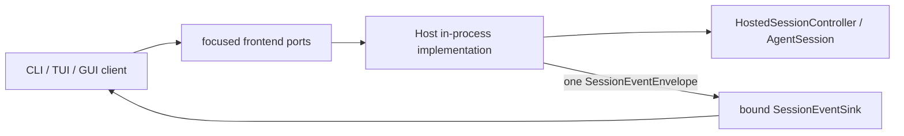

# Platform Protocol

## Metadata

> 状态：`active`
> 类型：`platform authority`
> 负责人：`Agent platform maintainers`
> 最后同步日期：`2026-08-20`
> 对应代码范围：`packages/embedagent-protocol/src/embedagent_protocol/`, `packages/embedagent-host/src/embedagent_host/frontend_ports.py`, `packages/embedagent-host/src/embedagent_host/runtime/session_event_protocol.py`, `packages/embedagent-host/src/embedagent_host/runtime/services/event_emitter.py`

## 1. Purpose And Boundary

`embedagent_protocol` 是 stdlib-only 的通用 Host/UI 协议发行包，拥有 JSON-safe DTO、聚焦的前端 port ABC、单一 event sink 和封闭的失败分类。协议只传输冻结快照、capability descriptors、commands、interactions 和 canonical session events。

协议不暴露 mutable Core `Session`、Host adapter、restore policy 或应用实现；不执行工具、不授予权限，也不定义 shell 布局。Host 实现 ports，产品层组合实现与 shell，前端只依赖协议对象。

## 2. Focused Frontend Ports

`FrontendSessionPort` 是 session 操作边界，覆盖：

- list、summary、bootstrap、create 和 resume；
- submit、cancel、mode 和 interaction response；
- rename、archive 和 fork；
- session capability query 与 close。

`FrontendWorkspacePort` 是 workspace 读写边界，覆盖 frozen snapshot、tree、file、diff 和 local-resource reload。它不拥有 application 选择或 workspace registry policy。

`SessionEventSink.on_session_event(envelope)` 是唯一 live-event 输入。sink 在 Host 创建时绑定；submit/create/resume 不接受 callback 或 resolver 参数。bound sink 抛出的异常必须传播给发布调用者，不能被日志记录后当作成功。`FrontendPortError` 由 Host 在 port 边界抛出并携带一个 `FailureRecord`。

封闭失败代码为：`usage_error`, `configuration_error`, `session_not_found`, `interaction_required`, `permission_denied`, `provider_error`, `runtime_error`, `cancelled`, `protocol_error`。shell 不从异常消息文本推断分类。`FailureRecord` 是 public failure 的唯一结构化入口；它只允许 code、safe message、retryable、source、phase、kind、correlation id 和 exception type，不能携带异常文本、prompt、source、tool output 或 credential。

## 3. DTO Families

- session：`SessionSnapshot`, `ThreadShell`, `SessionBootstrap`, `PlanSnapshot`, `PermissionContext`；
- events：`SessionEventEnvelope`, `FailureRecord`；
- capabilities：`CapabilitySnapshot`, `ModeDescriptor`, `CommandDescriptor`, `ToolPresentation`, `WorkflowPackageDescriptor`, `AgentApplicationDescriptor`；
- app shell：`AppBootstrap`, `ShellDescriptor` 及 workspace/surface descriptors；
- activity：`Message`, `ToolCall`, `ToolResult`, `CommandResult`, `InteractionActivity`；
- workspace：`WorkspaceInfo`, `DiffPreview`, `RuntimeEnvironmentSnapshot`。

`SessionBootstrap` 是唯一详细会话 bootstrap DTO。`SessionSnapshot.workflow_state` 是唯一通用 workflow carrier；协议不展开 phase、discipline、task 等应用字段。应用读模型位于 `workflow_state["workflow"]`，协议只验证其 JSON-safe 容器。

`SessionSnapshot.last_failure` 是 session failure 的只读投影；Host 不再发布 `last_error` 或 session error payload 的 raw `error`。失败工具事件保留 `failure`，并递归移除 observation 中的 `error`、`exception` 和 `traceback` 字段；durable tool observation 仍由 Core ledger 拥有。

## 4. Current Wire Schema

当前 frontend wire schema version 是整数 `2`。`AppBootstrap`、`SessionBootstrap`、`ShellDescriptor` 和 `CapabilitySnapshot` 拒绝其他版本；GUI strict normalizer 对 bootstrap、capability 和 `SessionEventEnvelope` 同样只接受 version `2` 与 `snake_case` keys。其他独立协议的 version 不得复用这个常量。

| Root DTO | Exact current root keys |
|---|---|
| `AppBootstrap` | `schema_version`, `app`, `workspaces`, `active_workspace`, `has_active_workspace`, `shell`, `settings`, `diagnostics`, `last_failure`；workspace 删除响应可额外包含 `removed` |
| `SessionBootstrap` | `schema_version`, `event_cursor`, `thread`, `snapshot`, `history`, `capabilities`, `plan`, `permission_context` |
| `CapabilitySnapshot` | `schema_version`, `modes`, `commands`, `tools`, `workflow_packages`, `agent_application`, `agent_applications`, `resources`, `model_profiles`, `empty_state` |
| `SessionEventEnvelope` | `schema_version`, `event_id`, `session_id`, `sequence`, `event_kind`, `timestamp`, `payload` |

`history` 只包含 `activities` 和 `integrity`。descriptor DTO 拒绝未声明字段；显式 `metadata`、`workflow` 和 `payload` mapping 保持开放。Python `to_dict()` 是 wire serializer；JavaScript `protocol-normalizer.js` 是唯一 wire-to-view-model 映射点。

## 5. Boundary And Event Rule

`InProcessFrontendSessionPort` 与 `InProcessFrontendWorkspacePort` 是 Host 的进程内实现，内部 adapter 不向调用方暴露。Host 对一次 live change 只创建一个 `SessionEventEnvelope`，然后交给构造时绑定的 sink；任何 shell 或 bridge 都不得重组 payload、重命名 event kind 或创建第二个 sequence。Host cursor 只表示 envelope sequence 已分配，不是 delivery acknowledgement；sink 失败通过异常使整个发布操作失败，不新增确认 cursor、重试队列或旁路事件账本。

## 6. Composition

Product composition resolves configuration, selects the application, injects its runtime contribution plus explicit model/tool providers, constructs one `HostedRuntime(session, workspace)`, binds the selected shell sink, and compiles one `ShellDescriptor`. Protocol and generic Host do not select a product application, provider, profile or default mode. Incomplete application composition becomes the closed, non-retryable `configuration_error` failure; it is not reclassified from exception message text. A new shell implements a client projection over the focused ports; it does not add an aggregate Host facade or a new event shape.

`WorkspaceChangedNotification` is an app-level notification with its own strict DTO. It is sent as
`{"type":"workspace_changed","data":...}` and never enters the session event cursor or
session ledger. A sink with no live transport must report the publish failure explicitly; an event
must not be logged and treated as delivered.

## 7. Verification

- `tests/test_protocol_package_imports.py`
- `tests/test_agent_app_protocol.py`
- `tests/test_host_frontend_ports.py`
- `tests/test_session_event_protocol.py`
- `tests/test_inprocess_adapter_frontend_api.py`
- `tests/test_pre_release_architecture_guards.py`

## 8. Related Documents

- `docs/platform/frontend-protocol.md`
- `docs/platform/frontend-gui.md`
- `docs/platform/frontend-tui.md`
- `docs/platform/session-runtime.md`
- `docs/product/composition.md`
