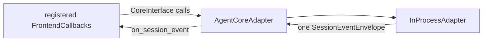

# Platform Protocol

## Metadata

> 状态：`active`
> 类型：`platform authority`
> 负责人：`Agent platform maintainers`
> 最后同步日期：`2026-08-09`
> 对应代码范围：`packages/embedagent-protocol/src/embedagent_protocol/`, `src/embedagent/core/`

## 1. Purpose And Boundary

`embedagent_protocol` 是通用 Host/UI 线协议发行包，只依赖 Python 标准库，拥有 JSON-safe DTO、`CoreInterface` 和 `FrontendCallbacks`。`src/embedagent/core/adapter.py` 实现 `AgentCoreAdapter`，将通用 hosted runtime 能力暴露为协议对象。

协议只传输冻结快照、capability descriptors、commands、interactions 和 canonical session events。它不暴露 mutable Core `Session`、不恢复历史、不决定 active tools 或权限、不定义某个前端的布局。

## 2. Public Interfaces

`CoreInterface` 覆盖：

- session create/resume/list/bootstrap/snapshot/lifecycle；
- submit/cancel/mode/interaction response；
- workspace、file、diff、plan 和 permission context；
- app/session capability queries；
- local resource reload；
- shutdown。

`FrontendCallbacks` 只保留 canonical `on_session_event(envelope)` live-session callback。GUI app host 通过 `CoreInterface` / `FrontendCallbacks` 绑定浏览器 shell；TUI 通过公开 `HostedSessionHost` 间接消费同一 DTO 和 event callback 语义。新 shell 不增加前端专用 Core facade 或 event shape。

## 3. DTO Families

- session：`SessionSnapshot`, `ThreadShell`, `SessionBootstrap`, `PlanSnapshot`, `PermissionContext`；
- events：`SessionEventEnvelope`, `FailureRecord`；
- capabilities：`CapabilitySnapshot`, `ModeDescriptor`, `CommandDescriptor`, `ToolPresentation`, `WorkflowPackageDescriptor`, `AgentApplicationDescriptor`；
- app shell：`AppBootstrap`, `ShellDescriptor` 及 workspace/surface descriptors；
- activity：`Message`, `ToolCall`, `ToolResult`, `CommandResult`, `InteractionActivity`；
- workspace：`WorkspaceInfo`, `DiffPreview`, `RuntimeEnvironmentSnapshot`。

`SessionBootstrap` 是唯一详细会话 bootstrap DTO；已不存在并行 detail DTO。`SessionSnapshot.workflow_state` 是唯一通用 workflow carrier，协议不展开 phase、discipline、task 或 activity 等应用字段。应用需要给 UI 的读模型位于 `workflow_state["workflow"]`，协议只验证其 JSON-safe 容器，不解释内容。

DTO 可以携带通用 workflow state 和 capability metadata，但协议发行包不导入任何应用实现。

## 4. Current Wire Schema

当前 wire schema version 是整数 `1`。`AppBootstrap`、`SessionBootstrap`、`ShellDescriptor` 和 `CapabilitySnapshot` 构造时拒绝其他版本；GUI strict protocol normalizer 对 bootstrap、capability 和 `SessionEventEnvelope` 同样只接受 version `1` 与 `snake_case` keys。product composition 编译一个 `ShellDescriptor`，GUI/TUI 消费同一结构；renderer view projection 不定义第二套 wire shape。

| Root DTO | Exact current root keys |
|---|---|
| `AppBootstrap` | `schema_version`, `app`, `workspaces`, `active_workspace`, `has_active_workspace`, `shell`, `settings`, `diagnostics`, `last_error`；workspace 删除响应可额外包含 `removed` |
| `SessionBootstrap` | `schema_version`, `event_cursor`, `thread`, `snapshot`, `history`, `capabilities`, `plan`, `permission_context` |
| `CapabilitySnapshot` | `schema_version`, `modes`, `commands`, `tools`, `workflow_packages`, `agent_application`, `agent_applications`, `resources`, `model_profiles`, `empty_state` |
| `SessionEventEnvelope` | `schema_version`, `event_id`, `session_id`, `sequence`, `event_kind`, `timestamp`, `payload` |

`history` 只包含 `activities` 和 `integrity`。descriptor DTO 也拒绝未声明字段；generic `metadata`、`workflow`、`payload` 等显式扩展映射保留开放内容。Python DTO `to_dict()` 是 wire serializer，JavaScript `protocol-normalizer.js` 是唯一 wire-to-view-model 映射点；内部 React camelCase 属性不是 wire shape。

## 5. Adapter Rule

`AgentCoreAdapter` 可将 Host 的 snapshot dictionary 转换为协议 dataclass，但对 live events 只做 validation/forwarding：Host 创建一次 `SessionEventEnvelope`，adapter 不重命名 event kind、不重组 payload、不为不同 shell 重新编码。

## 6. Registration And Composition

`AgentCoreAdapter.register_frontend(...)` 绑定当前 shell callback。GUI app host 可按 workspace 创建/替换 `CoreInterface` 实例；TUI 从产品 bootstrap 接收公开 `HostedSessionHost` 边界并由 `TerminalRuntime` 适配为同一 bootstrap/envelope 语义。应用 registry、默认 workflow、provider、tools 和产品文案由 product composition 注入，不由 protocol 或 shell 写死。

## 7. Verification

- `tests/test_architecture.py`
- `tests/test_protocol_package_imports.py`
- `tests/test_session_event_protocol.py`
- `tests/test_gui_sync.py`
- `tests/test_terminal_frontend.py`
- `tests/test_inprocess_adapter_frontend_api.py`

## 8. Related Documents

- `docs/platform/frontend-protocol.md`
- `docs/platform/frontend-gui.md`
- `docs/platform/frontend-tui.md`
- `docs/platform/session-runtime.md`
- `docs/product/composition.md`
