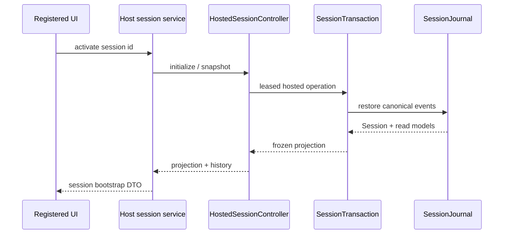

# Session Runtime

## Metadata

> 状态：`active`
> 类型：`platform authority`
> 负责人：`Agent platform maintainers`
> 最后同步日期：`2026-08-09`
> 对应代码范围：`packages/embedagent-core/src/embedagent_core/session*.py`, `packages/embedagent-host/src/embedagent_host/runtime/session_*.py`, `packages/embedagent-host/src/embedagent_host/runtime/transcript_store.py`

## 1. Purpose And Scope

本文档定义通用 Agent 平台的持久会话真相、交易边界、恢复策略和 Host 投影。`transcript.jsonl` 是 hosted session 历史的唯一持久账本；交易内部的 `Session` 及 `session.turns` 是唯一 live structured state。

前端 bootstrap、历史 DTO、运行时诊断、工作流快照与恢复汇总都是读模型，不能变成另一份会话真相。

## 2. Ownership

| 对象 | 拥有的职责 | 不拥有的职责 |
|---|---|---|
| `AgentSession` | 公开、可持久使用的会话句柄 | 不暴露 mutable `Session` |
| `SessionTransaction` | 对 session id 租约、restore-dispatch-project 和 hosted operation | 不绕过 journal 直接落盘 |
| `SessionJournal` | 事件预检、append-before-apply 提交和 restore fold | 不定义应用工作流语义 |
| `SessionReducer` | live 执行和 restore 的唯一 `Session` 写入者 | 不执行工具或授权 |
| `SessionLogPort` | Core 所见的事件账本端口 | 不暴露产品存储细节 |
| `TranscriptStore` | Host 对 canonical `transcript.jsonl` 的实现 | 不拥有 live state |
| `HostedSessionController` | 受支持的 Core/Host 操作边界和冻结投影 | 不将 Core 内部对象交给 Host |
| `SessionHistoryAssembler` | 将冻结 history 投影序列化为 UI DTO | 不恢复、修复或改写 session |

## 3. Durable Commit

`SessionTransaction` 为一次请求租约 session id，先恢复或创建交易状态，再分发输入。所有 canonical state 变化以 `EventIntent` 进入 `SessionJournal.commit(...)`：

1. journal 深拷贝 live `Session` 和 reducer context；
2. reducer 在 detached state 上预检整批 intent；
3. 每个 intent 通过 `SessionLogPort.append_event(...)` 写入 canonical event；
4. 只有 append 成功后，reducer 才将该 stored event 应用到 live `Session`。

因此，一个尚未持久的投影、callback 或 UI 事件不能先改变 live truth。事件 envelope 的 schema version 是实际协议标识，不是文档生命周期版本。

## 4. Restore And Recovery

`SessionJournal.restore(...)` 从 `SessionLogPort` 读取账本，创建新 `Session` 和 reducer context，并使用与 live commit 相同的 `SessionReducer` 按序折叠事件。`SessionRestorePolicyPort` 只决定哪个事件前缀可信；它不另建恢复状态机。

恢复结果携带 consumed/transcript event count、stop reason、operation diagnostics、compaction、recovery、runtime config 和 turn experience 读模型。遇到不可信的中断时，`SessionTransaction` 根据 restore policy 拒绝继续或显式进入恢复流程，不允许 Host 猜测或补写状态。

Planned `tool_call` 与实际副作用开始是两个不同事实。只有 assistant/tool call 已提交而没有 `operation_started(kind="tool_call")` 时，restore 保留该工具记录，但不推断 runtime 已执行，也不触发 `incomplete_side_effect`。一旦 stable invocation 的 execution-start 已持久化且没有 matching finish/interruption，restore 将其视为 outcome unknown，并以 `incomplete_side_effect` 拒绝自动继续。平台不自动重放工具，也不根据 provider call id 猜测 execution identity。

Permission 或 user-input 挂起由 canonical pending interaction 与 JSON-safe preparation checkpoint 恢复；checkpoint identity 或 batch prefix 不一致时 fail closed，且不得 dispatch。正常回复先提交 interaction resolution，再通过同一个 Kernel/Loop preparation continuation 恢复。

## 5. Hosted Projection And Bootstrap

`HostedSessionController` 通过 `SessionTransaction` 执行 initialize、mode apply、command submit/resume、resource prompt update 和 snapshot，返回冻结 `HostedSessionProjection`。Host 的 `ManagedSession` 只保存：

- session id 与 `AgentSession` / controller 句柄；
- 投影、history 和 integrity diagnostics；
- worker、交互和 UI 调度状态。

`ManagedSession` 不持有 mutable Core `Session`，也不实现 restore policy。`SessionSnapshotProjector` 从冻结 Core 视图生成 host snapshot，`SessionHistoryAssembler` 生成通用 UI history。`/api/sessions/{id}/bootstrap` 激活指定会话并返回这些投影；app bootstrap 只是 shell metadata，不是 session truth。

## 6. Generic Workflow Carrier

`Session.workflow_state` 是平台级通用载体。扩展可通过已声明的 reducer/patch 合约维护其命名空间；Core 只持久化和投影该状态，不解释某个上层应用的任务语义。Host 将整个容器投影为 `SessionSnapshot.workflow_state`，不再展开应用字段；前端只通过注册 renderer 消费 `workflow_state["workflow"]`，不能回写或从 UI local state 恢复工作流。

## 7. Verification

主要回归入口：

- `tests/test_session_journal.py`
- `tests/test_session_reducer.py`
- `tests/test_session_reducer_restore.py`
- `tests/test_session_truth_boundaries.py`
- `tests/test_host_agent_facade.py`
- `tests/test_session_history.py`
- `tests/test_session_integration.py`
- `tests/test_session_operation_log.py`
- `tests/test_transcript_store.py`
- `tests/test_inprocess_adapter_frontend_api.py`
- `tests/test_gui_backend_api.py`

修改事件族、append 顺序、restore policy、host projection、history DTO 或 session bootstrap 时，必须同步本文档并运行根 `AGENTS.md` 中的架构守卫。

## 8. Related Documents

- `docs/platform/agent-core.md`
- `docs/platform/protocol.md`
- `docs/platform/frontend-protocol.md`
- `docs/platform/permissions-and-context.md`
- `docs/overall-solution-architecture.md`
