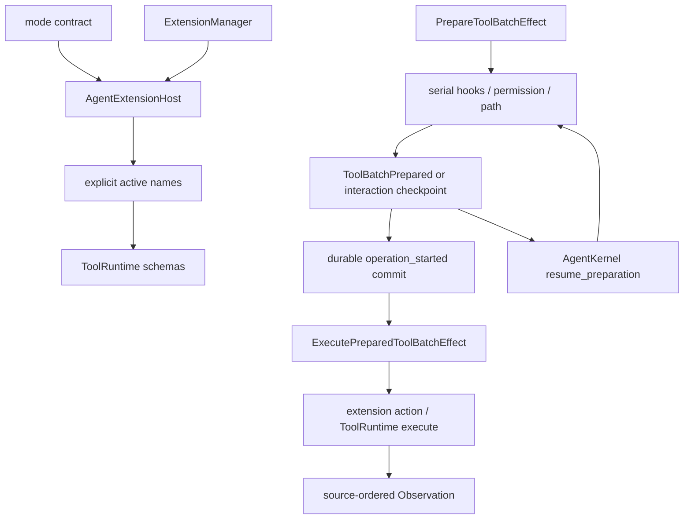

# Tools And Extensions

## Metadata

> 状态：`active`
> 类型：`platform authority`
> 负责人：`Agent platform maintainers`
> 最后同步日期：`2026-08-19`
> 对应代码范围：`packages/embedagent-core/src/embedagent_core/agent_extension_host.py`, `packages/embedagent-core/src/embedagent_core/extensions.py`, `packages/embedagent-core/src/embedagent_core/agent_tool_action_service.py`, `packages/embedagent-host/src/embedagent_host/runtime/tools/`

## 1. Purpose And Boundary

本文档定义通用 Agent 平台的工具注册、激活、schema 投影、执行和扩展分发。平台只内建工作流无关的基础工具；上层应用通过同一扩展边界注册其工具、prompt、状态和上下文能力。

`ToolRuntime` 是唯一工具运行时 facade。`ExtensionManager` 是能力注册和 active tool policy 的共享边界。`AgentExtensionHost` 是 Core 内的统一扩展分发边界。`AgentToolActionService` 是所有非 LLM action 的统一执行管道。

## 2. Workflow-Neutral Tools

平台基础词汇：

- `read_file`；
- `list_dir`；
- `glob_files`；
- `grep_text`；
- `write_file`；
- `edit_file`；
- `author_local_capability`；
- `bash`；
- `ask_user`。

应用工具不得被复制到基础包或 mode registry。平台文档不枚举某个应用的工具集；其所有权由对应 `docs/applications/` 文档说明。

## 3. Registration, Activation, Projection

三个动作必须区分：

1. registration 将 `ToolDefinition` 和 catalog metadata 放入共享 `ToolRuntime`；
2. activation 由 mode contract 与 `ExtensionManager.allowed_tool_names(...)` 产生当前显式名称集；
3. projection 只能通过 `ToolRuntime.schemas_for(mode, workflow_state, tool_names=...)` 生成模型可见 schema。

已注册不等于已激活；manifest、capability registry、runtime config 和前端 catalog 都是读模型，不能使工具变为 active。调用 `schemas_for(...)` 时不传显式名称，只投影平台 mode contract。

## 4. Extension Capabilities

扩展只通过 `extension_capabilities()` 返回的 `ExtensionCapability` 记录参与。能力记录包含 name、handler、可选 event type、reducer/observer kind、fail-closed override 和安全 metadata。具有同名 Python 方法不构成能力声明。

`AgentEventBus` 按 source 分发 hooks，`AgentExtensionHost` 将 context、prompt、active tools、schema、tool-call、tool-result 和 extension-owned actions 集中在一个边界。运行时所有者不得在 session transaction、Host facade 或 UI adapter 中散落 manager 直调。

注册是 owner-scoped effect：`ExtensionManager.register()`、`AgentEventBus.register_reducer()` 和 `AgentEventBus.register_observer()` 都返回幂等 disposer；应用层可将这些句柄挂入 `RegistrationScope`，在 `ACTIVE -> QUIESCING -> DISPOSED` 生命周期中逆序撤销。scope 进入 quiescing 后不接受新的 registration 或 operation admission，child scope 必须先于 parent scope 退出。该原语只管理内部注册和 admission，不替代 session journal、permission 或不可逆外部 effect 的补偿协议。

每个 scope 具有显式 `owner_id` 和可观察的 registration/child/active-operation 计数。Hosted runtime 以一个 `hosted-runtime` root scope 拥有 application、project extension、context reducer 和 session cache；shutdown 先 quiesce、再等待 worker/operation、最后按 child 与 registration 的逆序释放。并发 close 共享同一 completion barrier，失败也不能留下第二条 dispose 路径。

扩展诊断是 safe projection：Core 只发布 code、kind、exception type 和固定 safe message；Host project loader 通过 `FailureRecord` 转换异常。原始异常文本只能留在当前同步调用的 exception chain，不能进入 event payload、snapshot、extension state 或 metadata。

`ReducerRegistry` 的 context reducer 注册也属于 owner-scoped effect：注册返回幂等 disposer，冲突 owner fail-closed，同一 owner 的替换会先撤销旧 registration；ExtensionManager 会把 workflow/project reducer handles 绑定到 extension child scope。context assembly 读取锁保护的 reducer snapshot，因此正在进行的 assembly 可以完成，但 disposed owner 不会被新的 assembly 接纳。

## 5. Execution Pipeline

`AgentKernel` 先提交 assistant message 和 planned tool call，再产生 `PrepareToolBatchEffect`。`AgentToolActionService` 在 preparation 阶段按 source order 串行处理：

1. 检查工具是否 active；
2. 应用 before-tool hooks；
3. 根据 runtime catalog metadata 请求 `PermissionPolicy`；
4. 独立应用写路径守卫；
5. 创建 permission/user-input interaction 或准备 runtime dispatch metadata。

Preparation 不调度工具。`AgentKernel` 接受准备结果后，只为 ready invocation 产生 `operation_started`；`AgentLoop` 必须先将这些事件持久化提交，再执行 `ExecutePreparedToolBatchEffect`。执行阶段才调度 extension-owned action 或 `ToolRuntime.execute(...)`，然后应用 result hooks、workflow patch，产生结构化 `Observation` 和 read-model invalidations。blocked、denied、invalid、truncated 和 suspended action 不产生 execution-start record。

交互式 action 不进入并行执行。interaction checkpoint 保存原 assistant identity、source index、已准备前缀和 immediate results；回复后通过 `AgentKernel.resume_preparation(...)` 回到同一个 commit-execute-resume Loop，并从 checkpoint 继续未完成的 preparation，不重复已经通过的 hook、权限或路径决策。

Preparation 始终串行；execute 只并行连续的 `read_only && concurrency_safe` invocation，canonical observations 始终恢复为 source order。扩展 hooks 不能跳过 mode、权限、路径或 active-tool 检查。

## 6. Runtime Catalog

catalog entry 是 permission category 和安全展示 metadata 的唯一真相，并可包含：

- execution：只读性、并发性、timeout 和 handler 所有权；
- permission：`read`, `workspace_write`, `shell_exec`, `toolchain_exec`, `git_write`, `network`, `telemetry`, `other`；
- presentation：`preview_arg`, `changed_path_arg`, labels 和 renderer keys；
- context/read model：reducer key 和 `read_model_invalidations`；
- provenance：source type 和 source id。

UI 不得根据工具名推测权限、diff preview、changed paths 或刷新范围。未分类的工具归为 `other`，默认询问用户。

## 7. Local Resources And Project Extensions

Host 可发现 workspace-bound skills、prompts 和 workflow-neutral recipe JSON；resource reload 只刷新文件快照，不执行资源、安装依赖或改变 active tools。`author_local_capability` 只在 `.embedagent` 下创建文件资源或默认禁用的 project extension skeleton。

project Python extension 必须 workspace-bound、manifest-gated、显式 enabled，并经路径和 permission 校验。loader 不访问远程 registry，不安装运行时依赖，不允许替换内建工具。动态工具仍需正常注册、激活和授权。

## 8. Offline And Network Boundaries

所有 runtime-invoked binaries 必须来自 `scripts/offline-runtime-contract.json`。增加子进程依赖必须同步 contract 和产品包装验证。内网 Git、自定义 service、provider gateway 和 telemetry 必须是显式可禁用 adapter，并经正常 `network` 或 `telemetry` 权限。

## 9. Verification

- `tests/test_tools_package.py`
- `tests/test_tool_execution.py`
- `tests/test_dynamic_tool_registration.py`
- `tests/test_workflow_extensions.py`
- `tests/test_capability_extensions.py`
- `tests/test_local_resources.py`
- `tests/test_project_extensions.py`
- `tests/test_self_extension_authoring.py`

## 10. Related Documents

- `docs/platform/tool-contracts.md`
- `docs/platform/permission-model.md`
- `docs/platform/permissions-and-context.md`
- `docs/platform/mode-contract.md`
- `docs/platform/agent-core.md`
