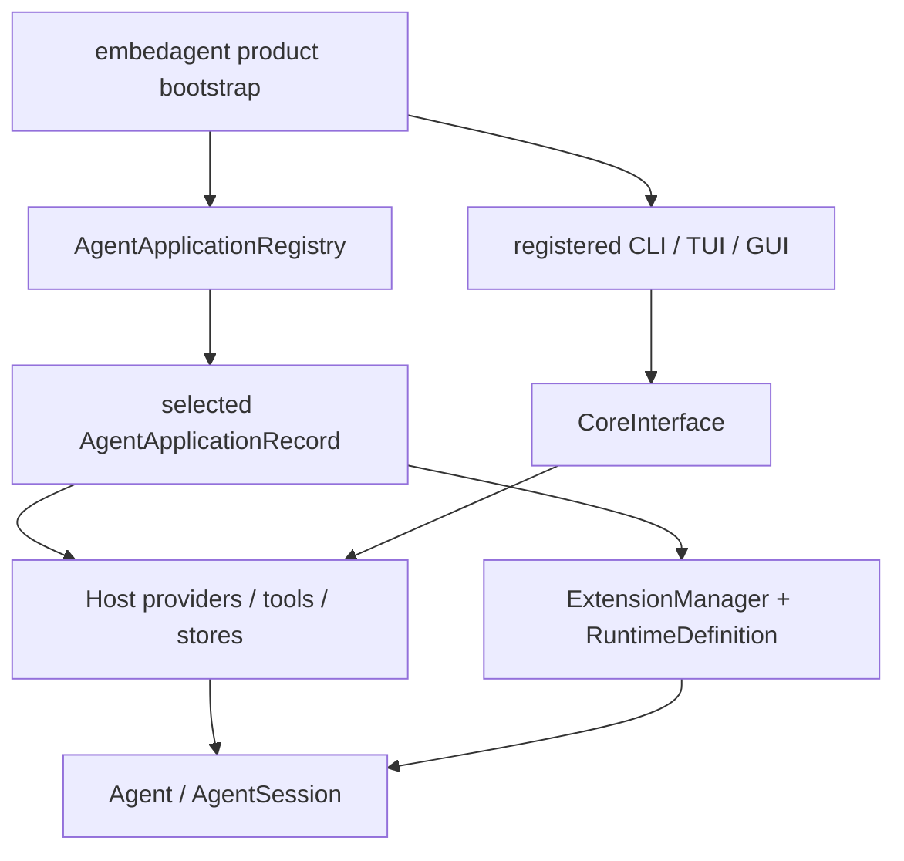

# EmbedAgent Composition

## Metadata

> 状态：`active`
> 类型：`product authority`
> 负责人：`EmbedAgent product maintainers`
> 最后同步日期：`2026-08-03`
> 对应代码范围：`src/embedagent/`, `packages/embedagent-host/src/embedagent_host/runtime/agent_applications.py`, `packages/embedagent-composition/src/embedagent_composition/`

## 1. Purpose And Boundary

EmbedAgent 是本仓库对 Agent Platform、application records、provider/tools/stores、GUI/TUI/CLI 和 Windows 7 离线交付的产品组合。本文档记录运行时选择、默认注册和 shell 注入；平台契约和应用内部语义分别由 `docs/platform/` 和 `docs/applications/` 拥有。

未来将 Agent Platform 迁出本仓库时，产品层应只需依赖其发行包和公开注册契约，不需连同具体工作流一起迁移。

## 2. Three Composition Boundaries

### Build-Time Definition

`embedagent-composition` 是无运行时依赖的中立编译/导出层，提供 `AgentProductDefinition`, `ComponentManifest`, `compile_agent()` 和 `export_agent()`。它不是 product bootstrap，不导入 Core、Host、Protocol 或任何工作流。

### Runtime Application Registry

`AgentApplicationRegistry` 拥有可选 `AgentApplicationRecord` 和 default application id。record 声明：

- application/profile identity；
- profile/runtime factories；
- workflow package ids；
- workspace profile detectors；
- source/provenance；
- empty-state metadata；
- app-shell commands/surfaces/capability restrictions。

Host 的 base registry 当前提供 generic、Python 和 HTML profile records。`src/embedagent/product_catalog.py` 在此基础上注册 packaged C/C++ workflow record，并将它设为 EmbedAgent 默认应用。C/C++ record 是当前唯一具有独立 workflow distribution 的默认产品应用。

### Product Bootstrap

`embedagent` 产品包选择 application record，并注入：

- provider client、`ToolRuntime`、context、permission、store 和 restore policy；
- selected application 的 profile、`RuntimeDefinition`, `ExtensionManager` 和 workspace detectors；
- `InProcessAdapter` 与 `AgentCoreAdapter`；
- GUI/TUI/CLI shell 及产品 metadata；
- 默认配置、资源路径和离线 runtime discovery。

Host 不导入 `embedagent`，Core 不导入 Host/Protocol/product/shell/application package。product bootstrap 是依赖方向最顶层。

## 3. Distribution Roles

| Distribution | Product role |
|---|---|
| `embedagent-core` | 独立 Agent SDK 与通用转轮/会话内核 |
| `embedagent-protocol` | stdlib-only Host/UI DTO 和双向接口 |
| `embedagent-host` | 通用 providers、tools、stores、context、profiles 与 session hosting |
| `embedagent-composition` | 中立 build-time definition/compiler/export contracts |
| `embedagent-workflow-cpp` | packaged C/C++ 上层应用 |
| `embedagent` | 产品 bootstrap、registry 组合、CLI/TUI/GUI 和交付资产 |

产品依赖五个下层发行包，下层包不反向依赖产品。具体必须匹配的项目依赖见 `AGENTS.md` 和各 `pyproject.toml`。

## 4. Shell Injection

GUI/TUI 的目标边界都是平台级注册 shell。产品层只选择启动哪个 shell，并注入 core factory、application registry、app capabilities、product copy 和 bundled runtime 路径。shell 不得反向读取 `product_catalog.py` 的应用细节以作为 UI policy。

产品 app-shell descriptors 可对 commands、surfaces、keybindings、palette groups 和 disabled capabilities 做选择。这些是组合 metadata，不改变 shell 支持的 generic renderer/handler contract。

当前 GUI 已消费大部分 app-shell descriptors，TUI 仍使用本地固定 catalog；两者尚未共享同一编译结果。前端收敛切片负责建立 product-owned descriptor compiler，并在 GUI/TUI 同步切换时删除旧 catalog 和 fallback。

## 5. Configuration And Offline Defaults

EmbedAgent 默认离线，运行时只从 bundle/config/workspace 中解析 provider、tools、resources 和 application。`config/config.json` 可包含 API key，不得提交或进入 telemetry/diagnostics。optional intranet adapters 必须显式可禁用并通过正常 network permission。

## 6. Verification

- `tests/test_host_package_composition.py`
- `tests/test_agent_app_protocol.py`
- `tests/test_agent_profiles.py`
- `tests/test_gui_app_host.py`
- `tests/test_terminal_frontend.py`
- `tests/test_python_distribution_contract.py`
- `tests/test_current_architecture_boundaries.py`

## 7. Related Documents

- `docs/overall-solution-architecture.md`
- `docs/platform/README.md`
- `docs/applications/cpp-workflow.md`
- `docs/platform/protocol.md`
- `docs/product/packaging-and-deployment.md`
