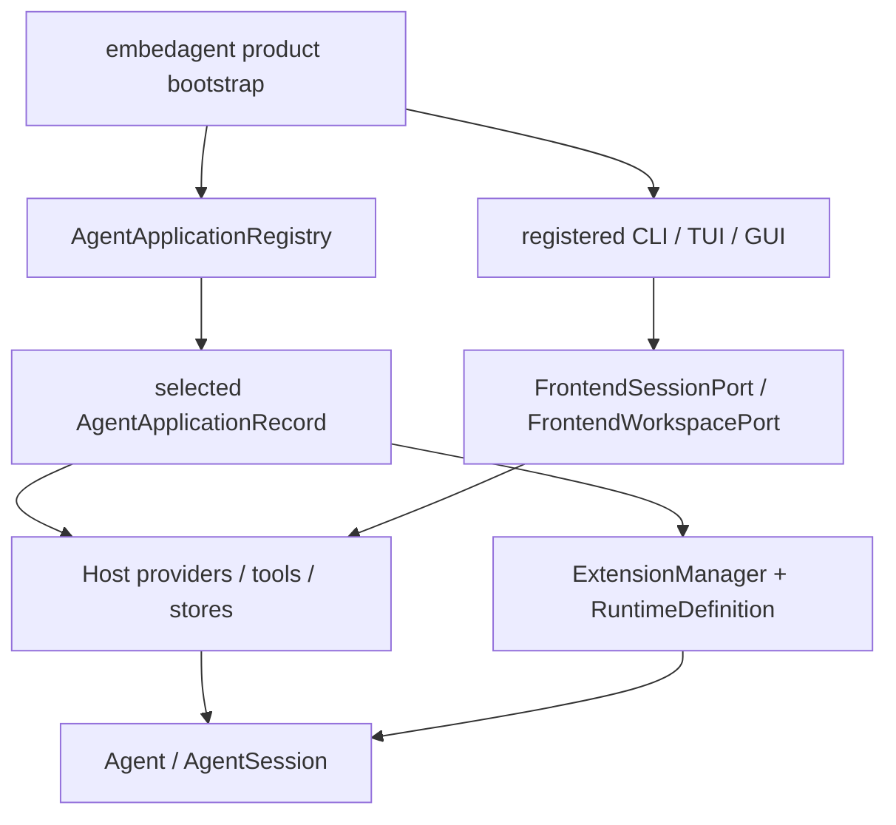

# EmbedAgent Composition

## Metadata

> 状态：`active`
> 类型：`product authority`
> 负责人：`EmbedAgent product maintainers`
> 最后同步日期：`2026-08-14`
> 对应代码范围：`src/embedagent/`, `packages/embedagent-host/src/embedagent_host/runtime/agent_applications.py`, `packages/embedagent-composition/src/embedagent_composition/`, `scripts/compile-bundle-plan.py`

## 1. Purpose And Boundary

EmbedAgent 是本仓库对 Agent Platform、application records、provider/tools/stores、GUI/TUI/CLI 和 Windows 7 离线交付的产品组合。本文档记录运行时选择、默认注册和 shell 注入；平台契约和应用内部语义分别由 `docs/platform/` 和 `docs/applications/` 拥有。

未来将 Agent Platform 迁出本仓库时，产品层应只需依赖其发行包和公开注册契约，不需连同具体工作流一起迁移。

## 2. Three Composition Boundaries

### Build-Time Definition

`embedagent-composition` 是无运行时依赖的中立编译/导出层，提供 `AgentProductDefinition`, `ComponentManifest`, `compile_agent()` 和 `export_agent()`，以及 `OfficialBundleRecipe`, `FrozenBundleRecipeRegistry` 和 `compile_bundle_plan()`。它不是 product bootstrap，不导入 Core、Host、Protocol 或任何工作流。

`src/embedagent/bundle_catalog.py` 是产品 component catalog 与官方 recipe 的唯一所有者。catalog 描述 distribution、profile、provider、toolset、workflow 和 shell 的依赖及 runtime requirements；recipe 只选择产品定义、shell 和配置模板，不枚举 asset path、wheel name 或 release gate。`scripts/compile-bundle-plan.py` 将 recipe、target、assurance、runtime contract 和 asset manifest 编译成只读 `CompiledBundlePlan`，并同时导出 `bundle-plan.json`, `agent.json` 和 `agent.lock.json`。

当前官方 flavor：

| Flavor | Agent application | Shells | Product scope |
|---|---|---|---|
| `minimal-cli` | `embedagent.generic` | CLI | workflow-neutral 最小 Agent，不激活 C/C++ workflow、TUI 或 GUI |
| `cpp-desktop` | `embedagent.default_c_cpp` | CLI, TUI, GUI | 默认完整 C/C++ desktop 产品 |

`cpp-desktop` 是省略 `-Flavor` 时的默认值。`-Flavor` 选择产品内容，`-Profile dev|release` 只选择 assurance；二者正交。任意私有 `AgentProductDefinition` 仍可使用中立 composition API 编译，但只有冻结 registry 中的 recipe 是本产品可打包的公开 flavor。

编译计划是 export、staging、validation、release identity、target evidence 和 runtime bootstrap 的共同输入。未知 recipe/component/requirement/provider/asset/feature/launcher/gate/schema 或 hash 必须在输出变更前失败，后续阶段不得重新推导另一份产品选择。

### Runtime Application Registry

`AgentApplicationRegistry` 拥有可选 `AgentApplicationRecord` 和 default application id。record 声明：

- application/profile identity；
- profile/runtime factories；
- workflow package ids；
- workspace profile detectors；
- source/provenance；
- empty-state metadata；
- app-shell commands/surfaces/capability restrictions。

Host 的 base registry 当前提供 generic、Python 和 HTML profile records。`src/embedagent/product_catalog.py` 在此基础上注册 packaged C/C++ workflow record，并将它设为 EmbedAgent 默认应用。C/C++ record 是当前唯一具有独立 workflow distribution 的默认产品应用。

开发源码中的 registry 可包含全部 records；bundle runtime 不能据此扩大制品能力。`src/embedagent/bundle_policy.py` 校验 embedded plan 与 bundle manifest 的 flavor/hash binding，并只向 Host 暴露计划允许的 application IDs。空 application 选择解析为计划中的首个允许项；显式选择未打包 application 会 fail closed，即使对应 Python distribution 物理存在。

### Product Bootstrap

`embedagent` 产品包选择 application record，并注入：

- provider client、`ToolRuntime`、context、permission、store 和 restore policy；
- selected application 的 profile、`RuntimeDefinition`, `ExtensionManager` 和 workspace detectors；
- private `InProcessAdapter` 与公开 `HostedRuntime(session, workspace)` focused ports；
- 构造时绑定的 `SessionEventSink` 与 shared client runtime；
- GUI/TUI/CLI shell 及产品 metadata；
- 默认配置、资源路径和离线 runtime discovery。

Host 不导入 `embedagent`，Core 不导入 Host/Protocol/product/shell/application package。product bootstrap 是依赖方向最顶层。



## 3. Distribution Roles

| Distribution | Product role |
|---|---|
| `embedagent-core` | 独立 Agent SDK 与通用转轮/会话内核 |
| `embedagent-protocol` | stdlib-only Host/UI DTO 和双向接口 |
| `embedagent-host` | 通用 providers、tools、stores、context、profiles 与 session hosting |
| `embedagent-composition` | 中立 build-time definition/compiler/export contracts |
| `embedagent-workflow-cpp` | packaged C/C++ 上层应用 |
| `embedagent` | 产品 bootstrap、registry 组合、CLI/TUI/GUI 和交付资产 |

产品依赖五个下层发行包，下层包不反向依赖产品。具体必须匹配的项目依赖见 `AGENTS.md` 和各 `pyproject.toml`。

## 4. Shell Injection

CLI/TUI/GUI 都是产品选择的可注册 shell。产品层选择启动 shell，并注入 Host port factory、application registry、product metadata、shell descriptor 和 bundled runtime 路径。shell 不得反向读取应用 catalog 的细节作为 UI policy。

打包运行时还必须先通过 `BundleRuntimePolicy.require_shell(...)`。`minimal-cli` 只允许 CLI；TUI/GUI 入口在该 flavor 中既不 staging，也不能通过源码或 wheel 的物理存在被激活。开发树不发现 bundle 时保持 unrestricted，便于使用全部已注册 shell 和 application。

产品维护一个 `ShellContributionRegistry`：generic contribution 定义最小 session/timeline/composer/interaction 能力，selected application 只追加其 commands、surfaces、tool presentation、timeline item 和 interaction records。`compile_shell_descriptor(...)` 合并两层记录，按当前 session capabilities 过滤 application commands，校验唯一 id/order、dispatch kind、renderer key 和 keybinding target，并产出 schema version 1 的 `ShellDescriptor`。

CLI application、GUI app bootstrap 与 TUI launcher 调用同一个 product shell compiler。三者没有本地固定 catalog、兼容 fallback 或第二条注册路径。renderer registry 只声明该 shell 构建实际支持的通用 renderer key；它不是产品能力真相。

EmbedAgent 默认组合注册最小核心以及 desktop files、terminal、source control、preview 等可选 contributions，并为 C/C++ 应用注册其 application commands。删除任一可选 contribution 不得影响最小 Agent shell 的 session 主干。

## 5. CLI Product Contract

CLI 是 focused ports 上的无状态 product host。每次进程启动都由同一个 product composition 解析 config、选择 application、构造 ports、绑定 Python `SessionClientRuntime` 并编译 `ShellDescriptor`；CLI 不维护常驻 Agent 或 session truth。

当前 grammar 只有：

```text
embedagent chat [launch/session options]
embedagent run [launch/session/output options] TASK
embedagent sessions list [launch/output options]
embedagent sessions show [launch/output options] REFERENCE
embedagent sessions rename [launch/output options] REFERENCE TITLE
embedagent sessions archive [launch/output options] REFERENCE
embedagent sessions fork [launch/output options] REFERENCE [--title TITLE]
```

`chat` 是交互式 session client，支持 descriptor commands、permission/user-input continuation、resume、EOF 和 cancel。`run` 是 one-shot client：遇到交互返回 blocked，不在进程内自动回答。`sessions` 只通过 session port 管理 durable sessions。不存在裸 message mode、shell 兼容 flag 或 CLI 到 TUI/GUI 的转发。

`run --output json` 产生 schema version 1 的 `CliResult`。稳定 exit codes 为：completed `0`；interaction/permission blocked `2`；usage/configuration `3`；provider/runtime/protocol/session failure `4`；cancelled `130`。text 模式把结果写 stdout，把结构化失败 category 与 tool diagnostics 写 stderr。

## 6. Configuration And Offline Defaults

EmbedAgent 默认离线，运行时只从 bundle/config/workspace 中解析 provider、tools、resources 和 application。官方 flavor 分别使用 `config/bundle-flavors/minimal-cli.json` 与 `cpp-desktop.json`；模板不含 `api_key` 或 credential 字段。用户生成的 `config/config.json` 可包含 API key，不得提交或进入 telemetry/diagnostics。optional intranet adapters 必须显式可禁用并通过正常 network permission。

所有 shell 只构造 `LaunchOverrides` 并调用产品 `resolve_launch_config(...)`。统一优先级从低到高为：built-in defaults、`~/.embedagent/config.json`、workspace `.embedagent/config.json`、`EMBEDAGENT_*` environment、explicit shell arguments。CLI/TUI/GUI launcher 不直接调用 `load_config()`，显式 `False` boolean override 不与 unspecified 混淆。

## 7. Verification

- `tests/test_host_package_composition.py`
- `tests/test_agent_app_protocol.py`
- `tests/test_agent_profiles.py`
- `tests/test_gui_app_host.py`
- `tests/test_terminal_frontend.py`
- `tests/test_python_distribution_contract.py`
- `tests/test_agent_composition.py`
- `tests/test_bundle_plan.py`
- `tests/test_product_bundle_recipes.py`
- `tests/test_bundle_runtime_policy.py`
- `tests/test_packaging_control_plane.py`
- `tests/test_cli_hosted_entrypoint.py`
- `tests/test_cli_parser.py`
- `tests/test_cli_run.py`
- `tests/test_cli_chat.py`
- `tests/test_current_architecture_boundaries.py`

## 8. Related Documents

- `docs/overall-solution-architecture.md`
- `docs/platform/README.md`
- `docs/applications/cpp-workflow.md`
- `docs/platform/protocol.md`
- `docs/product/packaging-and-deployment.md`
