# Packaging And Deployment

## Metadata

> 状态：`active`
> 类型：`product authority`
> 负责人：`release maintainers`
> 最后同步日期：`2026-08-19`
> 对应代码范围：`scripts/`, workspace distribution `pyproject.toml`, `src/embedagent/frontend/gui/static/`

## 1. Delivery Contract

EmbedAgent 交付为 Windows 7 SP1 x64 可运行的单文件夹离线包。目标机不需预安装计划选择的 runtime tools，也不在运行时联网解析依赖。Node.js 只用于 GUI build，不是任何 flavor 的运行时依赖；VS Code、WSL 和 Docker 均不是交付依赖。

每个制品必须携带计划内所有 runtime-invoked binaries。generic flavor 携带 Python 3.8 embeddable、vendored Python packages、MinGit 及 Bash、ripgrep；显式选择 `cpp-desktop` 时才增加 Universal Ctags、LLVM/Clang executables、TUI/GUI Python features、native GUI launcher 和 Fixed Version WebView2 109。

## 2. Selected Distribution Boundary

builder 可以构建 workspace 中的候选 wheel；checker、exporter 和 staging 只接受 bundle plan 声明的 selected closure：

| Distribution | Bundle location | Project dependencies |
|---|---|---|
| `embedagent-core` | `runtime/site-packages` | none |
| `embedagent-protocol` | `runtime/site-packages` | none |
| `embedagent-host` | `runtime/site-packages` | exact Core + Protocol |
| `embedagent-composition` | `runtime/site-packages` | none |
| `embedagent-workflow-cpp` | `runtime/site-packages` when selected | exact Core + Protocol |
| `embedagent-shell` | `app/embedagent` | exact Core + Protocol + Host |

每个 flavor 都按 `project_distribution_ids` 构建、检查、wheel-only 安装并归档自身闭包；未被计划选择的 wheel 是错误。release staging 中，产品 package 和产品 dist-info 不得在 `runtime/site-packages` 重复出现。不接受 editable links、开发源码树复制或依赖用户 site-packages 的结果。

compiled plan 另行固定 `application_project_distribution_ids`、`application_runtime_requirements` 与 `application_registration_entries`，用于证明 selected application plugin 的独立运行时边界。checker 先从已检查 wheel 内的 registration module path 确定唯一 registration-entry owner，再从该 owner 的 `Requires-Dist` metadata 递归导出 workspace dependency closure，并要求它与 `application_project_distribution_ids` 精确同集；metadata header 顺序不参与依赖语义，plan 与 wheelhouse 同时夹带无关 distribution 也不能扩大 closure。`cpp-desktop` 的 application closure 因此只能包含 `embedagent-core`、`embedagent-protocol` 和 `embedagent-workflow-cpp`。这个 application closure 不替代 flavor 的完整 `project_distribution_ids`，正常产品 release 仍按完整 closure staging。

`scripts/build-python-distributions.py` 是强制 wheel builder，不能以 raw `uv build --all-packages` 替代。builder 只清理已知生成物，保护外部 wheelhouse，并将嵌套 `uv` 构建绑定到启动 builder 的兼容 Python 3.8 解释器；这允许 Linux CI 使用 3.8.x patch 版本而不被仓库 `.python-version` 的发布 pin 误导。`check-python-distributions.py` 必须在安装、归档或 staging 前通过。

## 3. Flavor And Plan Contract

`scripts/package.config.json` 的 `default_flavor` 是 `minimal-cli`。`-Flavor` 选择产品内容；`-Profile dev|release` 只选择 assurance。`dev` 运行静态检查且不创建 zip，结果为 `DEV_ONLY`；`release` 创建 zip、运行计划选中的动态 gates，并产生 release candidate。命令名不能将 `dev` profile 提升成 release assurance，计划选中的 gate 也不能通过命令行关闭。

| Flavor | Allowed application | Shell/runtime content | Release gates |
|---|---|---|---|
| `minimal-cli` | `embedagent.generic` | CLI；Python, MinGit/Bash, ripgrep；无 TUI/GUI/WebView2/LLVM/C workspace | `runtime_contract`, `win7_cli_smoke` |
| `cpp-desktop` | `embedagent.default_c_cpp` | CLI/TUI/GUI；上述基础 runtime 加 LLVM/Clang, WebView2 109 和 C workspace | `runtime_contract`, `win7_cli_smoke`, `cpp_smoke_workspace`, `gui_headless_smoke`, `win7_windowed_gui_smoke` |

`scripts/compile-bundle-plan.py` 从 official recipe、`win7-x64-portable` target、assurance、`offline-runtime-contract.json` 和 `offline-assets.json` 生成 canonical `bundle-plan.json`, `agent.json` 与 `agent.lock.json`。计划固定 application、component、shell、runtime capability/component、asset、Python feature、launcher、gate 和 selected distribution IDs。export、prepare、build、validate、identity、evidence 和 runtime policy 必须校验同一 plan SHA-256，不能从已存在文件反推或扩大计划。

运行时 `BundleRuntimePolicy` 只读取并冻结 compiled plan 的 selected closure：`runtime_capability_ids`、`runtime_component_ids`、`asset_ids`、`gate_ids` 和 `project_distribution_ids`。每个字段必须存在、元素非空且唯一（合法空闭包除外）；runtime policy 不导入 composition、不扫描全局 catalog，也不合成 fallback id。registration entry 只在加载器中按 plan 逐项解析，未知符号不能通过 runtime policy 的第二套注册表放行。

## 4. Bundle Layout

```text
EmbedAgent/
|-- embedagent.cmd / validate-cli-smoke.cmd
|-- [desktop] EmbedAgent.exe / embedagent-gui.exe
|-- [desktop] embedagent-tui.cmd / embedagent-gui.cmd
|-- [desktop] validate-cpp-smoke.cmd / validate-gui-smoke.cmd
|-- app/
|   `-- embedagent/
|-- runtime/
|   |-- python/
|   |-- site-packages/
|   `-- [desktop] webview2-fixed-runtime/
|-- bin/
|   |-- git/
|   |-- rg/
|   |-- ctags/
|   `-- [desktop] llvm/
|-- config/
|-- [desktop] data/workspace-template/
|-- tools/validation/
|-- manifests/
|   |-- bundle-plan.json / agent.json / agent.lock.json
|   |-- bundle-manifest.json
|   |-- checksums.txt
|   |-- release-identity.json
|   |-- evidence/
|   `-- licenses/
`-- docs/
```

`embedagent.cmd` 只执行 `runtime/python/python.exe -m embedagent`。desktop 的
`embedagent-tui.cmd` 独立执行 `-m embedagent.frontend.tui.launcher`，GUI launcher 使用其
专有入口；launcher 之间不通过已退役的 CLI compatibility flags 互相转发。

The product CLI prepares `sys.stdout` and `sys.stderr` once at startup. It keeps
the selected stream encoding and uses replacement for characters the encoding
cannot represent; Core and Host continue to carry Unicode without presentation
fallbacks.

## 5. Build And Release Flow

`scripts/package.ps1` 是主编排入口：

- `doctor`：独立环境/资产预检；
- `deps`：构建并检查 plan-selected wheels，准备锁定第三方依赖，以 no-index/no-deps 安装项目 wheel；
- `assemble`：按 plan 构建所需 native GUI launcher（若选择 GUI），生成 staging tree，再按 profile 生成分发目录、可选 zip 和 source seed；
- `verify`：运行静态/动态 bundle checks 和 release smokes；
- `release`：依次执行 `deps -> assemble -> verify`，任一 blocking issue 立即停止。

```mermaid
flowchart LR
    D["package.ps1 doctor"] --> R["package.ps1 release"]
    R --> P["compiled immutable bundle plan"]
    P --> W["selected checked wheels + plan-selected dependencies"]
    W --> A["plan-selected offline staging"]
    A --> Z["artifact + zip + identity"]
    Z --> V["bundle validation + smokes"]
    V --> T["TARGET_READY candidate"]
    T --> E["clean Win7 evidence validation"]
    E --> C["ACCEPTED"]
```



## 6. Script Ownership

| Script | Ownership |
|---|---|
| `build-python-distributions.py` | plan-selected wheel 清洁构建 |
| `check-python-distributions.py` | wheel set、file ownership、project DAG、archive/path/Win7 collision checks |
| `smoke-python-distributions.py` | Python 3.8 隔离 venv 中 no-index/no-deps 导入与 product CLI parser 冒烟；`--application-isolated` 比较已安装 plugin public manifest 的 distribution、dependencies、runtime requirements 与 registration entry 后再执行 registration/disposer，并拒绝未选 Host/Product/Composition import |
| `compile-bundle-plan.py` | 将 official recipe、target 和 assurance 编译为 immutable plan/Agent lock |
| `export-dependencies.py` | 锁定第三方导出和 checked project wheel install |
| `prepare-offline.ps1` | 从已安装 distributions 生成分级 staging tree |
| `build-offline-bundle.ps1` | 分发目录、zip、source seed 和 manifests |
| `validate-offline-bundle.ps1` | 完整性、checksum、launcher、Python path、runtime contract 和 smoke gates |
| `build-gui-launcher.ps1` | 生成薄 Win32 native GUI launcher |
| `validate-cpp-smoke.py` | 使用 bundle-local compiler 构建小型 workspace |
| `validate-cli-smoke.py` | 通过 staged `embedagent.cmd` 验证 CLI parser、Agent turn、交互、durable session 与 exit contract |
| `validate-gui-smoke.py` | 验证 GUI、WebSocket、tool/interaction flow 和 renderer report |
| `validate-release-evidence.py` | 将目标机报告与 release identity 校验为验收结果 |

## 7. Offline Runtime Contract

`scripts/offline-runtime-contract.json` 是 runtime-invoked external binaries 和 release gates 的唯一列表。tool、recipe、launcher 或 validator 开始调用新 binary 时，必须在同一变更中更新 contract 及测试，不在打包脚本中再建硬编码工具表。

`validate-cli-smoke.py` 是 stdlib-only 的共同动态 gate，不导入产品或 Host API。它隔离
user home 与 workspace，写入 credential-free `~/.embedagent/config.json` 和 workspace
config，启动本地回环 fake provider，然后实际调用 staged `embedagent.cmd`。两种 flavor
必须执行完全相同的 9 个场景：`run_json`, `chat_completion`, `chat_permission`,
`chat_user_input`, `sessions_list`, `sessions_show`, `run_resume`,
`blocked_permission`, `blocked_user_input`。

The validator runs the staged CLI with `PYTHONIOENCODING=cp1252` so the gate is
independent of the development machine locale and covers English Windows
redirected output. Failure reports may include only the scenario ID, process
exit code, and stable CLI failure code; raw stdout/stderr and interaction data
remain forbidden.

schema version 2 报告记录 `command_launcher=embedagent.cmd`、实际 flavor/application、
`runtime_source=bundle`、逐场景结果和 `system_tool_fallback_allowed=false`。报告不包含
prompt、source、raw tool output、credential 或 permission payload。任一场景、launcher、
plan-selected application 或 bundled runtime identity 不匹配都会阻断 release。

`validate-cpp-smoke.py` 只在计划选择 C/C++ workflow 时执行，并只接受 bundle 内
compiler；GUI gates 只在计划选择 GUI 时执行，且不将开发机 runtime 作为交付证明。

## 8. Release Identity And States

`manifests/release-identity.json` 是 credential-free 发布身份，记录 source revision、product version、profile、flavor、target、bundle plan/Agent lock hash、精确 gate IDs、selected wheel 名称/哈希、可选 GUI static hash、asset-manifest hash 和 runtime-contract hash。target report 必须回传完全相同的 flavor、plan hash 与 gate set；额外或缺失 gate 都是 blocking error。

- `TARGET_READY`：仓库门禁、bundle-local checks 和要求的 smokes 通过。它仍是 candidate，`publishable=false`，不是 Win7 交付声明。
- `ACCEPTED`：只由 offline evidence validator 在目标报告匹配 release identity，并证明 Windows 7 SP1 AMD64 及计划选择的全部 gates 后产生。最小 flavor 需要 bundle-local CLI smoke，不需要 GUI/C++ evidence；desktop flavor 另外需要 bundled browser/runtime renderer 和 bundle compiler smoke。

开发机、CI、headless smoke 或其他 Windows 版本的结果不能替代 clean-machine Win7 的 plan-selected target evidence。详细交接见 `docs/guides/win7-release-runbook.md`。

## 9. Reproducibility

production package config 必须声明 `metadata.config_origin=production`，fixture 只能在重定向的临时根中运行。release report 记录 run id、source revision、execution kind、report/artifact roots 和 config path。

`package.ps1 release -Flavor <flavor> -Reproducible -ReproducibilityRoot <root>` 产生同一 flavor、target、assurance 的两次独立子运行，再由 `compare-release-artifacts.py` 比较稳定文件、identity、wheel、可选 GUI、asset manifest、runtime contract、plan 与 Agent lock。不同 flavor 或 plan hash 不能互相比较为成功。只能忽略 fixture 配置明确声明的 operational path/timestamp 差异和生成的 smoke/acceptance report。

dirty worktree 生成的 report 只是 diagnostics，提交后必须从清洁 revision 重新生成。report 使用同 volume sibling temporary file + atomic replace。

## 10. Required Commands

```powershell
uv run python scripts/build-python-distributions.py --dist-dir dist --bundle-plan build/plans/minimal-cli/bundle-plan.json
uv run python scripts/check-python-distributions.py --dist-dir dist --bundle-plan build/plans/minimal-cli/bundle-plan.json
uv run python scripts/smoke-python-distributions.py --dist-dir dist --python .venv/Scripts/python.exe --bundle-plan build/plans/minimal-cli/bundle-plan.json
uv run --all-packages pytest tests/test_phase4_cpp_isolated_wheel.py -q
powershell -ExecutionPolicy Bypass -File scripts/package.ps1 doctor -Profile release -Flavor minimal-cli
powershell -ExecutionPolicy Bypass -File scripts/package.ps1 doctor -Profile release -Flavor cpp-desktop
powershell -ExecutionPolicy Bypass -File scripts/package.ps1 release -Profile release -Flavor minimal-cli
powershell -ExecutionPolicy Bypass -File scripts/package.ps1 release -Profile release -Flavor cpp-desktop
```

release profile 自行执行 dependency export，正常发布前不需手工重复调用 `export-dependencies.py`。诊断 wheel 边界时可单独运行 build/check/smoke。

`test_phase4_cpp_isolated_wheel.py` 的确定性证据包含 application scope、由 wheel metadata 导出的精确 closure、唯一 registration owner、`network_resolution=disabled`、application runtime requirements、registration entry、已安装 public manifest 比对与 `selected_application` scenario status。它还证明 plan 和 wheelhouse 同时增加 Host 时 fail closed，并逐字段拒绝 manifest distribution/dependencies/runtime requirements/registration entry 漂移。测试在临时 wheelhouse 和新建 Python 3.8 venv 中执行，不读取开发源码或 user site-packages。该本地证据只是物理拆库和 release 的前置条件，不能替代 clean-machine Windows 7 C++/GUI/CLI evidence。

## 11. Change Triggers

以下变化必须同步本文档并重跑交付门禁：

- distribution 数量、依赖 DAG、wheel ownership 或 staging layout；
- third-party dependency/asset/version/hash；
- official recipe、component catalog、bundle plan schema/hash、runtime-invoked binary 或 release gate；
- GUI static build、native launcher 或 bundled browser runtime；
- Win7 兼容性或 evidence contract；
- package scripts、config schema、manifest、identity 或 reproducibility rules。

## 12. Related Documents

- `docs/product/composition.md`
- `docs/guides/win7-release-runbook.md`
- `docs/guides/win7-preflight-checklist.md`
- `docs/guides/win7-gui-validation.md`
- `docs/workflows/release-doc-checklist.md`
- `docs/references/code-doc-matrix.md`
