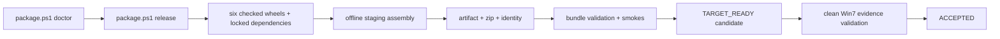

# Packaging And Deployment

## Metadata

> 状态：`active`
> 类型：`product authority`
> 负责人：`release maintainers`
> 最后同步日期：`2026-08-01`
> 对应代码范围：`scripts/`, 六个 distribution `pyproject.toml`, `src/embedagent/frontend/gui/static/`

## 1. Delivery Contract

EmbedAgent 交付为 Windows 7 SP1 x64 可运行的单文件夹离线包。目标机不需预安装 Python、Git、Bash、Clang、Node.js、VS Code、WSL 或 Docker，也不在运行时联网解析依赖。

产品包必须携带 Python 3.8 embeddable、vendored Python packages、MinGit 及 Bash、ripgrep、Universal Ctags、必需 LLVM/Clang executables、GUI browser runtime assets 和其他所有 runtime-invoked binaries。

## 2. Six Distribution Boundary

builder 必须生成且 checker 必须验证恰好六个 wheel：

| Distribution | Bundle location | Project dependencies |
|---|---|---|
| `embedagent-core` | `runtime/site-packages` | none |
| `embedagent-protocol` | `runtime/site-packages` | none |
| `embedagent-host` | `runtime/site-packages` | exact Core + Protocol |
| `embedagent-composition` | `runtime/site-packages` | none |
| `embedagent-workflow-cpp` | `runtime/site-packages` | exact Core |
| `embedagent` | `app/embedagent` | all five lower distributions |

release staging 中，产品 package 和产品 dist-info 不得在 `runtime/site-packages` 重复出现。不接受 editable links、开发源码树复制或依赖用户 site-packages 的结果。

`scripts/build-python-distributions.py` 是强制 wheel builder，不能以 raw `uv build --all-packages` 替代。builder 只清理已知生成物，保护外部 wheelhouse。`check-python-distributions.py` 必须在安装、归档或 staging 前通过。

## 3. Bundle Layout

```text
EmbedAgent/
|-- EmbedAgent.exe / embedagent-gui.exe
|-- embedagent.cmd / embedagent-tui.cmd / embedagent-gui.cmd
|-- validate-cpp-smoke.cmd / validate-gui-smoke.cmd
|-- app/
|   `-- embedagent/
|-- runtime/
|   |-- python/
|   |-- site-packages/
|   `-- webview2-fixed-runtime/
|-- bin/
|   |-- git/
|   |-- rg/
|   |-- ctags/
|   `-- llvm/
|-- config/
|-- data/workspace-template/
|-- tools/validation/
|-- manifests/
|   |-- bundle-manifest.json
|   |-- checksums.txt
|   |-- release-identity.json
|   |-- evidence/
|   `-- licenses/
`-- docs/
```

## 4. Build And Release Flow

`scripts/package.ps1` 是主编排入口：

- `doctor`：独立环境/资产预检；
- `deps`：构建并检查六 wheel，准备锁定第三方依赖，以 no-index/no-deps 安装项目 wheel；
- `assemble`：构建 native GUI launcher，生成 staging tree，再生成分发制品、zip 和 source seed；
- `verify`：运行静态/动态 bundle checks 和 release smokes；
- `release`：依次执行 `deps -> assemble -> verify`，任一 blocking issue 立即停止。



## 5. Script Ownership

| Script | Ownership |
|---|---|
| `build-python-distributions.py` | 六 wheel 清洁构建 |
| `check-python-distributions.py` | wheel set、file ownership、project DAG、archive/path/Win7 collision checks |
| `smoke-python-distributions.py` | Python 3.8 隔离 venv 中 no-index/no-deps 导入冒烟 |
| `export-dependencies.py` | 锁定第三方导出和 checked project wheel install |
| `prepare-offline.ps1` | 从已安装 distributions 生成分级 staging tree |
| `build-offline-bundle.ps1` | 分发目录、zip、source seed 和 manifests |
| `validate-offline-bundle.ps1` | 完整性、checksum、launcher、Python path、runtime contract 和 smoke gates |
| `build-gui-launcher.ps1` | 生成薄 Win32 native GUI launcher |
| `validate-cpp-smoke.py` | 使用 bundle-local compiler 构建小型 workspace |
| `validate-gui-smoke.py` | 验证 GUI、WebSocket、tool/interaction flow 和 renderer report |
| `validate-release-evidence.py` | 将目标机报告与 release identity 校验为验收结果 |

## 6. Offline Runtime Contract

`scripts/offline-runtime-contract.json` 是 runtime-invoked external binaries 和 release gates 的唯一列表。tool、recipe、launcher 或 validator 开始调用新 binary 时，必须在同一变更中更新 contract 及测试，不在打包脚本中再建硬编码工具表。

`validate-cpp-smoke.py` 只接受 bundle 内 compiler 作为 release evidence，不使用 system `PATH` fallback。GUI launcher 默认要求 bundled fixed browser runtime，不将开发机已安装 runtime 作为交付证明。

## 7. Release Identity And States

`manifests/release-identity.json` 是 credential-free 发布身份，记录 source revision、product version、六个 wheel 名称/哈希、GUI static hash、asset-manifest hash 和 runtime-contract hash。

- `TARGET_READY`：仓库门禁、bundle-local checks 和要求的 smokes 通过。它仍是 candidate，`publishable=false`，不是 Win7 交付声明。
- `ACCEPTED`：只由 offline evidence validator 在目标报告匹配 release identity，且证明 Windows 7 SP1 AMD64、bundled browser runtime/renderer、bundle compiler smoke、无 tool fallback、无 command/blocking errors 后产生。

开发机、CI、headless smoke 或其他 Windows 版本的结果不能替代 clean-machine Win7 windowed evidence。详细交接见 `docs/guides/win7-release-runbook.md`。

## 8. Reproducibility

production package config 必须声明 `metadata.config_origin=production`，fixture 只能在重定向的临时根中运行。release report 记录 run id、source revision、execution kind、report/artifact roots 和 config path。

`package.ps1 release -Reproducible -ReproducibilityRoot <root>` 产生两次独立子运行，再由 `compare-release-artifacts.py` 比较稳定文件、identity、wheel、GUI、asset manifest 和 runtime contract。只能忽略 fixture 配置明确声明的 operational path/timestamp 差异。

dirty worktree 生成的 report 只是 diagnostics，提交后必须从清洁 revision 重新生成。report 使用同 volume sibling temporary file + atomic replace。

## 9. Required Commands

```powershell
uv run python scripts/build-python-distributions.py --dist-dir dist
uv run python scripts/check-python-distributions.py --dist-dir dist
uv run python scripts/smoke-python-distributions.py --dist-dir dist --python .venv/Scripts/python.exe
powershell -ExecutionPolicy Bypass -File scripts/package.ps1 doctor
powershell -ExecutionPolicy Bypass -File scripts/package.ps1 release
```

release profile 自行执行 dependency export，正常发布前不需手工重复调用 `export-dependencies.py`。诊断 wheel 边界时可单独运行 build/check/smoke。

## 10. Change Triggers

以下变化必须同步本文档并重跑交付门禁：

- distribution 数量、依赖 DAG、wheel ownership 或 staging layout；
- third-party dependency/asset/version/hash；
- runtime-invoked binary 或 release gate；
- GUI static build、native launcher 或 bundled browser runtime；
- Win7 兼容性或 evidence contract；
- package scripts、config schema、manifest、identity 或 reproducibility rules。

## 11. Related Documents

- `docs/product/composition.md`
- `docs/guides/win7-release-runbook.md`
- `docs/guides/win7-preflight-checklist.md`
- `docs/guides/win7-gui-validation.md`
- `docs/workflows/release-doc-checklist.md`
- `docs/references/code-doc-matrix.md`
