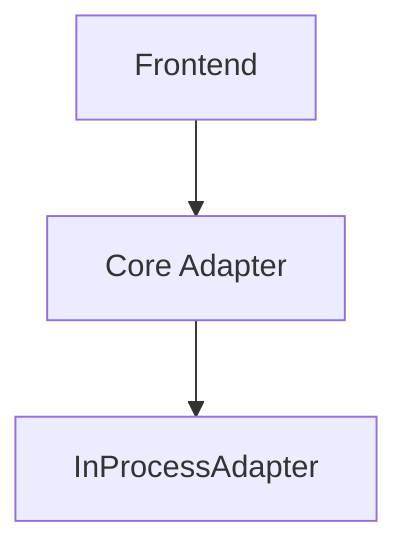
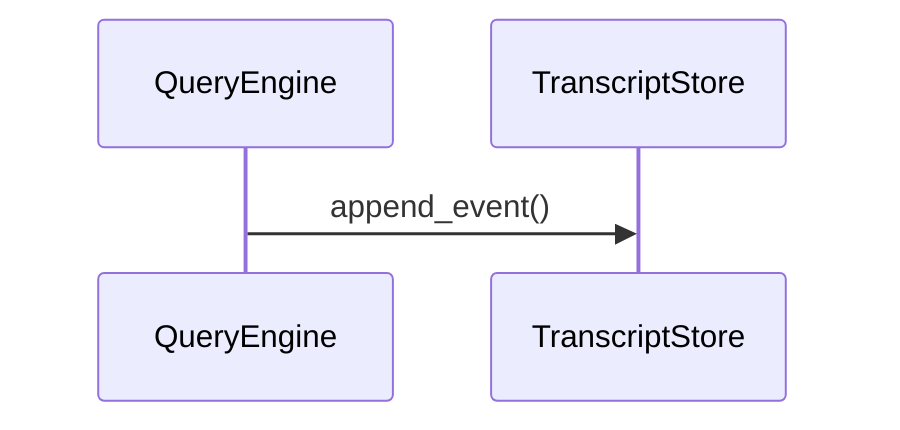
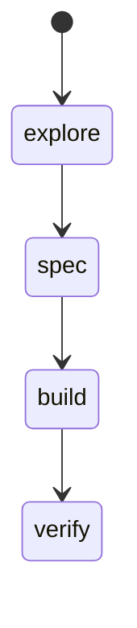

# Diagram Conventions

> 状态：`active`
> 类型：`reference`
> 负责人：`project maintainers`
> 最后同步日期：`2026-04-08`
> 对应代码范围：`docs/`

## 1. Preferred Diagram Types

- `flowchart`：分层关系、处理流程、模块调用骨架
- `sequenceDiagram`：时序链路、请求/响应路径、事件传播
- `stateDiagram-v2`：状态迁移、模式切换、等待态与终止态

## 2. When Mermaid Is Required

- 架构总览文档必须包含至少 1 张主链路图
- 模块文档在存在多组件交互时必须包含至少 1 张 Mermaid 图
- 工作流文档必须包含至少 1 张流程图
- 协议、事件流、状态流主题必须包含至少 1 张时序图或状态图

## 3. Labeling Rules

- 节点标签使用中文说明业务语义，必要时保留英文代码标识
- 节点标签不要堆叠过多路径；详细路径写回正文
- 图表中出现的正式术语必须与 `references/glossary.md` 保持一致

## 4. Code And Document Boundaries

- 图表说明结构与关系，不替代正文中的代码映射块
- 图中组件名应能回指到实际代码目录、入口文件或核心对象
- 同一主题如果已经在全局文档有高层图，模块文档应补模块内更细粒度图，而不是复制同一张图

## 5. Update Rules

- 代码边界变化时，同步检查相关图表是否仍准确
- 活动文档中的图表应始终对应当前代码
- 已废弃图表应与其文档一起归档，不应继续留在活动入口

示例：

