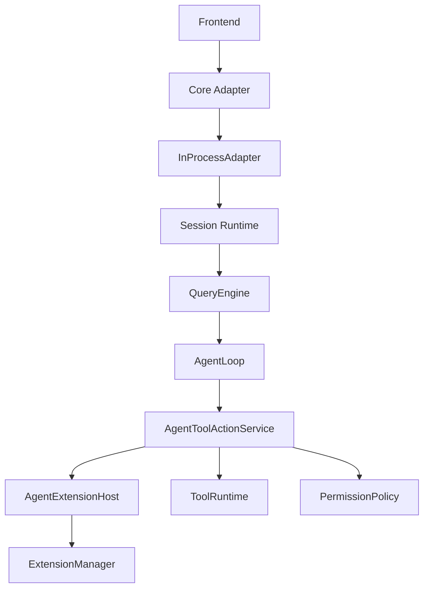
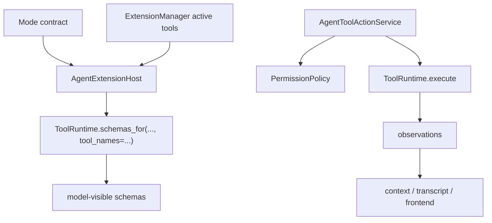
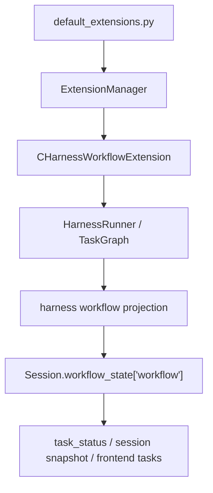
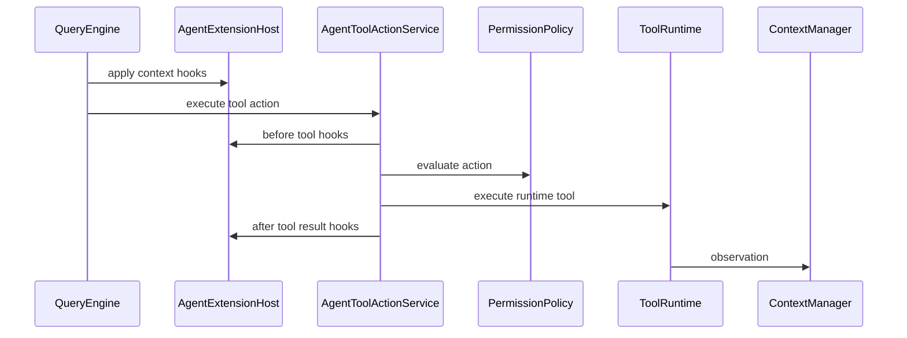

# Self-Extensible Documentation Cutover Implementation Plan

> **For agentic workers:** REQUIRED SUB-SKILL: Use superpowers:subagent-driven-development (recommended) or superpowers:executing-plans to implement this plan task-by-task. Steps use checkbox (`- [ ]`) syntax for tracking.

**Goal:** Complete Slice 6 by making active documentation and module documentation reflect the completed self-extensible Agent Core architecture.

**Architecture:** This is a documentation-only cutover. It aligns active source-of-truth docs, module docs, archive indexes, and tracker/changelog entries with the runtime behavior already delivered in Slices 1-5: local resources, manifest-gated project extensions, dynamic tools, shared extension hosting, and the slim `QueryEngine` spine.

**Tech Stack:** Markdown documentation, Git, ripgrep, existing pytest only for optional smoke checks if code or tests are touched.

---

## Scope

Included:

- Align active source-of-truth docs with local offline self-extension as official architecture.
- Update module docs that still describe the pre-Slice-5 execution spine.
- Move the completed Slice 3 local-resource implementation plan out of active `docs/superpowers/plans`.
- Update the self-extensible archive README.
- Add a Slice 6 design-change-log entry and development-tracker row.
- Archive the Slice 6 design and implementation plan after global docs are synchronized.
- Run textual documentation audits and whitespace checks.

Excluded:

- Runtime code changes.
- New extension APIs.
- Sample `.embedagent/` extensions.
- User-facing extension authoring guide.
- Documentation test infrastructure.
- Remote registry, plugin marketplace, online install, dependency installation, built-in tool replacement, browser automation, or multi-agent orchestration scope.

## File Structure

- Modify `README.md`
  - Confirm the official architecture section states local offline self-extension and the non-goal boundary clearly.

- Modify `AGENTS.md`
  - Confirm future-agent instructions treat local resources and manifest-gated project extensions as official, and keep remote/marketplace/dependency-install scope out.

- Modify `docs/overall-solution-architecture.md`
  - Confirm the top-level execution spine and extension runtime language match Slice 5.

- Modify `docs/implementation-roadmap.md`
  - Mark self-extensible Agent Core documentation cutover as closed and keep remaining near-term work focused on legacy cleanup, validation, packaging, and real C projects.

- Modify `docs/tool-contracts.md`
  - Confirm dynamic extension tools, explicit active schemas, and file-only resource reload are documented together.

- Modify `docs/permission-model.md`
  - Confirm extension-registered tools remain subject to `PermissionPolicy`.

- Modify `docs/frontend-protocol.md`
  - Confirm resource reload, project extension state, and extension diagnostics are part of the frontend-facing contract.

- Modify `docs/agent-harness-v2.md`
  - Confirm the default C/C++ harness is the bundled built-in extension and not irreducible Agent Core.

- Modify `docs/modules/agent-core.md`
  - Add `AgentLoop`, `AgentToolActionService`, `AgentExtensionHost`, `ExtensionManager`, `default_extensions.py`, and `project_extensions.py` to the module ownership story.

- Modify `docs/modules/tools-and-tooling.md`
  - Add dynamic tool registration, explicit schema projection, resource reload, and extension tool permission gating.

- Modify `docs/modules/harness.md`
  - Reframe the harness as the bundled built-in workflow extension installed through `default_extensions.py`.

- Modify `docs/modules/session-runtime.md`
  - Add `Session.workflow_state`, `extensions.local_resources`, `extensions.project_extensions`, and `extension_diagnostics`.

- Modify `docs/modules/permissions-and-context.md`
  - Add `AgentToolActionService` and `AgentExtensionHost` as the tool hook/permission execution path for extension tools.

- Modify `docs/modules/protocol-and-core.md`
  - Add resource reload and extension diagnostics to the protocol/core bridge responsibilities.

- Modify `docs/modules/README.md`
  - Update the index date and mention self-extensible module ownership alignment.

- Modify `docs/README.md`
  - Update the archive rule to mention completed self-extensible slice materials are archived after global docs sync.

- Modify `docs/archive/self-extensible-agent-core/README.md`
  - Add the completed Slice 3 local-resource plan, Slice 5 design, Slice 5 plan, and eventually Slice 6 design/plan after final archive.

- Move `docs/superpowers/plans/2026-06-05-local-resource-reload.md`
  - To `docs/archive/self-extensible-agent-core/2026-06-05-local-resource-reload.md`.

- Modify `docs/development-tracker.md`
  - Update the date/status and add a 2026-06-12 Slice 6 row.

- Modify `docs/design-change-log.md`
  - Add `DC-128` for Slice 6.

---

## Tasks

### Task 1: Source-Of-Truth Documentation Alignment

**Files:**

- Modify: `README.md`
- Modify: `AGENTS.md`
- Modify: `docs/overall-solution-architecture.md`
- Modify: `docs/implementation-roadmap.md`
- Modify: `docs/tool-contracts.md`
- Modify: `docs/permission-model.md`
- Modify: `docs/frontend-protocol.md`
- Modify: `docs/agent-harness-v2.md`

- [ ] **Step 1: Run an active-doc stale-scope audit**

Run:

```bash
rg -n "project-local extension discovery (is|remains) out of scope|project-local discovery (is|remains) out of scope|project-local extension discovery still|future project-local extension|project-local discovery still" README.md AGENTS.md docs/README.md docs/overall-solution-architecture.md docs/implementation-roadmap.md docs/tool-contracts.md docs/permission-model.md docs/frontend-protocol.md docs/agent-harness-v2.md docs/modules
```

Expected: no matches. Matches in `docs/archive/` or old historical changelog entries are allowed, but this command intentionally excludes them.

- [ ] **Step 2: Update root architecture language only where the audit or review shows drift**

Review `README.md`, `AGENTS.md`, `docs/overall-solution-architecture.md`, and `docs/agent-harness-v2.md`.

Ensure these exact facts are present in active prose:

```text
Local offline self-extension is official architecture through file-only workspace resources and manifest-gated project-local Python extensions.

Resource reload discovers `.embedagent/skills`, `.embedagent/prompts`, and `.embedagent/recipes`; it does not execute Python extension code.

Project-local Python extension loading is a hosted adapter operation under `.embedagent/extensions/<name>/extension.json`; enabled manifests must declare permissions and load only workspace-bound `extension.py` entrypoints.

The default C/C++ harness is installed by hosted product paths as the bundled built-in workflow extension through `default_extensions.py`.

Remote registries, plugin marketplaces, online installs, dependency installation, built-in tool replacement, and general multi-agent orchestration remain out of scope.
```

If a file already states the fact clearly, leave that paragraph unchanged.

- [ ] **Step 3: Update roadmap language**

In `docs/implementation-roadmap.md`, update the self-extensible area so it communicates that Slice 6 closes the documentation cutover. Use this sentence in the completed/recent boundary list:

```markdown
- Slice 6 completed the documentation cutover for self-extensible Agent Core: active source-of-truth docs and module docs now treat local offline self-extension as official architecture while keeping marketplaces, online installs, dependency installation, built-in tool replacement, and multi-agent orchestration out of scope
```

Keep the "Remaining Near-Term Work" section focused on:

```markdown
- deleting dead compatibility shims
- validating real C/C++ projects
- validating the Win7/offline bundle
- keeping documentation synchronized with the official extension boundaries
```

- [ ] **Step 4: Update tool, permission, and frontend protocol docs only for missing facts**

Review `docs/tool-contracts.md`, `docs/permission-model.md`, and `docs/frontend-protocol.md`.

Ensure these exact facts are present:

```text
Dynamic extension tools are model-visible only when active through the shared `ExtensionManager` path and remain subject to `PermissionPolicy`.

`ToolRuntime.schemas_for(mode, workflow_state, tool_names=...)` remains the only schema projection entry point; extension-aware callers pass explicit active tool names.

`POST /api/sessions/{session_id}/resources/reload` refreshes file resources and is not a Python extension execution endpoint.

`extensions.local_resources`, `extensions.project_extensions`, and `extension_diagnostics` are frontend-visible health and diagnostics state, not frontend-owned execution policy.
```

If the exact fact already appears with equivalent wording, keep it and avoid churn.

- [ ] **Step 5: Verify source-of-truth docs**

Run:

```bash
rg -n "local offline self-extension|manifest-gated project-local Python|AgentExtensionHost|AgentToolActionService|AgentLoop|ToolRuntime.schemas_for|extension_diagnostics" README.md AGENTS.md docs/overall-solution-architecture.md docs/implementation-roadmap.md docs/tool-contracts.md docs/permission-model.md docs/frontend-protocol.md docs/agent-harness-v2.md
```

Expected: matches across the listed docs that show the current architecture terms are discoverable from active source-of-truth docs.

- [ ] **Step 6: Commit source-of-truth documentation alignment**

Run:

```bash
git status --short
git add README.md AGENTS.md docs/overall-solution-architecture.md docs/implementation-roadmap.md docs/tool-contracts.md docs/permission-model.md docs/frontend-protocol.md docs/agent-harness-v2.md
git commit -m "docs: align self extensible architecture sources"
```

Expected: a commit with only active source-of-truth documentation changes.

### Task 2: Module Documentation Cutover

**Files:**

- Modify: `docs/modules/agent-core.md`
- Modify: `docs/modules/tools-and-tooling.md`
- Modify: `docs/modules/harness.md`
- Modify: `docs/modules/session-runtime.md`
- Modify: `docs/modules/permissions-and-context.md`
- Modify: `docs/modules/protocol-and-core.md`
- Modify: `docs/modules/README.md`

- [ ] **Step 1: Update `docs/modules/agent-core.md`**

Set the metadata date to:

```markdown
> 最后同步日期：`2026-06-12`
```

Update "对应代码范围" so it includes:

```markdown
> 对应代码范围：`src/embedagent/query_engine.py`, `src/embedagent/agent_loop.py`, `src/embedagent/agent_tool_action_service.py`, `src/embedagent/agent_extension_host.py`, `src/embedagent/inprocess_adapter.py`, `src/embedagent/default_extensions.py`, `src/embedagent/project_extensions.py`, `src/embedagent/session_runtime.py`
```

Replace the responsibilities list with:

```markdown
- session-scoped `QueryEngine` facade and transcript/session mutation owner
- `AgentLoop` turn-loop boundary
- `AgentToolActionService` non-LLM tool action execution boundary
- `AgentExtensionHost` extension dispatch and active schema projection boundary
- hosted `InProcessAdapter` shared `ExtensionManager` ownership
- default extension assembly and manifest-gated project-local extension loading
- session runtime host state
```

Replace the main data-flow diagram with:



Add these test entries:

```markdown
- `tests/test_capability_extensions.py`
- `tests/test_dynamic_tool_registration.py`
- `tests/test_project_extensions.py`
- `tests/test_local_resources.py`
- `tests/test_workflow_extensions.py`
```

- [ ] **Step 2: Update `docs/modules/tools-and-tooling.md`**

Set the metadata date to `2026-06-12`.

Add these responsibilities:

```markdown
- explicit active schema projection through `ToolRuntime.schemas_for(...)`
- source-aware dynamic tool registration
- file-only local resource reload
- extension tool catalog metadata and permission categories
```

Replace the data-flow diagram with:



Add these regression entries:

```markdown
- `tests/test_dynamic_tool_registration.py`
- `tests/test_local_resources.py`
- `tests/test_project_extensions.py`
- `tests/test_workflow_extensions.py`
```

- [ ] **Step 3: Update `docs/modules/harness.md`**

Set the metadata date to `2026-06-12`.

Update code mapping so the core objects include:

```markdown
`CHarnessWorkflowExtension`, `HarnessRunner`, `TaskGraph`, `build_workflow_projection()`, `advance_phase()` / `advance_until_stable()`
```

State this current boundary in prose:

```text
The default C/C++ harness is the bundled built-in workflow extension. Hosted product paths install it through `src/embedagent/default_extensions.py`; a bare `QueryEngine` does not import or construct it. Harness internals may own `TaskGraph`, but Agent Core and frontend consumers receive only the generic `Session.workflow_state["workflow"]` projection.
```

Replace the flow diagram with:



- [ ] **Step 4: Update `docs/modules/session-runtime.md`**

Set the metadata date to `2026-06-12`.

Add these responsibilities:

```markdown
- `Session.workflow_state` generic workflow and extension state carrier
- session snapshot projection for `extensions.local_resources`, `extensions.project_extensions`, and `extension_diagnostics`
- transcript-backed resource reload diagnostics
```

Add this boundary statement:

```text
Session runtime stores generic workflow and extension state; it does not execute project-local Python extensions. Hosted adapter loading and `ExtensionManager` registration happen before session snapshots project extension state to frontends.
```

Add these regression entries:

```markdown
- `tests/test_capability_extensions.py`
- `tests/test_local_resources.py`
- `tests/test_project_extensions.py`
```

- [ ] **Step 5: Update `docs/modules/permissions-and-context.md`**

Set the metadata date to `2026-06-12`.

Add these responsibilities:

```markdown
- permission enforcement for extension-registered tools through runtime catalog metadata
- extension context patching through `AgentExtensionHost`
- extension pre/post tool hooks around `AgentToolActionService`
```

Replace the sequence diagram with:



- [ ] **Step 6: Update `docs/modules/protocol-and-core.md`**

Set the metadata date to `2026-06-12`.

Add these responsibilities:

```markdown
- expose resource reload through the stable core API
- carry `extensions.local_resources`, `extensions.project_extensions`, and `extension_diagnostics` through snapshots
- keep tool catalog visibility aligned with the hosted runtime's shared `ExtensionManager`
```

Add these regression entries:

```markdown
- `tests/test_gui_backend_api.py`
- `tests/test_gui_runtime.py`
- `tests/test_local_resources.py`
- `tests/test_project_extensions.py`
- `tests/test_capability_extensions.py`
```

- [ ] **Step 7: Update `docs/modules/README.md`**

Set the metadata date to `2026-06-12`.

Add this maintenance note under "模块文档维护规则":

```markdown
- Self-extensible Agent Core changes must update the relevant module docs in the same slice: agent core, tools/tooling, harness, session runtime, permissions/context, and protocol/core.
```

- [ ] **Step 8: Verify module-doc discoverability**

Run:

```bash
rg -n "AgentExtensionHost|AgentToolActionService|AgentLoop|ExtensionManager|project-local|local_resources|project_extensions|extension_diagnostics|ToolRuntime.schemas_for" docs/modules
```

Expected: matches across the updated module docs, including at least `agent-core.md`, `tools-and-tooling.md`, `session-runtime.md`, `permissions-and-context.md`, and `protocol-and-core.md`.

- [ ] **Step 9: Commit module documentation cutover**

Run:

```bash
git status --short
git add docs/modules/agent-core.md docs/modules/tools-and-tooling.md docs/modules/harness.md docs/modules/session-runtime.md docs/modules/permissions-and-context.md docs/modules/protocol-and-core.md docs/modules/README.md
git commit -m "docs: update module docs for self extensible core"
```

Expected: a commit with only module documentation changes.

### Task 3: Archive Completed Self-Extensible Slice Materials

**Files:**

- Move: `docs/superpowers/plans/2026-06-05-local-resource-reload.md` to `docs/archive/self-extensible-agent-core/2026-06-05-local-resource-reload.md`
- Modify: `docs/archive/self-extensible-agent-core/README.md`
- Modify: `docs/README.md`

- [ ] **Step 1: Move the completed local-resource plan**

Run:

```bash
git mv docs/superpowers/plans/2026-06-05-local-resource-reload.md docs/archive/self-extensible-agent-core/2026-06-05-local-resource-reload.md
```

Expected: `git status --short` shows a rename for the local-resource plan.

- [ ] **Step 2: Update the self-extensible archive README**

In `docs/archive/self-extensible-agent-core/README.md`, replace the archived slices list with:

```markdown
Archived slices in this package:

- `2026-06-04-self-extensible-agent-core-design.md`
- `2026-06-04-capability-extension-contract.md`
- `2026-06-04-dynamic-tool-registration-design.md`
- `2026-06-04-dynamic-tool-registration.md`
- `2026-06-05-local-resource-reload.md`
- `2026-06-05-project-local-python-extensions-design.md`
- `2026-06-05-project-local-python-extensions.md`
- `2026-06-12-query-engine-slimming-design.md`
- `2026-06-12-query-engine-slimming-plan.md`
```

Keep the final sentence saying active planning for unfinished follow-up work belongs under `docs/superpowers/`.

- [ ] **Step 3: Update `docs/README.md` archive rule**

In `docs/README.md`, add this sentence under "Archive 使用规则":

```markdown
- Completed self-extensible Agent Core slice materials belong under `docs/archive/self-extensible-agent-core/` after their durable conclusions are synchronized into active source-of-truth docs and module docs.
```

- [ ] **Step 4: Verify active plan cleanup**

Run:

```bash
if (Test-Path -LiteralPath docs\superpowers\plans\2026-06-05-local-resource-reload.md) { Write-Error "local resource reload plan still active"; exit 1 } else { "local resource reload plan archived" }
if (Test-Path -LiteralPath docs\archive\self-extensible-agent-core\2026-06-05-local-resource-reload.md) { "archive target exists" } else { Write-Error "archive target missing"; exit 1 }
```

Expected:

```text
local resource reload plan archived
archive target exists
```

- [ ] **Step 5: Commit archive cleanup**

Run:

```bash
git status --short
git add docs/archive/self-extensible-agent-core/README.md docs/archive/self-extensible-agent-core/2026-06-05-local-resource-reload.md docs/README.md
git commit -m "docs: archive local resource reload slice plan"
```

Expected: a commit containing the rename and archive index changes.

### Task 4: Tracker And Change Log Cutover Record

**Files:**

- Modify: `docs/development-tracker.md`
- Modify: `docs/design-change-log.md`

- [ ] **Step 1: Add `DC-128` to `docs/design-change-log.md`**

Insert this entry above `DC-127`:

```markdown
### DC-128

- 日期：2026-06-12
- 变更主题：Self-extensible Agent Core documentation cutover Slice 6 落地
- 变更摘要：
  - 接受 documentation cutover 作为 self-extensible Agent Core 的第六实现 slice
  - 将 active source-of-truth docs 与 module docs 同步到当前官方口径：local offline self-extension 已是架构 baseline，默认 C/C++ harness 是 hosted paths 安装的 bundled built-in extension，`QueryEngine` 保持 session facade
  - 明确 resource reload 与 project-local Python extension loading 是两条不同路径：前者 file-only，后者 manifest-gated hosted adapter loading
  - 将完成的 self-extensible slice-local materials 从 active `docs/superpowers/` 迁入 `docs/archive/self-extensible-agent-core/`
  - 继续保持 remote registry、plugin marketplace、online install、dependency installation、built-in tool replacement 与 multi-agent orchestration 不在当前产品范围内
- 影响范围：
  - `README.md`
  - `AGENTS.md`
  - `docs/overall-solution-architecture.md`
  - `docs/implementation-roadmap.md`
  - `docs/tool-contracts.md`
  - `docs/permission-model.md`
  - `docs/frontend-protocol.md`
  - `docs/agent-harness-v2.md`
  - `docs/modules/`
  - `docs/archive/self-extensible-agent-core/README.md`
  - `docs/README.md`
  - `docs/development-tracker.md`
- 关联文档：
  - `docs/archive/self-extensible-agent-core/2026-06-12-self-extensible-documentation-cutover-design.md`
  - `docs/archive/self-extensible-agent-core/2026-06-12-self-extensible-documentation-cutover-plan.md`
- 是否需要 ADR：`否，属于已批准 self-extensible Agent Core 方向的第六实现 slice`
- 后续动作：
  - 后续如果新增 extension authoring guide 或 sample extension，应作为独立 slice 设计，不混入本次 documentation cutover
  - 继续通过 active docs 与 module docs 维护 local offline self-extension 的边界，避免重新把 marketplace 或 dependency installation 写入产品 baseline
```

The associated document paths intentionally point to the final archived locations that Task 6 will create.

- [ ] **Step 2: Update `docs/development-tracker.md` status**

Set the header update line to:

```markdown
> 更新日期：2026-06-12（Self-extensible Agent Core Slice 6 文档收口）
```

Append this sentence to the "最新 self-extensible Agent Core" bullet:

```text
Slice 6 已将 active source-of-truth docs、module docs 与 self-extensible archive index 同步到当前官方口径，completed self-extensible slice materials 归档到 `docs/archive/self-extensible-agent-core/`。
```

Add this row at the top of "最近更新记录":

```markdown
| 2026-06-12 | Self-extensible Agent Core Slice 6 文档收口：active source-of-truth docs 与 module docs 已同步 local offline self-extension 官方口径；resource reload 与 project-local Python extension loading 的边界重新写清；completed self-extensible slice materials 已迁入 `docs/archive/self-extensible-agent-core/` |
```

- [ ] **Step 3: Verify tracker and changelog references**

Run:

```bash
rg -n "DC-128|Slice 6 文档收口|self-extensible Agent Core Slice 6|self-extensible-agent-core/2026-06-12-self-extensible-documentation-cutover" docs/design-change-log.md docs/development-tracker.md
```

Expected: matches in both files.

- [ ] **Step 4: Commit tracker and changelog**

Run:

```bash
git status --short
git add docs/design-change-log.md docs/development-tracker.md
git commit -m "docs: record self extensible documentation cutover"
```

Expected: a commit containing only tracker and changelog changes.

### Task 5: Documentation Cutover Verification

**Files:**

- Read-only verification across docs.

- [ ] **Step 1: Run whitespace verification**

Run:

```bash
git diff --check
```

Expected: exit code 0. CRLF warnings are acceptable if the command still exits 0.

- [ ] **Step 2: Run stale active-doc scope audit**

Run:

```bash
rg -n "project-local extension discovery (is|remains) out of scope|project-local discovery (is|remains) out of scope|future project-local extension|project-local discovery still|extension discovery still deferred" README.md AGENTS.md docs/README.md docs/overall-solution-architecture.md docs/implementation-roadmap.md docs/tool-contracts.md docs/permission-model.md docs/frontend-protocol.md docs/agent-harness-v2.md docs/modules
```

Expected: no matches. This command excludes dated archive and changelog history on purpose.

- [ ] **Step 3: Run current-boundary discoverability audit**

Run:

```bash
rg -n "local offline self-extension|manifest-gated project-local Python|AgentExtensionHost|AgentToolActionService|AgentLoop|ToolRuntime.schemas_for|extensions.local_resources|extensions.project_extensions|extension_diagnostics" README.md AGENTS.md docs/README.md docs/overall-solution-architecture.md docs/implementation-roadmap.md docs/tool-contracts.md docs/permission-model.md docs/frontend-protocol.md docs/agent-harness-v2.md docs/modules docs/development-tracker.md docs/design-change-log.md
```

Expected: matches across active source-of-truth docs, module docs, tracker, and changelog.

- [ ] **Step 4: Run archive cleanup audit**

Run:

```bash
if (Test-Path -LiteralPath docs\superpowers\plans\2026-06-05-local-resource-reload.md) { Write-Error "completed Slice 3 plan still active"; exit 1 }
if (-not (Test-Path -LiteralPath docs\archive\self-extensible-agent-core\2026-06-05-local-resource-reload.md)) { Write-Error "archived Slice 3 plan missing"; exit 1 }
rg -n "2026-06-05-local-resource-reload|2026-06-12-query-engine-slimming-design|2026-06-12-query-engine-slimming-plan" docs\archive\self-extensible-agent-core\README.md
```

Expected: no PowerShell errors and archive README matches all listed completed materials.

- [ ] **Step 5: Decide whether pytest is required**

Run:

```bash
git diff --name-only HEAD~4..HEAD
```

Expected: only Markdown documentation paths. If the output includes `src/` or `tests/`, stop and run:

```bash
uv run pytest tests/ -m "not slow and not gui" -v
```

If the output is documentation-only, record that pytest was not required for this docs-only cutover.

### Task 6: Archive Slice 6 Design And Plan

**Files:**

- Move: `docs/superpowers/specs/2026-06-12-self-extensible-documentation-cutover-design.md` to `docs/archive/self-extensible-agent-core/2026-06-12-self-extensible-documentation-cutover-design.md`
- Move: `docs/superpowers/plans/2026-06-12-self-extensible-documentation-cutover.md` to `docs/archive/self-extensible-agent-core/2026-06-12-self-extensible-documentation-cutover-plan.md`
- Modify: `docs/archive/self-extensible-agent-core/README.md`

- [ ] **Step 1: Mark this implementation plan complete before archiving**

Run:

```bash
$path = Join-Path (Get-Location).Path 'docs\superpowers\plans\2026-06-12-self-extensible-documentation-cutover.md'
$text = [System.IO.File]::ReadAllText($path)
$text = $text -replace '- \[ \]', '- [x]'
$utf8NoBom = New-Object System.Text.UTF8Encoding($false)
[System.IO.File]::WriteAllText($path, $text, $utf8NoBom)
```

Expected: task checkboxes in this plan are marked complete.

- [ ] **Step 2: Move Slice 6 design and plan into the archive**

Run:

```bash
git mv docs/superpowers/specs/2026-06-12-self-extensible-documentation-cutover-design.md docs/archive/self-extensible-agent-core/2026-06-12-self-extensible-documentation-cutover-design.md
git mv docs/superpowers/plans/2026-06-12-self-extensible-documentation-cutover.md docs/archive/self-extensible-agent-core/2026-06-12-self-extensible-documentation-cutover-plan.md
```

Expected: `git status --short` shows two renames.

- [ ] **Step 3: Add Slice 6 files to the archive README**

In `docs/archive/self-extensible-agent-core/README.md`, append these files to the archived slices list:

```markdown
- `2026-06-12-self-extensible-documentation-cutover-design.md`
- `2026-06-12-self-extensible-documentation-cutover-plan.md`
```

- [ ] **Step 4: Verify no completed self-extensible Slice 6 files remain active**

Run:

```bash
if (Test-Path -LiteralPath docs\superpowers\specs\2026-06-12-self-extensible-documentation-cutover-design.md) { Write-Error "Slice 6 design still active"; exit 1 }
if (Test-Path -LiteralPath docs\superpowers\plans\2026-06-12-self-extensible-documentation-cutover.md) { Write-Error "Slice 6 plan still active"; exit 1 }
if (-not (Test-Path -LiteralPath docs\archive\self-extensible-agent-core\2026-06-12-self-extensible-documentation-cutover-design.md)) { Write-Error "Slice 6 archived design missing"; exit 1 }
if (-not (Test-Path -LiteralPath docs\archive\self-extensible-agent-core\2026-06-12-self-extensible-documentation-cutover-plan.md)) { Write-Error "Slice 6 archived plan missing"; exit 1 }
rg -n "self-extensible-documentation-cutover" docs\archive\self-extensible-agent-core\README.md docs\design-change-log.md
```

Expected: no PowerShell errors and matches in archive README plus design change log.

- [ ] **Step 5: Final verification after archive**

Run:

```bash
git diff --check
git status --short
```

Expected: `git diff --check` exits 0. `git status --short` shows only the Slice 6 archive renames and archive README update.

- [ ] **Step 6: Commit Slice 6 archive**

Run:

```bash
git add docs/archive/self-extensible-agent-core/README.md docs/archive/self-extensible-agent-core/2026-06-12-self-extensible-documentation-cutover-design.md docs/archive/self-extensible-agent-core/2026-06-12-self-extensible-documentation-cutover-plan.md
git commit -m "docs: archive self extensible documentation cutover"
```

Expected: a final archive commit.

- [ ] **Step 7: Final branch status**

Run:

```bash
git status --short --branch
git log --oneline -8
```

Expected: clean branch with commits for design, plan, source docs, module docs, archive cleanup, tracker/changelog, and final Slice 6 archive.

