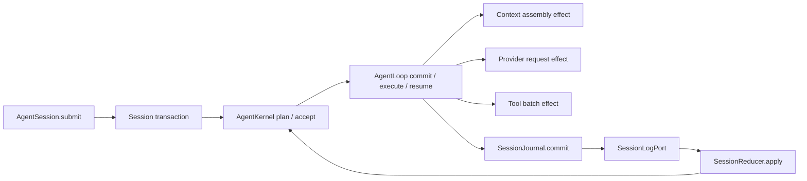

# Minimal Agent Core Convergence Design

**Status:** Approved

**Date:** 2026-07-27

## 1. Goal

Converge `embedagent-core` from a package-separated but internally callback-heavy
runtime into a small, durable, Pi-inspired Agent Core.

The result must continue to provide the standalone `Agent` / `AgentSession` SDK,
support hosted and workflow-specialized agents through injected ports and
extensions, and preserve the mandatory Windows 7, offline, Python 3.8, and
default C/C++ workflow constraints.

The main architectural outcome is not a smaller wheel by itself. It is one
state truth, one session transaction path, one loop driver, and no internal
facade that accumulates product semantics.

## 2. Current Baseline

The distribution boundary is already strong:

- `embedagent-core` has no runtime dependencies.
- Core does not import Protocol, Host, product, GUI, or workflow packages.
- `Agent`, `AgentSession`, `AgentPorts`, `RuntimeDefinition`, and `run_agent`
  provide a standalone execution path.
- the C/C++ workflow is injected through the workflow package and extension
  boundary rather than constructed by Core
- the six project distributions build, validate, and pass isolated import and
  composition smoke tests

The remaining debt is inside the runtime:

- `QueryEngine` is an internal coordinator of more than two thousand lines and
  still owns session mutation, provider/context operations, interaction
  handling, compaction, logging, and service assembly.
- `AgentLoop` receives more than twenty optional callbacks and validates its
  assembly only when `run()` starts.
- live execution appends transcript events and then directly mutates `Session`.
- `SessionRestorer` maintains a second imperative state-application path for
  the same event families.
- Host code still imports and stores mutable Core `Session` values.
- tests directly construct `QueryEngine` in roughly 87 locations, making an
  internal class behave like a compatibility API.
- `ExecutionTracer` and `CircuitBreaker` have no production assembly path.

## 3. Constraints

The design must preserve all of the following:

1. Python `>=3.8,<3.9`; no Python 3.9+ syntax.
2. No new Core runtime dependencies.
3. No Docker, WSL, VS Code, Electron, Node, or online runtime requirement.
4. Core remains workflow-neutral and contains no C/C++ task or pack knowledge.
5. `AgentPorts.permissions` stays mandatory. A permission decision never
   substitutes for the independent write-path policy.
6. `SessionLogPort` remains the durable abstraction. The hosted
   `transcript.jsonl` store remains one adapter.
7. Default offline C/C++ behavior and all six distribution boundaries remain
   operational throughout the migration.
8. Pre-release private APIs and internal transcript implementation shapes do
   not receive compatibility adapters.

## 4. Considered Designs

### 4.1 Single Runtime Command Entry

This design removes `QueryEngine` and gives `AgentRuntime` one private
`invoke(_RuntimeCall)` entry point. A closed command family represents submit,
host initialization, hosted mode changes, hosted command execution, and hosted
interaction resume.

It creates a very small method surface, but the operation count does not
disappear. A generic command dispatcher can become another monolith or a
string-and-dictionary service bag. This design hides complexity better than it
removes complexity and is not selected as the primary internal model.

### 4.2 Effect And Reducer Kernel

This design treats execution as a state machine that plans a bounded effect,
commits pre-effect events, executes the effect, and reduces the result into
durable post-effect events.

It provides deterministic live/replay behavior and explicit crash boundaries.
Its risk is type and phase proliferation if every internal operation becomes a
new effect. A fully general effect framework would be larger than the problem
and would not match Pi's small-loop philosophy.

### 4.3 Deep AgentSession Facade

This design makes `AgentSession` the complete session transaction boundary.
Callers continue to submit `UserTurn` and `InteractionReply` values without
learning restore, lease, loop, journal, or projection details.

It is the best standalone SDK shape, but a thin public facade alone could leave
the current dual-write and callback-heavy internals intact.

## 5. Selected Design

Use a hybrid of the deep `AgentSession` facade and a deliberately limited
effect/reducer kernel.

- keep the public `Agent`, `AgentSession`, `AgentPorts`, `RuntimeDefinition`,
  `UserTurn`, `InteractionReply`, `AgentResult`, and `run_agent` concepts
- make `AgentSession.submit()` the only standalone session operation
- keep effects private and closed to three external side-effect families
- make `SessionJournal` the only durable state commit boundary
- make `SessionReducer` the only writer of live session state
- make `AgentLoop` a mechanical commit-execute-resume driver
- remove `QueryEngine` after its remaining behavior has moved to the selected
  owners
- keep hosted-only operations behind `HostedSessionController`, outside the
  package-root API

The selected flow is:



## 6. Public SDK Contract

The common standalone usage remains:

```python
agent = Agent.create(ports, definition)
session = agent.open("session-1")
result = session.submit(UserTurn("Fix the build failure"))

if result.pending_interaction is not None:
    result = session.submit(
        InteractionReply(
            result.pending_interaction.interaction_id,
            {"approved": True},
        )
    )
```

`AgentSession` remains a durable session identity and transaction handle. It
does not promise to hold mutable session state between submissions. Each submit
acquires the session lease, restores reducer state, executes one turn or resume
transaction, and returns a frozen projection.

`AgentResult.pending_interaction` must stop exposing the mutable internal
`PendingInteraction` object. A frozen public interaction request DTO should
preserve the field semantics and interaction id while hiding Core session
internals. This is a pre-release public cutover, not a compatibility wrapper.

`AgentPorts.extension_manager` and `RuntimeDefinition.extensions` remain the
hosted-manager and standalone-declarative composition paths during this
program. Supplying both is invalid: `Agent.create` must raise `ValueError`
instead of silently ignoring either source. Hosted composition injects its
shared manager through `AgentPorts`; standalone composition supplies extension
instances through `RuntimeDefinition`.

## 7. Internal Interfaces

### 7.1 AgentKernel

`AgentKernel` owns invocation-local state-machine decisions:

- start a user, hosted command, or interaction-resume turn
- plan the next context, provider, or tool effect
- validate effect id and phase on resume
- decide compact retry, continue, suspend, abort, guard stop, and completion
- produce durable event intents and the final outcome

The kernel performs no I/O and does not mutate `Session` directly.

The invocation-local cursor may contain phase, step index, provider attempt,
compact retry, and progress-guard evidence. It must not become a second durable
session state source.

### 7.2 AgentLoop

`AgentLoop` owns only the mechanical driver:

```python
step = kernel.start(state, input_value)
while step.outcome is None:
    committed = journal.commit(state, step.events)
    state = committed.state
    effect_result = executor.execute(step.effect, state, observer, cancel)
    step = kernel.accept(state, step.cursor, step.effect.effect_id, effect_result)
return journal.commit(state, step.events), step.outcome
```

The production constructor must have no optional callback dependencies and no
runtime `_ensure_configured` check. It should receive no more than these
focused collaborators:

- `AgentKernel`
- `SessionJournal`
- context/provider effect executor
- `AgentToolActionService`
- continuation policy when not owned by the kernel

### 7.3 Closed Effects

Only these private effect families are selected:

1. context assembly and turn-snapshot preparation
2. provider request and stream consumption
3. tool batch execution, including permission and interactive suspension

Effects and results are a closed Python 3.8 `Union` of frozen dataclasses. They
are not extension APIs. Extensions continue to participate through
`AgentExtensionHost`, tool/runtime ports, declared capabilities, and safe
workflow patches.

Every effect has an id and an expected phase. A stale, duplicate, or out-of-
order effect result fails closed before it can append state.

### 7.4 SessionJournal

`SessionJournal` owns restore and commit:

```python
class SessionJournal(object):
    def restore(self, session_id, restore_policy):
        ...

    def commit(self, state, event_intents):
        ...
```

For each event intent, commit must:

1. validate the event type and payload
2. append it through `SessionLogPort`
3. use the stored event envelope returned by the port as the canonical event
4. apply that event through `SessionReducer`
5. publish committed lifecycle events to observers

If a multi-event commit fails partway through, the returned or restored state
must reflect the successfully stored prefix only. The journal must never patch
live state before the corresponding durable append succeeds.

Streaming text and reasoning deltas remain transient observer signals. Final
provider and tool results remain durable facts.

### 7.5 SessionReducer

`SessionReducer` is the sole state writer for both live execution and restore.
It owns event validation and application for:

- session metadata and runtime configuration
- messages, turns, steps, and transitions
- tool calls and tool results
- pending interaction creation and resolution
- context snapshots and content replacements
- workflow patches
- compact boundaries and compacted-history checkpoints
- recovery markers and reducer-backed read models

The reducer may update private in-memory structures in place to avoid copying a
long transcript on every event. Mutators must not be callable by the loop,
extensions, Host, or public SDK.

`SessionRestorer` becomes a thin fold/result facade over this reducer during
the migration and must be deleted when all callers use
`SessionJournal.restore`. Imperative event-family
branches are deleted in the same slice that promotes the corresponding reducer
handler.

### 7.6 Effect Executors

The context/provider executor owns:

- context assembly and extension context patches
- safe prompt-unit and capability projection
- frozen `TurnSnapshot` creation
- provider invocation and bounded provider retry
- provider stream callbacks

`AgentToolActionService` continues to own:

- active-tool enforcement
- extension pre/post hooks
- permission decisions
- independent write-path validation
- built-in and extension-owned tool execution
- pending permission and user-input outcomes
- workflow patch capture

Neither executor writes `Session` directly. Both return typed results for the
kernel to turn into event intents.

## 8. Hosted Boundary

`HostedSessionController` remains the supported non-root Host boundary, but its
target contract must not accept a mutable `Session` from Host.

Hosted operations should identify the `AgentSession`, submit a typed hosted
request, and return a frozen hosted result or projection. The same session
transaction, journal, reducer, kernel, and loop used by standalone submission
must execute hosted commands and interaction resume.

At convergence:

- Host stores `AgentSession` handles and Host-owned projections, not mutable
  Core `Session` objects.
- Host does not import `QueryEngine` or `SessionRestorer`.
- Host does not call a private `AgentSession` or `AgentRuntime` member.
- Core does not absorb Host session lists, GUI bootstrap, timeline transport,
  resource discovery, or workspace intelligence.

This boundary change is required for complete runtime separation. It must be a
separate implementation slice after reducer parity is established.

## 9. Failure And Recovery Semantics

The existing fail-closed behavior remains authoritative:

- permission rejection is a diagnostic tool outcome or pending interaction,
  not an unstructured exception path
- ordinary command, build, and test failures remain observations for the next
  model step
- guard stop is reserved for no-progress and runaway protection
- provider compact retry is explicit and bounded
- cancellation records interrupted lifecycle state
- incomplete provider or tool operations remain visible to recovery reducers
- potentially side-effecting tool calls are never replayed automatically after
  an uncertain crash boundary
- malformed or out-of-order durable events stop strict restore; trusted-prefix
  recovery remains an explicit Host policy

Observer delivery occurs after durable commit for lifecycle facts. A failed
observer must not roll back or corrupt committed session state.

## 10. Redundancy Retirement

The program must delete rather than preserve these transitional surfaces:

- `QueryEngine` and direct-construction compatibility tests
- `AgentLoop` callback injection and `_ensure_configured`
- live call sites of `Session.add_*`, `record_*`, direct workflow-state patching,
  and direct pending-interaction assignment outside the reducer
- imperative restore branches replaced by reducer handlers
- Host ownership of mutable `Session`
- source-text guards whose only purpose is freezing internal classes or wrapper
  names
- `ExecutionTracer`, which has no production assembly path
- `CircuitBreaker` and its optional retry-wrapper integration, which have no
  production assembly path
- `runtime_config_provider` callback paths that exist only in internal tests

`LLMClientRetryWrapper`, permission policy, write-path policy, progress guard,
turn snapshots, capability read models, extension hosting, and durable recovery
remain because they have production responsibilities.

## 11. Migration Milestones

### Milestone 1: Remove The Pseudo-Public Internal Contract

- add public SDK characterization for user turns, interaction resume,
  cancellation, compaction retry, tool failure, and hosted command behavior
- move focused action, lifecycle, extension, and snapshot tests to their owning
  services
- stop asserting that `QueryEngine` can be directly constructed
- replace internal source-string guards with dependency and forbidden-import
  guards

No production behavior changes in this milestone.

### Milestone 2: Promote Journal And Reducer Single-Writer State

Migrate event families in this order:

1. session metadata, messages, turns, and steps
2. tool calls and results
3. pending interactions and resolutions
4. context snapshots, replacements, and workflow patches
5. transitions, compaction, compacted history, and recovery markers

Each sub-slice adds live/replay parity tests, routes live commits through the
journal, and deletes the corresponding direct mutation and imperative restore
path before completion.

### Milestone 3: Converge Kernel And Loop

- introduce the three closed effect/result families
- move phase decisions into `AgentKernel`
- make `AgentLoop` the small commit-execute-resume driver
- move provider/context execution out of `QueryEngine`
- remove callback wiring, forwarding helpers, and engine-local session state
- preserve explicit operation save points and interruption behavior

### Milestone 4: Delete QueryEngine And Close The Host Boundary

- assemble kernel, loop, journal, reducer, effect executors, extension host,
  and action service once in `AgentRuntime`
- route `run_agent` and hosted operations through the same transaction path
- remove Host imports and storage of mutable Core `Session`
- remove `QueryEngine`, `AgentRuntime.build_engine`, and direct engine tests
- replace the internal pending-interaction leak with the frozen public DTO

### Milestone 5: Delete Dormant Code And Close Documentation

- delete tracer and circuit-breaker code and remove the unused optional
  circuit-breaker path from `LLMClientRetryWrapper`
- remove obsolete test helpers and archived compatibility assertions from
  active test suites
- update `AGENTS.md`, the architecture, roadmap, module docs, tracker, and
  change log to describe only the promoted runtime path
- archive this implementation program after all gates pass

## 12. Verification Strategy

Every migration milestone requires focused tests plus the repository gates.

Required behavioral tests include:

- the same persisted events produce equivalent live and restored session state
- append failure never exposes an uncommitted live mutation
- partial event-batch append restores the committed prefix
- duplicate or stale effect results are rejected
- pending permission and `ask_user` interactions resume exactly once
- cancellation and crashes leave explicit interrupted operations
- failed build/test commands remain normal tool observations
- compact retry creates one valid boundary and does not duplicate history
- extension workflow patches enter state only through committed events
- observers receive committed lifecycle events in sequence
- simultaneous submits for one session fail with lease conflict

Required architecture assertions include:

- no production `QueryEngine` import or construction
- no `AgentLoop` optional callback dependency
- no session mutator call outside `SessionReducer`
- no Host import of mutable Core `Session` or `SessionRestorer`
- no Core import from Host, Protocol, product, GUI, or workflow packages
- no C/C++ workflow vocabulary in bare Core

The final gate is:

```bash
uv run pytest tests/test_pre_release_architecture_guards.py tests/test_current_architecture_boundaries.py -v
uv run pytest tests/ -m "not slow and not gui" -v
uv run --locked python scripts/lint.py
uv run python scripts/build-python-distributions.py --dist-dir dist
uv run python scripts/check-python-distributions.py --dist-dir dist
uv run python scripts/smoke-python-distributions.py --dist-dir dist --python .venv/Scripts/python.exe
```

Any frontend protocol change caused by the hosted boundary also requires the
webapp test and build gate, with generated static assets committed.

## 13. Completion Criteria

The program is complete only when:

1. the supported standalone SDK remains `Agent.create -> Agent.open ->
   AgentSession.submit`
2. `QueryEngine` no longer exists in production or tests
3. `AgentLoop` has only focused required collaborators and no callback bag
4. `SessionLogPort` plus `SessionReducer` are the sole durable/live state path
5. live and restore paths use the same reducer handlers
6. Host no longer owns or returns mutable Core `Session`
7. Core still has zero runtime dependencies and no workflow-specific imports
8. generic and C/C++ specialized agents pass isolated and composed wheel smoke
9. Python 3.8, offline, Windows 7, permission, and write-path constraints remain
   enforced
10. active documentation contains no compatibility description of the retired
    runtime path

## 14. Non-Goals

This program does not include:

- GUI UX redesign or T3 Code convergence work
- new tools, workflows, providers, extension marketplaces, or remote registries
- general multi-agent orchestration
- runtime dependency installation
- automatic replay of uncertain side-effecting operations
- a public effect API, reducer plugin API, or runtime command bus
- a wholesale port of Pi's TypeScript implementation
- clean Windows 7 bundle acceptance, which remains a separate release gate
