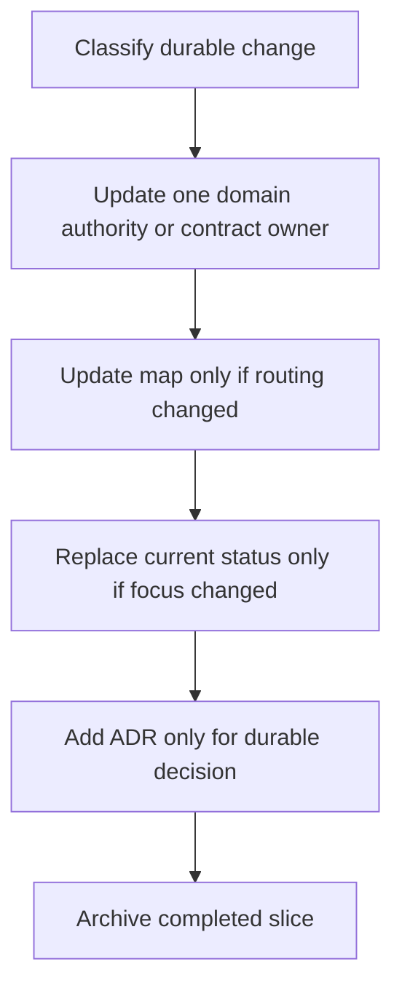

# Code-Doc Sync Workflow

> 状态：`active`
> 类型：`workflow`
> 负责人：`project maintainers`
> 最后同步日期：`2026-08-01`

## Trigger

公共契约、领域所有权、跨层数据流、配置、操作步骤、发布证据、长期决策或当前优先级变化时执行本流程。内部重构若不改变这些事实，不需要制造文档流水。

## Flow

## Classify The Owner

| Change | Owner |
|---|---|
| Cross-layer dependency or execution invariant | `docs/overall-solution-architecture.md` |
| Local component behavior | corresponding authority under `docs/platform/`, `docs/applications/`, or `docs/product/` |
| Tool, permission, protocol, or mode contract | corresponding contract document |
| Configuration or operational procedure | corresponding guide/workflow |
| Durable decision with alternatives | ADR |
| Current focus/blocker | `docs/current-status.md` |
| Open ordering/exit criterion | `docs/implementation-roadmap.md` |

## Steps

1. Identify the changed durable fact and its one owner through `docs/README.md` and `docs/references/code-doc-matrix.md`.
2. Update that authority in the same change as the code; remove superseded wording instead of appending a correction.
3. Update the global map or code-doc matrix only when ownership or routing changed.
4. Replace current status only when focus, blocker, next action, or evidence state changed.
5. Add/update an ADR only when rationale and alternatives must survive implementation.
6. If an active slice closes, synchronize durable conclusions, move its spec/plan into an indexed archive package, and update `docs/superpowers/README.md`.

## Verification

- Run focused tests for the changed code and contract.
- Run `uv run python scripts/test-suite.py tdd tests/test_documentation_navigation.py` for navigation/governance changes.
- Run architecture guards for cross-boundary changes.
- Use `rg` to verify retired paths and superseded terms no longer appear in active authorities.
- Run `git diff --check` and inspect links, commands, paths, metadata, and context budgets.

## Closure

A change is synchronized when the current owner states the new truth, duplicate old truth is removed, routing remains valid, and any completed process material is historical rather than active context.
