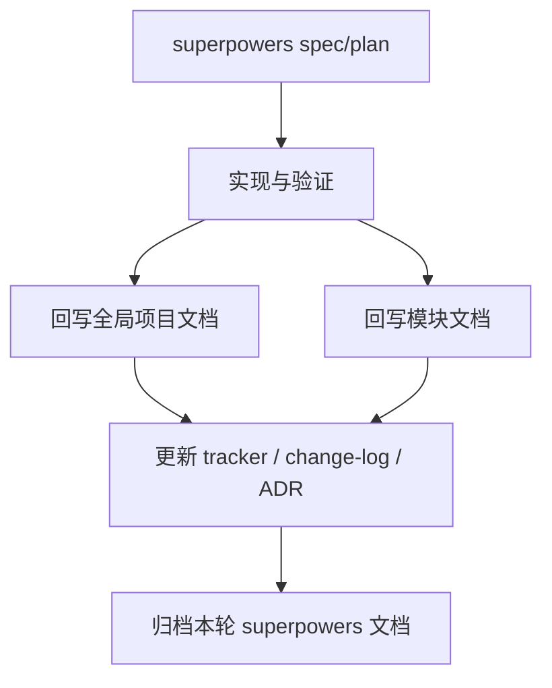

# Code-Doc Sync Workflow

> 状态：`active`
> 类型：`workflow`
> 负责人：`project maintainers`
> 最后同步日期：`2026-04-08`
> 对应代码范围：`README.md`, `AGENTS.md`, `docs/`, `src/embedagent/`

## 1. Trigger Conditions

以下情况必须启动代码-文档同步流程：

- 修改正式术语、模式、工具、权限、协议、会话模型或任务模型
- 修改模块职责、入口文件、关键数据流或对外接口
- 新增或删除用户可见工作流、部署方式、验证方式
- 修改验证步骤，导致现有文档命令失效

## 2. Change Classification

每次改动先判断属于以下哪类：

- `implementation`
- `module behavior`
- `architecture contract`
- `workflow / process`

分类结果决定需要更新哪些全局文档和模块文档。

## 3. Impact Assessment

至少识别以下内容：

- 受影响代码目录
- 受影响全局文档
- 受影响模块文档
- 是否需要更新 `development-tracker.md`
- 是否需要更新 `design-change-log.md`
- 是否需要新增或更新 `ADR`

## 4. Implementation And Sync

架构或协议类变化先更新契约文档，再做实现；模块内部变化可先实现，再在同一轮回写模块文档。

## 5. Verification

在声称一轮工作完成之前，至少检查：

- 相关 source-of-truth 文档是否已同步
- 术语是否仍符合官方词汇
- 路径、命令、图表与测试入口是否仍有效
- 活动文档是否错误依赖 archive

## 6. Tracker / Change Log / ADR Updates

- 中等以上设计变化必须更新 `design-change-log.md`
- 当前重点、风险或阶段变化必须更新 `development-tracker.md`
- 长期有效的重要决策应写入 `docs/adrs/`

## 7. Archive Handoff

- 切片关闭前先回写全局文档与模块文档
- 再把 `docs/superpowers/` 下该切片文档移动到 `docs/archive/<topic>/`
- archive README 应保留主题索引和关闭说明
